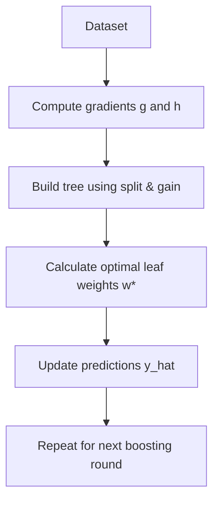
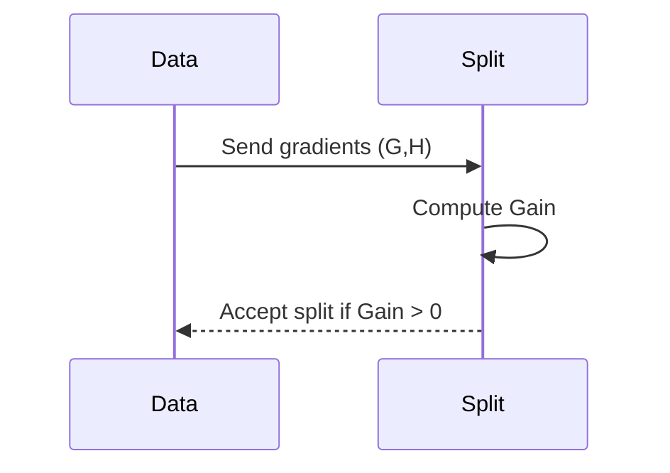

# ⚙️ XGBoost (Extreme Gradient Boosting) — Full Theoretical + Mathematical Notes

This document provides an advanced explanation of **XGBoost**, covering its core theory, mathematical foundations, and system-level optimizations that make it one of the fastest gradient boosting frameworks.

---

## 🧭 Table of Contents

1. **Gradient Boosting Refresher**
2. **Objective Function & Regularization**
3. **Second-Order Approximation (Taylor Expansion)**
4. **Optimal Leaf Weight & Structure Score**
5. **Splitting Criterion (Gain Calculation)**
6. **Tree Building Algorithms**
   - Exact Greedy
   - Approximate (Weighted Quantile Sketch)
7. **System Optimization**
8. **Key Differences vs Standard GBDT**
9. **Diagrams (Mermaid)**

---

# 1. 🌱 Gradient Boosting Refresher

XGBoost builds trees sequentially — each tree fixes the errors of the previous ensemble.

Final prediction with $K$ trees:

$$
\hat{y}_i^{(K)} = \sum_{k=1}^{K} f_k(\mathbf{x}_i)
$$

At iteration $t$:

$$
\hat{y}_i^{(t)} = \hat{y}_i^{(t-1)} + f_t(\mathbf{x}_i)
$$

---

# 2. 🎯 Objective Function & Regularization

General objective:

$$
\mathcal{L}^{(t)} = \sum_{i=1}^n L\big(y_i, \hat{y}_i^{(t-1)} + f_t(\mathbf{x}_i)\big) + \Omega(f_t)
$$

Regularization:

$$
\Omega(f) = \gamma T + \frac{1}{2}\lambda\sum_{j=1}^{T} w_j^2
$$

---

# 3. ✨ Second-Order Approximation (Taylor Expansion)

Approximated loss:

$$
L(y_i, \hat{y}_i^{(t-1)} + f) \approx L_i + g_i f + \frac{1}{2}h_i f^2
$$

Where $g_i$ and $h_i$ are the first and second derivatives:

$$
g_i = \frac{\partial L}{\partial \hat{y}_i}, \qquad h_i = \frac{\partial^2 L}{\partial \hat{y}_i^2}
$$

---

# 4. 🧮 Optimal Leaf Weight & Structure Score

Optimal weight for leaf j:

$$
w_j^* = -\frac{\sum_{i\in I_j} g_i}{\sum_{i\in I_j} h_i + \lambda}
$$

Structure score for a tree:

$$
\mathcal{L}_{\text{struct}} = -\frac{1}{2}\sum_{j=1}^T \frac{\left(\sum_{i\in I_j} g_i\right)^2}{\sum_{i\in I_j} h_i + \lambda} + \gamma T
$$

---

# 5. 📉 Splitting Criterion (Gain Calculation)

Gain formula:

$$
\text{Gain} = \frac{1}{2}\left[
\frac{G_L^2}{H_L+\lambda}
+ \frac{G_R^2}{H_R+\lambda}
- \frac{G^2}{H+\lambda}
\right] - \gamma
$$

---

# 6. 🌳 Tree Building Algorithms

## ✔ Exact Greedy (Small/Medium Datasets)
- Tests **all split points**
- Highest accuracy  
- Slowest

## ⚡ Approximate (Weighted Quantile Sketch — Large Datasets)
- Uses **quantile-based candidate splits**
- Much faster
- Nearly similar accuracy

---

# 7. 🚀 System Optimization

### 🔍 Sparsity-Aware Split Finding
- Learns default direction for missing values  
- Evaluates gain for missing → left and missing → right

### ⚡ Cache-Aware Access
- Uses **block memory layout**  
- Reduces CPU cache misses  
- Greatly speeds up training

---

# 8. 🔥 Key Differences vs Standard GBDT

| Feature | Standard GBDT | XGBoost |
|--------|---------------|---------|
| Derivatives | First-order | First + Second (g & h) |
| Regularization | Weak | L1/L2 + γ |
| Missing Values | Naive | Sparsity-Aware |
| Split Method | Exact | Exact + Quantile Approx |
| Parallelization | Limited | Highly optimized |

---

# 9. 🎨 Mermaid Diagrams (GitHub Renders These)

## 🌳 XGBoost Workflow

## 🔪 Split Gain Process

---