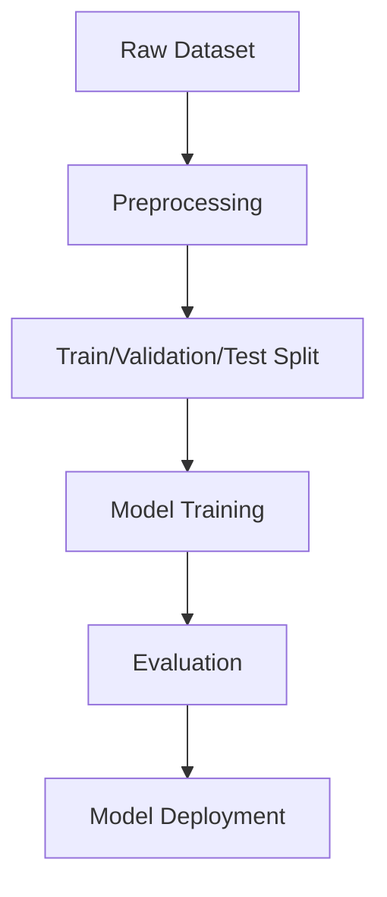
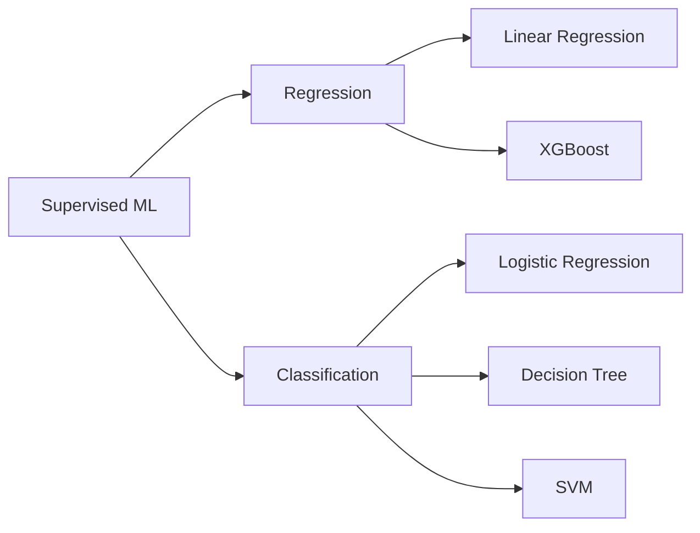
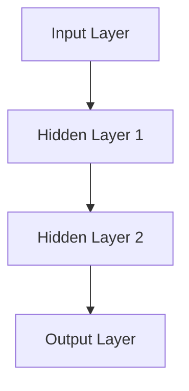

# 📘 Week 2 – AI/ML Internship (1 Dec – 5 Dec)

---

# 📑 **Table of Contents**

1. [Overview](#overview)
2. [Weekly Summary](#weekly-summary)
3. [Day 1 — Data Preprocessing](#day-1)
4. [Day 2 — Linear Regression Project](#day-2)
5. [Day 3 — Logistic Regression + Decision Tree](#day-3)
6. [Day 4 — SVM, UV, Swarms](#day-4)
7. [Day 5 — XGBoost + ANN + CNN](#day-5)
8. [Flowcharts (Mermaid Diagrams)](#flowcharts)
9. [Links to Theory & Practical Work](#links)

---

# 📌 Overview

This week covers **core supervised ML algorithms**, **data preprocessing**, **model building**, **math intuition**, and **hands-on practical implementation** using Jupyter notebooks.

Each day includes:
✔ Practical Tasks
✔ Theory Notes (Math + Intuition)
✔ GitHub Notebook Links
✔ Mermaid diagrams for architecture & workflow

---

# 🗓 Weekly Summary

| Date        | Tasks                                                   | Theory                               | GitHub Links         |
| ----------- | ------------------------------------------------------- | ------------------------------------ | -------------------- |
| **1/12/25** | Encode Data, Scale Features, Split Dataset              | Linear Regression Maths              | ✔ Practical + Theory |
| **2/12/25** | Linear Regression Mini Project                          | Logistic Regression Maths            | ✔ Practical + Theory |
| **3/12/25** | Logistic Regression Practical + Decision Tree Practical | Random Forest + Decision Tree Theory | ✔ Practical + Theory |
| **4/12/25** | SVM Practical, UV, Swarms Architecture                  | SVM Maths + XGBoost Maths            | ✔ Practical + Theory |
| **5/12/25** | XGBoost Practical                                       | XGBoost Maths + ANN + CNN            | ✔ Practical + Theory |

---

# Day - 1

## ✅ **Data Preprocessing Tasks (indian_food(in).csv)**

* Fix/remove outliers
* Encode categorical data (One-Hot / Label Encoding)
* Scale numerical features (StandardScaler / MinMaxScaler)
* Split dataset into Train/Val/Test

### 🔗 GitHub Links

* Practical: Split Data → `Split_data.ipynb`
* Theory: Linear Regression → `linear_regression_theory.md`

---

# Day - 2

## 📊 **Linear Regression Project – 50 Startups Dataset**

Includes:

* Data cleaning
* Outlier handling
* Encoding
* EDA
* Model training (Linear, Ridge, Lasso)
* Evaluation + Business insights

### 🔗 GitHub Links

* Practical: `linear_regression_practical.ipynb`
* Theory: `logistic_regression_theory.md`

---

# Day - 3

## 🔍 Logistic Regression & Decision Tree Practical

### Tasks

* Logistic Regression practical (binary classification)
* Decision Tree practical

### Theory

* Random Forest maths
* Decision Tree maths

### 🔗 GitHub Links

* Random Forest Theory
* Decision Tree Theory
* Logistic Regression Practical
* Decision Tree Practical

---

# Day - 4

## 🧠 SVM + UV Package Manager + Swarms

### Tasks

* SVM practical implementation
* UV environment setup
* Study Swarms architecture

### Theory

* SVM Maths
* XGBoost Maths

### 🔗 GitHub Links

* SVM Practical
* SVM Theory
* XGBoost Theory

---

# Day - 5

## ⚡ XGBoost Practical + ANN + CNN

### Tasks

* XGBoost practical

### Theory

* XGBoost Maths
* ANN Basics
* CNN Basics

### 🔗 GitHub Links

* XGBoost Practical
* XGBoost Theory

---

# 📐 Flowcharts (Mermaid)

## **ML Workflow (General)**

## **Supervised ML Algorithm Map**

## **Neural Network Basic Architecture**

---

# 🔗 Links

### **Theory Folder:**

[https://github.com/ShadowMonarchX/ai-ml-internship/tree/main/Week%20-%202/Theory](https://github.com/ShadowMonarchX/ai-ml-internship/tree/main/Week%20-%202/Theory)

### **Practical Folder:**

[https://github.com/ShadowMonarchX/ai-ml-internship/tree/main/Week%20-%202/Practical](https://github.com/ShadowMonarchX/ai-ml-internship/tree/main/Week%20-%202/Practical)

---

