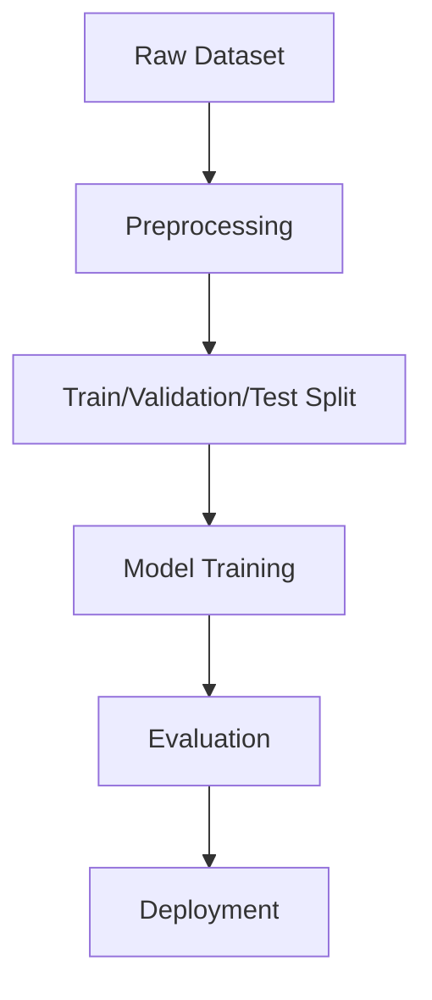
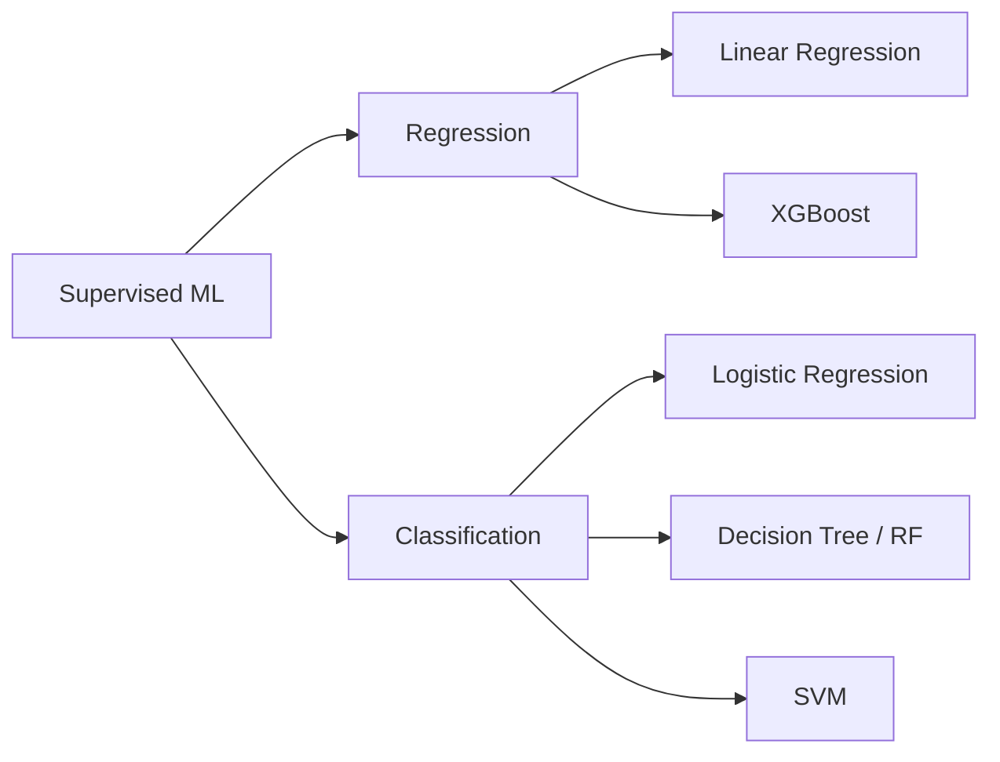
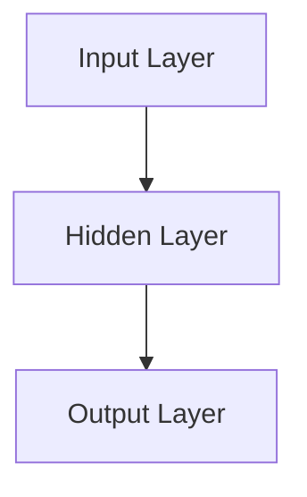

# 📘 Week 2 – AI/ML Internship

---

# 📑 **Table of Contents**

1. [Overview](#overview)
2. [Weekly Summary](#weekly-summary)
3. [Day 1 — Data Preprocessing (Linear Regression)](#day-1)
4. [Day 2 — Linear Regression Project](#day-2)
5. [Day 3 — Classification: Logistic Regression & Decision Tree](#day-3)
6. [Day 4 — SVM, UV, Swarms](#day-4)
7. [Day 5 — Advanced Models: XGBoost, ANN, CNN](#day-5)
8. [Flowcharts (Mermaid Diagrams)](#flowcharts)
9. [Links to Theory & Practical Work](#links)

---

# 📌 Overview {#overview}

This week focused on **core supervised Machine Learning algorithms**, covering **data preprocessing**, **model building**, **math intuition**, and **hands-on practical implementation** using Jupyter notebooks.

### 🎯 Key Deliverables:

* **Practical Tasks:** Hands-on implementation of 5+ ML algorithms.
* **Theory Notes:** Detailed mathematical intuition and model mechanics.
* **GitHub Notebooks:** Direct links to code and theory files.
* **Architecture Flowcharts:** Workflow diagrams using Mermaid.

---

# 🗓 Weekly Summary {#weekly-summary}

| Date        | Day | Topics Covered                                           | Algorithms Implemented                 |
| :---------- | :-- | :------------------------------------------------------- | :------------------------------------- |
| **1/12/25** | Mon | Data Preprocessing, Linear Regression Theory             | (Prep Work)                            |
| **2/12/25** | Tue | Linear Regression Project, Logistic Regression Theory    | **Linear Regression** (Project)        |
| **3/12/25** | Wed | Logistic Regression, Decision Tree, Ensemble Theory (RF) | **Logistic Regression, Decision Tree** |
| **4/12/25** | Thu | SVM, UV Environment, Swarms Architecture, XGBoost Theory | **Support Vector Machines (SVM)**      |
| **5/12/25** | Fri | XGBoost Implementation, ANN & CNN Basics                 | **XGBoost**                            |

---

# Day 1 — Data Preprocessing (Linear Regression) {#day-1}

### 📈 **Tasks: Data Preprocessing for `indian_food(in).csv`**

* Fix/remove outliers.
* Encode categorical data.
* Scale numerical features.
* Split dataset into Train/Validation/Test.

### 📚 **Theory:**

* Linear Regression Mathematics (Cost Function, Gradient Descent).

### 🔗 **GitHub Links**

| Type      | Description             | Link                          |
| :-------- | :---------------------- | :---------------------------- |
| Practical | Preprocessing Notebook  | `Split_data.ipynb`            |
| Theory    | Linear Regression Notes | `linear_regression_theory.md` |

---

# Day 2 — Linear Regression Project {#day-2}

### 📊 **Tasks:**

Full workflow including:

* Data Cleaning & EDA
* Encoding
* Linear, Ridge & Lasso Regression
* Evaluation Metrics

### 📚 **Theory:**

* Logistic Regression Math (Sigmoid, BCE Loss)

### 🔗 **GitHub Links**

| Type      | Description               | Link                                |
| :-------- | :------------------------ | :---------------------------------- |
| Practical | LR Project Notebook       | `linear_regression_practical.ipynb` |
| Theory    | Logistic Regression Notes | `logistic_regression_theory.md`     |

---

# Day 3 — Classification (Logistic Regression & Decision Tree) {#day-3}

### 🔍 **Tasks:**

* Logistic Regression Practical
* Decision Tree Implementation

### 📚 **Theory:**

* Decision Tree Math (Gini, Entropy, Information Gain)
* Random Forest Theory

### 🔗 **GitHub Links**

| Type      | Description         | Link                                  |
| :-------- | :------------------ | :------------------------------------ |
| Practical | Logistic Regression | `logistic_regression_practical.ipynb` |
| Practical | Decision Tree       | `decision_tree_practical.ipynb`       |
| Theory    | Decision Tree Notes | `decision_tree_theory.md`             |
| Theory    | Random Forest Notes | `random_forest_theory.md`             |

---

# Day 4 — SVM, UV, Swarms {#day-4}

### 🧠 **Tasks:**

* SVM Practical
* UV Package Manager Setup
* Swarms Architecture Study

### 📚 **Theory:**

* SVM Math (Kernel Trick, Hyperplane, Margins)
* XGBoost Theory

### 🔗 **GitHub Links**

| Type      | Description   | Link                  |
| :-------- | :------------ | :-------------------- |
| Practical | SVM Notebook  | `svm_practical.ipynb` |
| Theory    | SVM Notes     | `svm_theory.md`       |
| Theory    | XGBoost Notes | `xgboost_theory.md`   |

---

# Day 5 — Advanced Models: XGBoost, ANN, CNN {#day-5}

### ⚡ **Tasks:**

* XGBoost Practical & Tuning

### 📚 **Theory:**

* XGBoost Deep Dive
* ANN Basics
* CNN Basics

### 🔗 **GitHub Links**

| Type      | Description      | Link                         |
| :-------- | :--------------- | :--------------------------- |
| Practical | XGBoost Notebook | `xgboost_practical.ipynb`    |
| Theory    | ANN & CNN Notes  | `deep_learning_intro.md`     |
| Theory    | XGBoost Advanced | `xgboost_theory_advanced.md` |

---

# 📐 Flowcharts (Mermaid) {#flowcharts}

## ML Workflow

## Supervised ML Map

## Neural Network Architecture

---

# 🔗 Links {#links}

### **Theory Folder:**

[https://github.com/ShadowMonarchX/ai-ml-internship/tree/main/Week%20-%202/Theory](https://github.com/ShadowMonarchX/ai-ml-internship/tree/main/Week%20-%202/Theory)

### **Practical Folder:**

[https://github.com/ShadowMonarchX/ai-ml-internship/tree/main/Week%20-%202/Practical](https://github.com/ShadowMonarchX/ai-ml-internship/tree/main/Week%20-%202/Practical)
