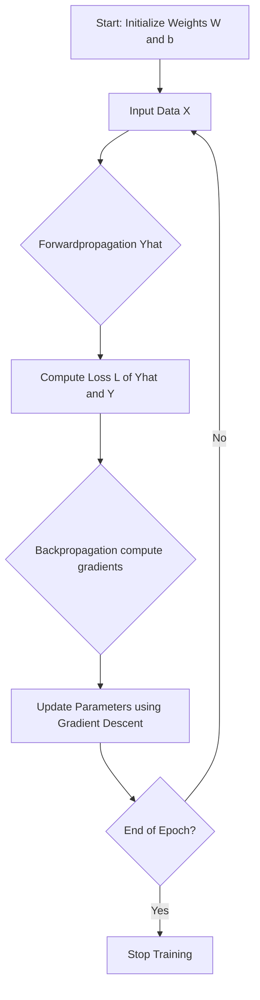
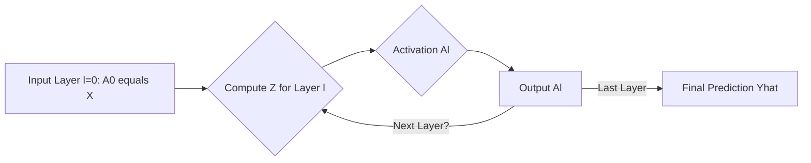
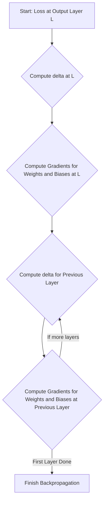
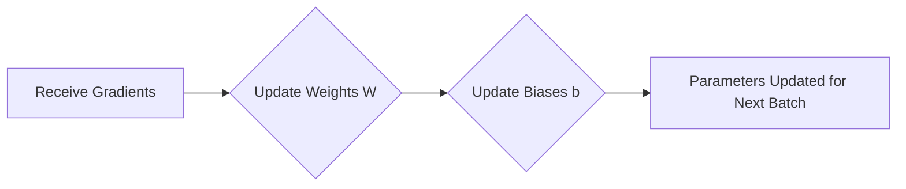

# 🧠 Artificial Neural Networks (ANN) — Theoretical Foundation

---

## Overview

An **Artificial Neural Network (ANN)**, or simply a Neural Network, is a computational model inspired by the structure and function of biological neural networks. It forms the core foundation of Deep Learning, used primarily for complex tasks like image recognition, natural language processing, and advanced prediction.

---

## 🧭 Table of Contents

1. [The Neuron (Perceptron)](#1-the-neuron-perceptron)
2. [Network Architecture](#2-network-architecture)
3. [The Core Function: Activation Functions](#3-the-core-function-activation-functions)
4. [Training the Network: The Loss Function](#4-training-the-network-the-loss-function)
5. [Learning Mechanism: Gradient Descent & Backpropagation](#5-learning-mechanism-gradient-descent--backpropagation)
6. [ANN Training Workflow](#6-ann-training-workflow)

---

## 1. The Neuron (Perceptron)

The basic building block of an ANN is the **Artificial Neuron**, historically called a **Perceptron**. It mimics a biological neuron by receiving multiple inputs, processing them, and producing a single output.

### 1.1 Mathematical Model

A single neuron performs two main steps: the **Weighted Sum** and the **Activation**.

#### a. Weighted Sum ($Z$)
The input features ($x_i$) are multiplied by their respective adjustable weights ($w_i$), summed up, and an offset term called the **bias** ($b$) is added.

$$Z = \sum_{i=1}^{n} (x_i w_i) + b$$

In vector form:
$$Z = \mathbf{w}^T \mathbf{x} + b$$

#### b. Activation ($A$)
The weighted sum $Z$ is then passed through an **Activation Function** ($g$) which introduces non-linearity, producing the neuron's output ($A$):

$$A = g(Z)$$

---

## 2. Network Architecture

ANNs are structured in layers, forming a **Feedforward Neural Network** (data flows in one direction, from input to output).

### 2.1 Layer Types

1.  **Input Layer:** Receives the raw data features ($\mathbf{x}$). The number of neurons equals the number of features.
2.  **Hidden Layer(s):** Intermediate layers where the bulk of the computation occurs. Each neuron processes information from the previous layer and passes it to the next. **Deep Learning** networks are characterized by having multiple hidden layers.
3.  **Output Layer:** Produces the final result.
    * **Regression:** Typically one neuron.
    * **Binary Classification:** One neuron (often using the Sigmoid activation).
    * **Multi-class Classification:** $C$ neurons, where $C$ is the number of classes (often using the Softmax activation).

[Image of a Feedforward Neural Network showing input, hidden, and output layers]

---

## 3. The Core Function: Activation Functions

Activation functions introduce **non-linearity**, allowing the network to learn complex, non-linear relationships in the data. Without them, a network would simply be performing a series of linear regressions.

| Function | Formula | Output Range | Use Case |
| :--- | :--- | :--- | :--- |
| **Sigmoid** | $g(Z) = \frac{1}{1 + e^{-Z}}$ | [0, 1] | Output layer (binary classification) |
| **Tanh** (Hyperbolic Tangent) | $g(Z) = \frac{e^Z - e^{-Z}}{e^Z + e^{-Z}}$ | [-1, 1] | Hidden layers |
| **ReLU** (Rectified Linear Unit) | $g(Z) = \max(0, Z)$ | [0, $\infty$) | Hidden layers (most common) |
| **Softmax** | $g(Z_i) = \frac{e^{Z_i}}{\sum_{j=1}^{C} e^{Z_j}}$ | [0, 1] (sum to 1) | Output layer (multi-class classification) |

---

## 4. Training the Network: The Loss Function

The **Loss Function** (or Cost Function) measures how well the network performs for a given set of weights and biases. Training aims to find the parameters that minimize this loss.

| Function | Formula (Example) | Use Case |
| :--- | :--- | :--- |
| **Mean Squared Error (MSE)** | $\mathcal{L} = \frac{1}{N} \sum_{i=1}^N (y_i - \hat{y}_i)^2$ | Regression |
| **Binary Cross-Entropy (BCE)** | $\mathcal{L} = - \frac{1}{N} \sum_{i=1}^N [y_i \log(\hat{y}_i) + (1 - y_i) \log(1 - \hat{y}_i)]$ | Binary Classification |
| **Categorical Cross-Entropy** | $\mathcal{L} = - \sum_{i=1}^{N} y_i \log(\hat{y}_i)$ | Multi-class Classification |

* $y_i$: The true label.
* $\hat{y}_i$: The network's predicted output.

---

## 5. Learning Mechanism: Gradient Descent & Backpropagation

The process of training relies on an optimization algorithm, **Gradient Descent**, and an error calculation technique, **Backpropagation**, to adjust parameters ($\mathbf{W}$ and $\mathbf{b}$) to minimize the Loss Function ($\mathcal{L}$).

### 5.1 Forwardpropagation: Calculating the Output (The Prediction)

**Forwardpropagation** is the process of feeding the input data forward through the network layers to produce the final output prediction ($\hat{y}$).

#### Step 1: Input to Layer $l$ (Vector Notation)
For any layer $l$ (starting with $l=1$ for the first hidden layer):

1.  **Weighted Sum (Z-value):**
    $$\mathbf{Z}^{[l]} = \mathbf{W}^{[l]} \mathbf{A}^{[l-1]} + \mathbf{b}^{[l]}$$

2.  **Activation (A-value):**
    $$\mathbf{A}^{[l]} = g^{[l]}(\mathbf{Z}^{[l]})$$
    *Note: $\mathbf{A}^{[0]}$ is the input vector $\mathbf{x}$. The final output is $\hat{\mathbf{y}} = \mathbf{A}^{[L]}$.*

### 5.2 Backpropagation: Calculating the Gradients (The Error Correction)

**Backpropagation** uses the **Chain Rule of Calculus** to efficiently calculate the gradient of the loss function ($\mathcal{L}$) with respect to every weight and bias.

#### Step 1: Output Layer Gradient ($\delta^{[L]}$)

The error sensitivity ($\delta$) is first calculated at the final output layer $L$:

$$\delta^{[L]} = \frac{\partial \mathcal{L}}{\partial \mathbf{Z}^{[L]}} = \frac{\partial \mathcal{L}}{\partial \mathbf{A}^{[L]}} \odot g^{[L]'}(\mathbf{Z}^{[L]})$$

* $\odot$: The **Hadamard product** (element-wise multiplication).

#### Step 2: Propagating the Error Backward (Layer $l$)

The error $\delta^{[l]}$ for any hidden layer $l$ is calculated by propagating the error from the next layer ($l+1$) backward:

$$\delta^{[l]} = \left( (\mathbf{W}^{[l+1]})^\top \delta^{[l+1]} \right) \odot g^{[l]'}(\mathbf{Z}^{[l]})$$

* This formula effectively distributes the error signal from the subsequent layer back through the weights.

#### Step 3: Calculating Parameter Gradients (The Adjustments)

Once $\delta^{[l]}$ is known, the average gradients for the weights ($\mathbf{W}$) and biases ($\mathbf{b}$) are calculated across the mini-batch:

1.  **Weight Gradient:**
    $$\frac{\partial \mathcal{L}}{\partial \mathbf{W}^{[l]}} = \frac{1}{m} \delta^{[l]} (\mathbf{A}^{[l-1]})^\top$$

2.  **Bias Gradient:**
    $$\frac{\partial \mathcal{L}}{\partial \mathbf{b}^{[l]}} = \frac{1}{m} \sum_{\text{batch}} \delta^{[l]}$$
    *Note: $m$ is the batch size.*

### 5.3 Parameter Update: Gradient Descent

The parameters are updated using the **Gradient Descent** rule to move in the direction of the steepest decrease of the loss function:

$$\mathbf{W}^{[l]} = \mathbf{W}^{[l]} - \eta \frac{\partial \mathcal{L}}{\partial \mathbf{W}^{[l]}}$$

$$\mathbf{b}^{[l]} = \mathbf{b}^{[l]} - \eta \frac{\partial \mathcal{L}}{\partial \mathbf{b}^{[l]}}$$

* $\eta$ is the **learning rate**, controlling the step size.

---

## 6.1 General ANN Training Workflow (Combined)

---

## 6.2 Forwardpropagation Workflow (Particular)

---

## 6.3 Backpropagation Workflow (Particular)

---

## 6.4 Parameter Update Workflow (Particular)

---