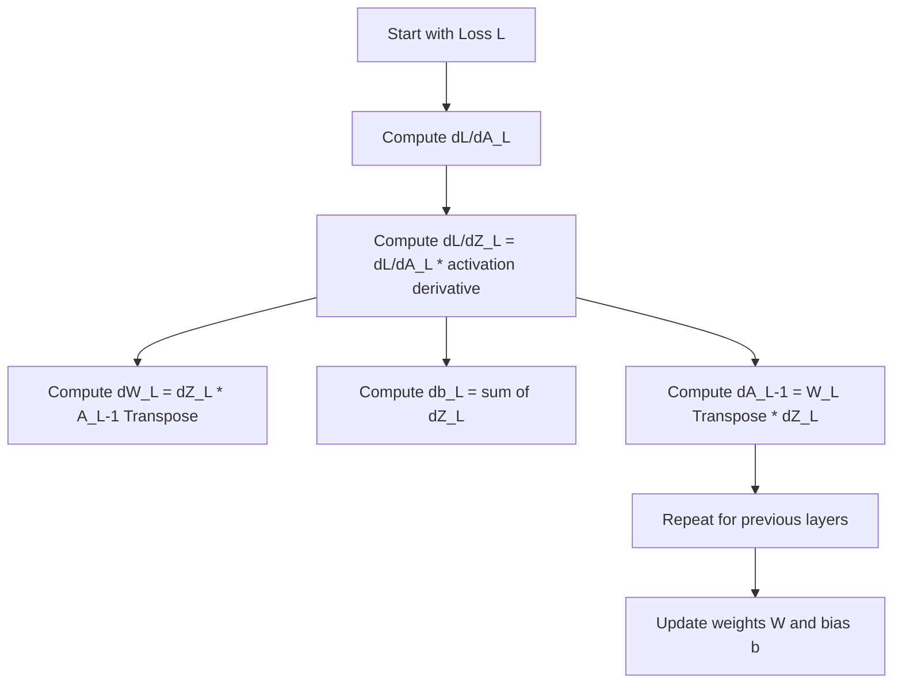
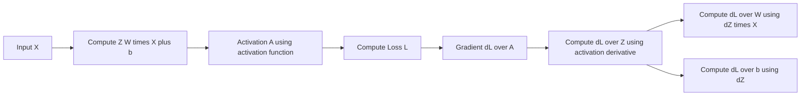
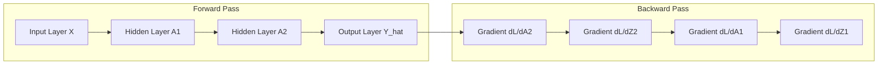
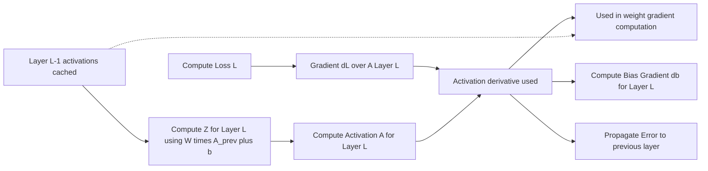

# 📘 Backpropagation: Complete Beginner → Advanced Theory (Math + Diagrams)

A full guide covering all required foundational, intermediate, and advanced concepts of backpropagation in Deep Learning — including intuition, mathematics, calculus, matrix form, vectorized gradients, and full propagation rules for every layer.

-----

## 📚 Table of Contents

1.  [What Is Backpropagation?](https://www.google.com/search?q=%231%EF%B8%8F%E2%83%A3-what-is-backpropagation)
2.  [Why Backpropagation Is Needed](https://www.google.com/search?q=%232%EF%B8%8F%E2%83%A3-why-backpropagation-is-needed)
3.  [The Chain Rule (The Heart of Backprop)](https://www.google.com/search?q=%233%EF%B8%8F%E2%83%A3-the-chain-rule-the-heart-of-backprop)
4.  [Backprop Through a Neuron](https://www.google.com/search?q=%234%EF%B8%8F%E2%83%A3-backprop-through-a-neuron)
5.  [Backprop Through a Full Layer](https://www.google.com/search?q=%235%EF%B8%8F%E2%83%A3-backprop-through-a-full-layer)
6.  [Backprop Through Deep Networks (Vector Form)](https://www.google.com/search?q=%236%EF%B8%8F%E2%83%A3-backprop-through-deep-networks-vector-form)
7.  [Matrix Calculus Essentials](https://www.google.com/search?q=%237%EF%B8%8F%E2%83%A3-matrix-calculus-essentials)
8.  [Activation Function Derivatives](https://www.google.com/search?q=%238%EF%B8%8F%E2%83%A3-activation-function-derivatives)
9.  [Loss Function Derivatives](https://www.google.com/search?q=%239%EF%B8%8F%E2%83%A3-loss-function-derivatives)
10. [Weight Update Rule](https://www.google.com/search?q=%23%F0%9F%94%9F-weight-update-rule)
11. [Fully Worked Example (Small)](https://www.google.com/search?q=%231%EF%B8%8F%E2%83%A31%EF%B8%8F%E2%83%A3-fully-worked-example-small)
12. [Common Mistakes](https://www.google.com/search?q=%231%EF%B8%8F%E2%83%A32%EF%B8%8F%E2%83%A3-common-mistakes)
13. [Diagrams (GitHub Mermaid — Fully Correct)](https://www.google.com/search?q=%231%EF%B8%8F%E2%83%A33%EF%B8%8F%E2%83%A3-diagrams-mermaid-github-safe)
14. [Advanced Architectures Backprop](https://www.google.com/search?q=%231%EF%B8%8F%E2%83%A34%EF%B8%8F%E2%83%A3-advanced-architectures-backprop)

-----

# 1️⃣ What Is Backpropagation?

**Backpropagation** (Backward Propagation) is the algorithm used to compute **gradients** of the loss function with respect to all weights ($\mathbf{W}$) and biases ($\mathbf{b}$) in the network.

## Core Idea

1.  **Perform forward pass** → compute predictions.
2.  **Compute loss** ($\mathcal{L}$).
3.  **Apply chain rule backwards** to compute gradients ($\frac{\partial \mathcal{L}}{\partial \mathbf{W}}$).
4.  **Update parameters** $\mathbf{W}, \mathbf{b}$ using Gradient Descent.

-----

# 2️⃣ Why Backpropagation Is Needed

| Problem | Solution |
| :--- | :--- |
| Millions of parameters | Backprop gives **efficient gradient computation** |
| Need to optimize weights | Backprop **gives the gradient vector** for optimization |
| Loss depends on deep layers | **Chain rule** passes the gradient backward through all layers |

-----

# 3️⃣ The Chain Rule (The Heart of Backprop)

If $y = f(g(h(x)))$, the gradient $\frac{dy}{dx}$ is:

$$
\frac{dy}{dx} = \frac{df}{dg} \cdot \frac{dg}{dh} \cdot \frac{dh}{dx}
$$

In a neural network, the loss ($\mathcal{L}$) is computed w.r.t a weight ($\mathbf{W}$):

$$
\frac{\partial \mathcal{L}}{\partial \mathbf{W}} =
\frac{\partial \mathcal{L}}{\partial a_L}
\cdot
\frac{\partial a_L}{\partial z_L}
\cdot
\frac{\partial z_L}{\partial \mathbf{W}}
$$

Where $a_L$ is the final activation and $z_L$ is the final pre-activation.

-----

# 4️⃣ Backprop Through a Neuron

## Forward Pass

$$
z = w_1 x_1 + w_2 x_2 + b
$$

$$
a = \sigma(z)
$$

$$
L = \text{loss}(a, y)
$$

## Backward Pass Steps

Step 1: Gradient w.r.t. activation (determined by the loss function)

$$
\frac{\partial L}{\partial a}
$$

Step 2: Activation derivative (local derivative)

$$
\frac{\partial a}{\partial z} = \sigma(z)(1-\sigma(z)) \quad (\text{for Sigmoid})
$$

Step 3: Weighted sum derivatives (w.r.t. parameters)

$$
\frac{\partial z}{\partial w_i} = x_i
$$

$$
\frac{\partial z}{\partial b} = 1
$$

## Final Formulas (Chain Rule Applied)

$$
\frac{\partial L}{\partial w_i} =
\frac{\partial L}{\partial a}
\cdot
\frac{\partial a}{\partial z}
\cdot
x_i
$$

$$
\frac{\partial L}{\partial b} =
\frac{\partial L}{\partial a}
\cdot
\frac{\partial a}{\partial z}
$$

-----

# 5️⃣ Backprop Through a Full Layer

Layer equations (Vectorized):

$$
\mathbf{Z}^{(l)} = \mathbf{W}^{(l)}\mathbf{A}^{(l-1)} + \mathbf{b}^{(l)}
$$

$$
\mathbf{A}^{(l)} = f(\mathbf{Z}^{(l)})
$$

Where $\odot$ is the Hadamard product (element-wise multiplication).

| Gradient w.r.t. | Formula | Notes |
| :--- | :--- | :--- |
| **Pre-activation ($d\mathbf{Z}$)** | $$d\mathbf{Z}^{(l)} = d\mathbf{A}^{(l)} \odot f'(\mathbf{Z}^{(l)})$$ | *Local derivative of $f(\cdot)$* |
| **Weights ($d\mathbf{W}$)** | $$d\mathbf{W}^{(l)} = d\mathbf{Z}^{(l)} \cdot \mathbf{A}^{(l-1)T}$$ | *Used for parameter update* |
| **Bias ($d\mathbf{b}$)** | $$d\mathbf{b}^{(l)} = \text{sum}(d\mathbf{Z}^{(l)}, \text{axis}=1)$$ | *Summed across the batch dimension* |
| **Previous Layer ($d\mathbf{A}^{(l-1)}$)** | $$d\mathbf{A}^{(l-1)} = \mathbf{W}^{(l)T} d\mathbf{Z}^{(l)}$$ | *Propagates the error backward* |

-----

# 6️⃣ # 🔹 Backprop Through Deep Networks (Vector Form)

Backpropagation iterates the layer update rules **from output layer L back to layer 1**.

## 📐 Step 1 — Output Layer Error

Calculated from the **loss derivative** and the **activation derivative**:

$$
d\mathbf{Z}^{(L)} = \frac{\partial \mathcal{L}}{\partial \mathbf{A}^{(L)}} \odot f_L'(\mathbf{Z}^{(L)})
$$

## 📐 Step 2 — Parameter Gradients

Using the **cached activations** from forward pass:

$$
d\mathbf{W}^{(L)} = d\mathbf{Z}^{(L)} \mathbf{A}^{(L-1)T}
$$

$$
d\mathbf{b}^{(L)} = \text{sum}(d\mathbf{Z}^{(L)})
$$

## 📐 Step 3 — Error Propagation to Previous Layer

The error signal propagates backward:

$$
d\mathbf{A}^{(L-1)} = \mathbf{W}^{(L)T} d\mathbf{Z}^{(L)}
$$

This becomes the **dL/dA term** for layer \(L-1\) and the process repeats **until layer 1**.

-----

# 7️⃣ Matrix Calculus Essentials

| Context | Formula |
| :--- | :--- |
| Derivative of $(\mathbf{W}\mathbf{x})$ w.r.t. $\mathbf{W}$ | $$\frac{\partial}{\partial \mathbf{W}}(\mathbf{W}\mathbf{x}) = \mathbf{x}^T$$ |
| Gradient of $\mathcal{L}$ w.r.t. a vector $\mathbf{x}$ | $$\nabla_{\mathbf{x}} \mathcal{L} = \left[ \frac{\partial \mathcal{L}}{\partial x_1}, \dots, \frac{\partial \mathcal{L}}{\partial x_n} \right]^T$$ |
| Matrix Chain Rule | $d\mathbf{Z}^{(l)}$ acts as the matrix of sensitivity, linking layers together. |

-----

# 8️⃣ Activation Function Derivatives

The term $f'(\mathbf{Z}^{(l)})$ is critical for the local calculation.

| Function | Derivative ($f'(z)$) | Notes |
| :--- | :--- | :--- |
| **Sigmoid** | $\sigma(z)(1-\sigma(z))$ | Prone to $\approx 0$ (Vanishing Gradient) |
| **Tanh** | $1 - \tanh^2(z)$ | Also suffers from vanishing gradients |
| **ReLU** | $1$ for $z>0$, else $0$ | Discontinuous at $z=0$, assumed to be 0 or 1 |
| **Leaky ReLU** | $1$ for $z>0$, $\alpha$ for $z \le 0$ | Small slope $\alpha$ prevents the zero gradient problem |
| **Softmax + CE Loss** | **Simplifies to $\mathbf{p} - \mathbf{y}$** | See Section 9. |

-----

# 9️⃣ Loss Function Derivatives

The derivative of the loss w.r.t. the output activation ($d\mathcal{L}/d\mathbf{A}^{(L)}$) seeds the backward pass.

| Loss Function | Formula for $\frac{\partial \mathcal{L}}{\partial \hat{y}}$ | Notes |
| :--- | :--- | :--- |
| **MSE** (Mean Squared Error) | $$\mathcal{L} = \frac{1}{2}(y-\hat{y})^2 \implies \frac{\partial \mathcal{L}}{\partial \hat{y}} = \hat{y}-y$$ | Used for regression tasks. |
| **Cross-Entropy (CE) + Softmax** | $$\frac{\partial \mathcal{L}}{\partial \mathbf{Z}} = \mathbf{p} - \mathbf{y}$$ | The gradient w.r.t. the pre-activation $\mathbf{Z}$ simplifies beautifully to the difference between **predicted probabilities ($\mathbf{p}$)** and **true labels ($\mathbf{y}$)**. This simplification is why CE loss is used with Softmax. |

-----

# 🔟 Weight Update Rule

The computed gradients are used by the optimizer (e.g., SGD) to adjust parameters by moving in the direction opposite to the gradient. $\eta$ is the learning rate.

$$
\mathbf{W}_{\text{new}} = \mathbf{W}_{\text{old}} - \eta d\mathbf{W}
$$

$$
\mathbf{b}_{\text{new}} = \mathbf{b}_{\text{old}} - \eta d\mathbf{b}
$$

-----

# 1️⃣1️⃣ Fully Worked Example (Small)

**Given**: Single neuron with Sigmoid activation.

$$
x=2, \quad w=0.5, \quad b=1, \quad y=1
$$

**Loss**: $\mathcal{L} = \frac{1}{2}(y-a)^2$

## Forward Pass

$$
z = 0.5\cdot2 + 1 = 2
$$

$$
a = \sigma(2) = 0.8808
$$

$$
L = \frac{1}{2}(1-0.8808)^2 \approx 0.00709
$$

## Backward Pass

1.  **$\mathbf{d\mathcal{L}/da}$**: $\frac{\partial \mathcal{L}}{\partial a} = a - y = 0.8808 - 1 = -0.1192$
2.  **$\mathbf{da/dz}$**: $\frac{\partial a}{\partial z} = \sigma(z)(1-\sigma(z)) = 0.8808(1-0.8808) \approx 0.105$
3.  **$\mathbf{d\mathcal{L}/dz}$**: (Chain Rule) $\frac{\partial \mathcal{L}}{\partial z} = \frac{\partial \mathcal{L}}{\partial a} \cdot \frac{\partial a}{\partial z} \approx (-0.1192) \cdot (0.105) \approx -0.0125$
4.  **$\mathbf{d\mathcal{L}/dw}$**: $\frac{\partial \mathcal{L}}{\partial w} = \frac{\partial \mathcal{L}}{\partial z} \cdot x \approx (-0.0125) \cdot 2 \approx -0.025$

-----

# 1️⃣2️⃣ Common Mistakes

| Mistake | Fix |
| :--- | :--- |
| **Wrong matrix shapes** | Check dimensions: $d\mathbf{W} = d\mathbf{Z} \cdot \mathbf{A}^{T}$ (requires a transpose) |
| **Missing activation derivative** | Always include the $f'(\mathbf{Z})$ term (the $\odot$ operation) |
| **Wrong softmax gradient** | Use the efficient $\mathbf{p} - \mathbf{y}$ shortcut when combining Softmax and Cross-Entropy |
| **Forgetting sum over batch** | $d\mathbf{b}$ requires summation over the batch dimension |
| **Not resetting gradients** | The optimizer handles this, but it's crucial to call `optimizer.zero_grad()` before backprop |

-----

# 1️⃣3️⃣ Diagrams (Mermaid — GitHub Safe)

### ✅ Backpropagation Workflow

### ✅ Backprop Through a Single Neuron

### ✅ Full Neural Network with Backprop Signals

-----

# 1️⃣4️⃣ Advanced Architectures Backprop

### 🔥 Combined Forward + Backward Integrated Diagram

This visualizes the memory requirements (caching) and the flow of both passes on the same graph.

-----