# 🚀 Mastering Forward Propagation: From Neuron to Deep Networks

*A complete conceptual, mathematical, and practical guide to the forward pass in Deep Learning.*

---

## 📚 Table of Contents

1. [Conceptual Foundations (Beginner Level)](#1️⃣-conceptual-foundations-beginner-level)
2. [Mathematical Foundations (Intermediate Level)](#2️⃣-mathematical-foundations-intermediate-level)
3. [Deep Learning Perspective (Advanced Level)](#3️⃣-deep-learning-perspective-advanced-level)
4. [Activation Functions (Complete Explanation)](#4️⃣-activation-functions-complete-explanation)
5. [Fully Worked Examples](#5️⃣-fully-worked-examples)
6. [PyTorch Perspective](#6️⃣-pytorch-perspective)
7. [Common Mistakes & Intuition](#7️⃣-common-mistakes--intuition)
8. [Final Summary Notes](#8️⃣-final-summary-notes)

---

# 1️⃣ Conceptual Foundations (Beginner Level)

## What Is Forward Propagation?

**Forward Propagation** is the computation where input data flows through a neural network to produce an output prediction.

## Why Neural Networks Need It

Forward propagation:

* Generates predictions
* Computes the loss for training
* Builds the computation graph for backpropagation

## Real-Life Analogy

Like an assembly line — input enters, is transformed step-by-step, and exits as output.

## Relationship with Network Components

| Component              | Role                  | Intuition        |
| ---------------------- | --------------------- | ---------------- |
| Input ( \mathbf{x} )   | Starting data         | Raw material     |
| Weights ( \mathbf{W} ) | Learnable multipliers | Worker skill     |
| Biases ( \mathbf{b} )  | Shifts activation     | Baseline effort  |
| Neurons                | Compute ( Wx + b )    | Assembly station |
| Activations ( f )      | Non-linearity         | Quality check    |

---

# 2️⃣ Mathematical Foundations (Intermediate Level)

Forward propagation = **Linear transform + Non-linear activation**

---

## 2.1 Single Neuron

### Weighted Sum

$$
z = \sum_{i=1}^n w_i x_i + b
$$

### Activation

$$
a = \sigma(z)
$$

### Deep Network Expression

$$
\hat{y} =
f_L!\left(
W^{(L)}, f_{L-1}!\left(
W^{(L-1)} \dots f_1!\left(
W^{(1)}A^{(0)} + b^{(1)}
\right)
\dots
\right)

* b^{(L)}
  \right)
  $$

---

## 2.2 Vector Form (Full Layer)

| Symbol                        | Meaning      | Shape  |
| ----------------------------- | ------------ | ------ |
| Input ( \mathbf{x} )          | Input vector | (n, 1) |
| Weights ( \mathbf{W} )        | Matrix       | (m, n) |
| Bias ( \mathbf{b} )           | Vector       | (m, 1) |
| Pre-activation ( \mathbf{z} ) | Weighted sum | (m, 1) |
| Activation ( \mathbf{a} )     | Output       | (m, 1) |

### Equation

$$
\mathbf{z} = \mathbf{W}\mathbf{x} + \mathbf{b}
$$
$$
\mathbf{a} = f(\mathbf{z})
$$

---

## 2.3 Multiple Layers with Mini-Batches

| Symbol                 | Meaning           | Shape                    |
| ---------------------- | ----------------- | ------------------------ |
| ( \mathbf{A}^{(l-1)} ) | Input activations | ( (n^{(l-1)}, B) )       |
| ( \mathbf{W}^{(l)} )   | Layer weights     | ( (n^{(l)}, n^{(l-1)}) ) |
| ( \mathbf{b}^{(l)} )   | Bias              | ( (n^{(l)}, 1) )         |
| ( \mathbf{Z}^{(l)} )   | Weighted sums     | ( (n^{(l)}, B) )         |
| ( \mathbf{A}^{(l)} )   | Outputs           | ( (n^{(l)}, B) )         |

### General Forward Equation

$$
\mathbf{A}^{(l)} = f!\left(\mathbf{W}^{(l)}\mathbf{A}^{(l-1)} + \mathbf{b}^{(l)}\right)
$$

---

# 3️⃣ Deep Learning Perspective (Advanced Level)

## Forward Pass as Function Composition

$$
\hat{y} = f_L(W^{(L)} f_{L-1}(\dots f_1(W^{(1)}A^{(0)} + b^{(1)})\dots ) + b^{(L)})
$$

---

## Computation Graph View

During forward pass, the framework stores:

* Activations ( A^{(l)} )
* Pre-activations ( Z^{(l)} )
* Graph edges (operation dependencies)

This enables automatic differentiation.

---

## What is Stored for Backprop?

| Stored          | Purpose                           |
| --------------- | --------------------------------- |
| ( A^{(l)} )     | Needed for weight gradients       |
| ( Z^{(l)} )     | Needed for activation derivatives |
| Graph structure | Enables chain rule                |

---

## Interaction with Optimization

1. Forward pass → ( \hat{y} )
2. Loss → ( \mathcal{L}(y, \hat{y}) )
3. Backprop → gradients
4. Update:

$$
W_{\text{new}} = W_{\text{old}} - \eta\frac{\partial \mathcal{L}}{\partial W}
$$

---

## Numerical Stability Tips

* Subtract max in softmax
* Use He/Xavier initialization
* Prefer ReLU/GELU for deep nets

---

# 4️⃣ Activation Functions (Complete Explanation)

| Function   | Formula                | Notes            | Use Case              |
| ---------- | ---------------------- | ---------------- | --------------------- |
| Sigmoid    | ( \frac{1}{1+e^{-z}} ) | Vanishes         | Binary classification |
| Tanh       | ( \tanh(z) )           | Zero-centered    | RNNs                  |
| ReLU       | ( \max(0,z) )          | Fast             | Default               |
| Leaky ReLU | small slope            | Fixes dying ReLU | Deep nets             |
| GELU       | ( z\Phi(z) )           | Smooth           | Transformers          |

---

## Softmax (Stable)

$$
\text{softmax}(z_i)=\frac{e^{z_i-\max(z)}}{\sum_j e^{z_j-\max(z)}}
$$

---

# 5️⃣ Fully Worked Examples

## Example 1 — Manual Computation (2 Neurons)

Given:

* ( \mathbf{x} = \begin{pmatrix} 2 \ 1 \end{pmatrix} )
* ( \mathbf{W} = \begin{pmatrix} 0.1 & 0.5 \ 0.8 & -0.2 \end{pmatrix} )
* ( \mathbf{b} = \begin{pmatrix} 0.3 \ 0.6 \end{pmatrix} )

### Weighted Sum

$$
z_1 = 1.0,\quad z_2 = 2.0
$$

### Activation (ReLU)

$$
a =
\begin{pmatrix}
1 \
2
\end{pmatrix}
$$

---

## Example 2 — Shape Tracing (Deep Network)

| Step    | Operation                        | Output Shape |
| ------- | -------------------------------- | ------------ |
| Input   | ( A^{(0)} )                      | (10, 8)      |
| Layer 1 | ( Z^{(1)} = W^{(1)}A^{(0)} + b ) | (5, 8)       |
| ReLU    | ( A^{(1)} )                      | (5, 8)       |
| Layer 2 | ( Z^{(2)} = W^{(2)}A^{(1)} + b ) | (3, 8)       |
| Softmax | ( A^{(2)} )                      | (3, 8)       |

---

# 6️⃣ PyTorch Perspective

## Basic Tensor Forward Pass

```python
z = W @ x + b
a = torch.relu(z)
```

## Using nn.Module

```python
class Net(nn.Module):
    def __init__(self):
        super().__init__()
        self.fc1 = nn.Linear(4, 10)
        self.fc2 = nn.Linear(10, 3)

    def forward(self, x):
        x = torch.relu(self.fc1(x))
        return torch.softmax(self.fc2(x), dim=1)
```

---

# 7️⃣ Common Mistakes & Intuition

| Mistake               | Why              | Fix             |
| --------------------- | ---------------- | --------------- |
| Shape mismatch        | Wrong dimensions | Check shapes    |
| Exploding activations | Large weights    | Lower LR, norm  |
| Vanishing activations | Sigmoid/Tanh     | Use ReLU/GELU   |
| Bad initialization    | Too big/small    | He/Xavier       |
| No non-linearity      | All linear       | Add activations |

---

# 8️⃣ Final Summary Notes

## One-Page Summary

Forward propagation computes:

1. ( Z = WX + b )
2. ( A = f(Z) )
3. Repeats this through all layers
4. Produces prediction ( \hat{y} )
5. Builds computation graph for gradients

---

## Core Formulas

| Concept      | Formula                                          |
| ------------ | ------------------------------------------------ |
| Weighted sum | ( z = \sum w_i x_i + b )                         |
| Activation   | ( a = \sigma(z) )                                |
| Layer        | ( Z = W X + b )                                  |
| Deep network | ( A^{(l)} = f(W^{(l)}A^{(l-1)} + b^{(l)}) )      |
| Softmax      | ( \frac{e^{z_i-\max(z)}}{\sum e^{z_j-\max(z)}} ) |

---

## Interview Definition

“Forward propagation is the computation of a neural network’s output by applying a sequence of linear transformations and non-linear activations. It constructs the computation graph required for backpropagation using the chain rule.”

---
Here is your **updated full README.md file** with **two diagrams added**:

✅ **Forward Propagation Flowchart (Mermaid)**
✅ **Neural Network Architecture Diagram (Mermaid)**

Everything is GitHub-renderable and safe to paste directly.

---

# 📘 Forward Propagation — Theory, Math, Diagrams, and Example

## 🚀 Overview

Forward propagation is the step where input data flows through the neural network, getting transformed at every layer using weights, biases, and activation functions.

---

# 🔷 1. Forward Propagation Flowchart (Diagram)


---

# 🔷 2. Neural Network Architecture Diagram

```mermaid
graph LR

subgraph Input Layer
X1((x1))
X2((x2))
end

subgraph Hidden Layer
H1((h1))
H2((h2))
end

subgraph Output Layer
Y((ŷ))
end

X1 -->|w11| H1
X1 -->|w12| H2
X2 -->|w21| H1
X2 -->|w22| H2

H1 -->|w1| Y
H2 -->|w2| Y
```



---

# ✨ 3. Weighted Sum

$$
z = \sum_{i=1}^n w_i x_i + b
$$

---

# ✨ 4. Activation Function

$$
a = \sigma(z)
$$

---

# ✨ 5. Full Deep Network Forward Pass

$$
\hat{y} =
f_L!\left(
W^{(L)}, f_{L-1}!\left(
W^{(L-1)} \dots f_1!\left(
W^{(1)}A^{(0)} + b^{(1)}
\right)
\dots
\right)

* b^{(L)}
  \right)
  $$

---

# ✨ 6. Example — Manual Computation (2-Neuron Layer)

## **Given**

### **Input Vector**

$$
\mathbf{x} =
\begin{pmatrix}
2 \
1
\end{pmatrix}
$$

### **Weight Matrix**

$$
\mathbf{W} =
\begin{pmatrix}
0.1 & 0.5 \
0.8 & -0.2
\end{pmatrix}
$$

### **Bias Vector**

$$
\mathbf{b} =
\begin{pmatrix}
0.3 \
0.6
\end{pmatrix}
$$

---

## **Weighted Sum**

$$
z_1 = 1.0,\quad z_2 = 2.0
$$

---

## **Activation (ReLU)**

$$
a =
\begin{pmatrix}
1 \
2
\end{pmatrix}
$$

---


