```mermaid
graph LR

subgraph Input Layer
X1((x1))
X2((x2))
end

subgraph Hidden Layer
H1((h1))
H2((h2))
end

subgraph Output Layer
Y((ŷ))
end

X1 -->|w11| H1
X1 -->|w12| H2
X2 -->|w21| H1
X2 -->|w22| H2

H1 -->|w1| Y
H2 -->|w2| Y
```

# 🚀 Mastering Forward Propagation: From Neuron to Deep Networks

*A complete conceptual, mathematical, and practical guide to the forward pass in Deep Learning.*

---

## 📚 Table of Contents

1. [Conceptual Foundations (Beginner Level)](#1️⃣-conceptual-foundations-beginner-level)
2. [Mathematical Foundations (Intermediate Level)](#2️⃣-mathematical-foundations-intermediate-level)
3. [Deep Learning Perspective (Advanced Level)](#3️⃣-deep-learning-perspective-advanced-level)
4. [Activation Functions (Complete Explanation)](#4️⃣-activation-functions-complete-explanation)
5. [Fully Worked Examples](#5️⃣-fully-worked-examples)
6. [PyTorch Perspective](#6️⃣-pytorch-perspective)
7. [Common Mistakes & Intuition](#7️⃣-common-mistakes--intuition)
8. [Final Summary Notes](#8️⃣-final-summary-notes)

---

# 1️⃣ Conceptual Foundations (Beginner Level)

## What Is Forward Propagation?

**Forward Propagation** is the sequential computation where input data flows through a neural network, layer by layer, to produce a final output prediction ($\hat{y}$). It is the core prediction step.

## Why Neural Networks Need It

Forward propagation is crucial because it:

* **Generates predictions** for the task (e.g., classification, regression).
* **Computes the Loss** ($\mathcal{L}$) by comparing $\hat{y}$ to the true value $y$.
* **Builds the computation graph** required for the learning step (Backpropagation).

## Real-Life Analogy

Forward propagation is analogous to a **complex assembly line** — the input enters, is transformed step-by-step by different stations (layers), and exits as the final product (the network's output).

## Relationship with Network Components

| Component | Role | Intuition |
| :--- | :--- | :--- |
| Input ($\mathbf{x}$) | Starting data | Raw material |
| Weights ($\mathbf{W}$) | Learnable multipliers (importance) | Worker skill |
| Biases ($\mathbf{b}$) | Additive term (shifts activation) | Baseline effort |
| Neurons | Compute the linear combination $(\mathbf{W}\mathbf{x} + \mathbf{b})$ | Assembly station |
| Activations ($f$) | Introduce non-linearity | Quality check/Transformation |

---

# 2️⃣ Mathematical Foundations (Intermediate Level)

Forward propagation is always executed as a sequence of: **Linear Transformation + Non-linear Activation**.

---

## 2.1 Single Neuron

### Weighted Sum

The linear combination of inputs $x_i$ and weights $w_i$, plus the bias $b$.
$$
z = \sum_{i=1}^n w_i x_i + b
$$

### Activation

The non-linear function $\sigma$ applied element-wise to $z$.
$$
a = \sigma(z)
$$

## 2.2 Vector Form (Full Layer)

This form handles one input sample ($\mathbf{x}$) against $m$ neurons in a single layer.

| Symbol | Meaning | Shape |
| :--- | :--- | :--- |
| Input ($\mathbf{x}$) | Input vector | $(n, 1)$ |
| Weights ($\mathbf{W}$) | Weight Matrix | $(m, n)$ |
| Bias ($\mathbf{b}$) | Bias vector | $(m, 1)$ |
| Pre-activation ($\mathbf{z}$) | Weighted sum vector | $(m, 1)$ |
| Activation ($\mathbf{a}$) | Output vector | $(m, 1)$ |

### Equations (Vectorized)

$$
\mathbf{z} = \mathbf{W}\mathbf{x} + \mathbf{b}
$$
$$
\mathbf{a} = f(\mathbf{z})
$$

---

## 2.3 Multiple Layers with Mini-Batches

This handles a batch of $B$ samples. $\mathbf{A}^{(l-1)}$ represents the input activations from the previous layer.

| Symbol | Meaning | Shape |
| :--- | :--- | :--- |
| $\mathbf{A}^{(l-1)}$ | Input activations | $(n^{(l-1)}, B)$ |
| $\mathbf{W}^{(l)}$ | Layer weights | $(n^{(l)}, n^{(l-1)})$ |
| $\mathbf{b}^{(l)}$ | Bias vector (broadcasted) | $(n^{(l)}, 1)$ |
| $\mathbf{Z}^{(l)}$ | Weighted sums | $(n^{(l)}, B)$ |
| $\mathbf{A}^{(l)}$ | Outputs | $(n^{(l)}, B)$ |

### General Forward Equation (Matrix Form)

$$
\mathbf{A}^{(l)} = f\left(\mathbf{W}^{(l)}\mathbf{A}^{(l-1)} + \mathbf{b}^{(l)}\right)
$$

## Deep Network Expression
This shows the full composition of functions from the input A^(0) to the final output ŷ.

$$
\hat{y} =
f_L\Big(
    \mathbf{W}^{(L)}
    \; f_{L-1}\big(
        \mathbf{W}^{(L-1)} \dots
        f_1(
            \mathbf{W}^{(1)}\mathbf{A}^{(0)} + \mathbf{b}^{(1)}
        )
        \dots
    \big)
    + \mathbf{b}^{(L)}
\Big)
$$


---

# 3️⃣ Deep Learning Perspective (Advanced Level)

## Forward Pass as Function Composition

The network can be viewed as a single large function that maps input to output:

$$
\hat{y} = f_L\Big(\mathbf{W}^{(L)} f_{L-1}\big(\dots f_1(\mathbf{W}^{(1)} \mathbf{A}^{(0)} + \mathbf{b}^{(1)}) \dots \big) + \mathbf{b}^{(L)}\Big)
$$

Where:

- $\mathbf{A}^{(0)}$ is the input to the network.  
- $\mathbf{W}^{(l)}$ and $\mathbf{b}^{(l)}$ are the weights and biases of layer $l$.  
- $f_l$ is the activation function of layer $l$.  
- $L$ is the total number of layers.  
- $\hat{y}$ is the predicted output.

## Computation Graph View

The forward pass dynamically **builds the Computation Graph**.

* Each operation creates a node with a reference (`grad_fn`) to the preceding operation.
* This structure defines the path for the Chain Rule during the backward pass (Autograd).

## What is Stored for Backprop?

The forward pass caches intermediate values to enable gradient computation:

| Stored | Purpose |
| :--- | :--- |
| $\mathbf{A}^{(l)}$ | Input to the next layer's $\mathbf{W}$ gradient calculation ($\frac{\partial \mathcal{L}}{\partial \mathbf{W}} = \delta \cdot \mathbf{A}^{T}$) |
| $\mathbf{Z}^{(l)}$ | Input for calculating the activation function's derivative ($\frac{\partial f}{\partial \mathbf{Z}}$) |
| Graph structure | Defines the dependency path for the Chain Rule |

## Interaction with Optimization

1.  **Forward Pass** generates $\hat{y}$.
2.  **Loss Function** computes the error $\mathcal{L}(y, \hat{y})$.
3.  **Backprop** uses the cached forward values to compute $\frac{\partial \mathcal{L}}{\partial \mathbf{W}}$.
4.  **Update**: The optimizer applies the gradient to adjust weights:
    $$
    \mathbf{W}_{\text{new}} = \mathbf{W}_{\text{old}} - \eta\frac{\partial \mathcal{L}}{\partial \mathbf{W}}
    $$

## Numerical Stability Tips

Large or small intermediate values during the forward pass can cause **Numerical Instability** (e.g., Overflow/Underflow leading to `NaN`). Solutions:
* Use He/Xavier initialization.
* Prefer ReLU/GELU over Sigmoid/Tanh in deep nets.
* Apply the stability trick for Softmax (subtracting $\max(\mathbf{z})$).

---

# 4️⃣ Activation Functions (Complete Explanation)

Activation functions introduce the necessary **non-linearity** to allow the network to model complex data.

| Function | Formula | Notes | Use Case |
| :--- | :--- | :--- | :--- |
| **Sigmoid** | $\sigma(z) = \frac{1}{1+e^{-z}}$ | Output $(0, 1)$. Suffers from Vanishing Gradients. | Output layer for **Binary Classification**. |
| **Tanh** | $\tanh(z)$ | Output $(-1, 1)$, zero-centered. Still vanishes. | Older RNNs/LSTMs. |
| **ReLU** | $f(z) = \max(0,z)$ | Fast, simple. Prone to Dying ReLU ($z \le 0$ gives zero gradient). | **Default** for hidden layers (CNNs, MLPs). |
| **Leaky ReLU** | $f(z) = \alpha z$ for $z \le 0$ | Small slope ($\alpha$) for negative inputs. Fixes the Dying ReLU problem. | Deep nets when ReLU fails. |
| **GELU** | $f(z) = z\Phi(z)$ | Smooth, weights inputs by their statistical significance. | **Current standard** for modern models (e.g., Transformers, BERT). |

---

## Softmax (Stable)

Softmax is used in the output layer for multi-class classification, converting raw scores ($\mathbf{z}$) into a probability distribution summing to 1.

$$
\text{softmax}(z_i)=\frac{e^{z_i-\max(\mathbf{z})}}{\sum_j e^{z_j-\max(\mathbf{z})}}
$$
The subtraction of $\max(\mathbf{z})$ ensures numerical stability by preventing exponential overflow.

---

# 5️⃣ Fully Worked Examples

## Example 1 — Manual Computation (2 Neurons)

Given:
* Input: $\mathbf{x} = \begin{pmatrix} 2 \\ 1 \end{pmatrix}$
* Weights: $\mathbf{W} = \begin{pmatrix} 0.1 & 0.5 \\ 0.8 & -0.2 \end{pmatrix}$
* Biases: $\mathbf{b} = \begin{pmatrix} 0.3 \\ 0.6 \end{pmatrix}$
* Activation: ReLU

### Weighted Sum ($\mathbf{z} = \mathbf{W}\mathbf{x} + \mathbf{b}$)

$$
z_1 = (0.1 \cdot 2) + (0.5 \cdot 1) + 0.3 = 1.0
$$
$$
z_2 = (0.8 \cdot 2) + (-0.2 \cdot 1) + 0.6 = 2.0
$$
$$
\mathbf{z} = \begin{pmatrix} 1.0 \\ 2.0 \end{pmatrix}
$$

### Activation (ReLU)

$$
\mathbf{a} = \text{ReLU}(\mathbf{z}) = \begin{pmatrix} \max(0, 1.0) \\ \max(0, 2.0) \end{pmatrix} = \begin{pmatrix} 1.0 \\ 2.0 \end{pmatrix}
$$

## Example 2 — Shape Tracing (Deep Network)

Tracing a batch of 8 samples ($B=8$) with 10 input features ($n^{(0)}=10$).

| Step | Operation | Output Shape | Notes |
| :--- | :--- | :--- | :--- |
| Input | $\mathbf{A}^{(0)}$ | $(10, 8)$ | Input matrix |
| Layer 1 | $\mathbf{Z}^{(1)} = \mathbf{W}^{(1)}\mathbf{A}^{(0)} + \mathbf{b}$ | $(5, 8)$ | $\mathbf{W}^{(1)}$ is $(5, 10)$ |
| ReLU | $\mathbf{A}^{(1)}$ | $(5, 8)$ | Element-wise |
| Layer 2 | $\mathbf{Z}^{(2)} = \mathbf{W}^{(2)}\mathbf{A}^{(1)} + \mathbf{b}$ | $(3, 8)$ | $\mathbf{W}^{(2)}$ is $(3, 5)$ |
| Softmax | $\mathbf{A}^{(2)}$ | $(3, 8)$ | Final probabilities |

---

# 6️⃣ PyTorch Perspective

## Basic Tensor Forward Pass

In PyTorch, the matrix multiplication uses the `@` operator:

```python
import torch

# Assuming W (m x n), x (n x B), b (m x 1)
# Note: PyTorch nn.Linear typically expects (B x n) shape.
z = W @ x + b
a = torch.relu(z)
````

## Using `nn.Module`

The PyTorch class structure encapsulates the logic within the `forward()` method.

```python
import torch.nn as nn

class Net(nn.Module):
    def __init__(self):
        super().__init__()
        # Weights and biases initialized here (requires_grad=True automatically)
        self.fc1 = nn.Linear(4, 10) # 4 input features, 10 neurons
        self.fc2 = nn.Linear(10, 3) # 10 inputs, 3 output classes

    def forward(self, x):
        # Sequential computation:
        # 1. fc1 performs Wx+b
        # 2. relu is applied
        x = torch.relu(self.fc1(x))
        # 3. fc2 performs Wx+b
        # 4. softmax is applied to output class dimension
        return torch.softmax(self.fc2(x), dim=1) 
```

### Forward vs. Backward Pass in PyTorch

| Phase | Action | Autograd Status |
| :--- | :--- | :--- |
| **Forward Pass** | Executes tensor operations, generates $\hat{y}$ | **Builds** the computation graph (stores `.grad_fn` in tensors) |
| **Backward Pass** | Executes `loss.backward()`, computes gradients | **Uses** the graph, calculates $\frac{\partial \mathcal{L}}{\partial \mathbf{W}}$, and stores results in $\mathbf{W}.\text{grad}$ |

-----

# 7️⃣ Common Mistakes & Intuition

| Mistake | Why | Fix |
| :--- | :--- | :--- |
| **Shape Mismatch** | Violating the matrix multiplication rule $N \times K$ $\cdot$ $K \times M$. | Always verify matrix dimensions using `tensor.shape` or `view()/reshape()`. |
| **Exploding Activations** | Weights are too large, multiplying errors exponentially. | **Use normalization** (BatchNorm/LayerNorm) or check initialization. |
| **Vanishing Activations** | Using saturated activations (Sigmoid/Tanh) in deep layers. | **Switch to ReLU/GELU** and use He/Xavier initialization. |
| **No Non-Linearity** | Forgetting activation functions (e.g., $f(\cdot)$). | The network collapses into a single linear layer. **Always include** non-linear activations between dense layers. |

-----

# 8️⃣ Final Summary Notes

## One-Page Summary

Forward propagation computes:

1.  **Linear Transformation:** $\mathbf{Z} = \mathbf{W}\mathbf{X} + \mathbf{b}$
2.  **Activation:** $\mathbf{A} = f(\mathbf{Z})$
3.  Repeats this through all layers.
4.  Produces prediction $\hat{y}$.
5.  **Builds the Computation Graph** for gradients.

## Core Formulas

| Concept | Formula |
| :--- | :--- |
| Weighted Sum | $$z = \sum w_i x_i + b$$ |
| Layer | $$\mathbf{Z} = \mathbf{W}\mathbf{X} + \mathbf{b}$$ |
| Deep Network | $$\mathbf{A}^{(l)} = f(\mathbf{W}^{(l)}\mathbf{A}^{(l-1)} + \mathbf{b}^{(l)})$$ |
| Stable Softmax | $$\frac{e^{z_i-\max(\mathbf{z})}}{\sum e^{z_j-\max(\mathbf{z})}}$$ |

## Interview Definition

“Forward propagation is the method used to generate a network’s output by applying a sequence of linear transformations and non-linear activations. It is critical because it **constructs the computation graph** and **caches intermediate values** required by PyTorch’s Autograd system for the efficient calculation of gradients during the subsequent backward pass."

-----

## 5\. Visual Architecture

### 5.1 Forward Propagation Flowchart (Diagram)

This flowchart illustrates the core computational cycle of the forward pass.


### 5.2 Simple Neural Network Architecture Diagram

This diagram shows the connections between two input neurons, two hidden neurons, and one output neuron.

