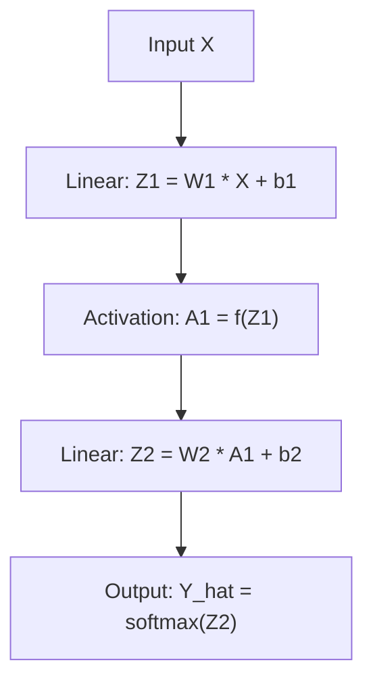
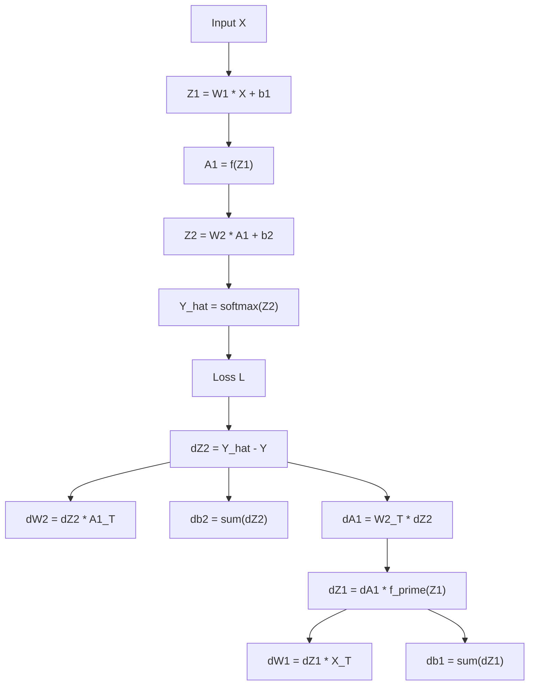

# PyTorch + Deep Learning Theory 

This document teaches all essential **theoretical + mathematical foundations** needed to understand and build neural networks **from scratch** in PyTorch.

💡 **Goal:** Understand exactly **how forward pass, backward pass, gradients, autograd, and optimizers work internally** — beyond just running code.

---

# 1️⃣ PyTorch Abstractions — How Models Are Built

## 1.1 `nn.Module` — The Core Building Block

### ✔ What It Is

`nn.Module` is the **base class** for all neural network components. You define:

* Learnable parameters (weights & biases)
* The forward computation logic

### ✔ Why It Matters

PyTorch automatically handles:

* Parameter registration (`.parameters()`)
* Device movement (CPU/GPU)
* Saving / loading with `.state_dict()`
* Nested modular architectures

---

## 1.2 Linear Layers + Activation Functions

### **`nn.Linear`**

Computes the affine transformation:

$$
\mathbf{Z} = \mathbf{W}\mathbf{X} + \mathbf{b}
$$

Where:

* $\mathbf{W}$ = weights
* $\mathbf{b}$ = bias
* $\mathbf{X}$ = input

### Activation Functions

| Activation  | Formula                               | Notes                     |
| ----------- | ------------------------------------- | ------------------------- |
| **ReLU**    | $ \max(0, x) $                        | Fast, default             |
| **Sigmoid** | $ \frac{1}{1 + e^{-x}} $              | Binary classification     |
| **Tanh**    | $ \frac{e^x - e^{-x}}{e^x + e^{-x}} $ | Zero-centered             |
| **Softmax** | $ \frac{e^{z_i}}{\sum_j e^{z_j}} $    | Multi-class probabilities |

---

## 1.3 Forward Pass Logic

A simple 2-layer ANN:

$$
Z_1 = W_1 X + b_1
$$

$$
A_1 = f(Z_1)
$$

$$
Z_2 = W_2 A_1 + b_2
$$

$$
\hat{Y} = \text{softmax}(Z_2)
$$

### 🔷 Forward Pass Diagram (GitHub-Safe Mermaid)



---

## 1.4 Loss Functions

### **MSE Loss (Regression)**

$$
\mathcal{L} = \frac{1}{N} \sum_i (Y_i - \hat{Y}_i)^2
$$

### **CrossEntropy Loss (Classification)**

$$
\mathcal{L} = -\sum_i Y_i \log(\hat{Y}_i)
$$

PyTorch's `nn.CrossEntropyLoss` = `LogSoftmax + NLLLoss`.

---

## 1.5 Optimizers — SGD & Adam

### **SGD**

$$
\theta = \theta - \eta \cdot \nabla_\theta \mathcal{L}
$$

### **Adam Optimizer**

Uses momentum + adaptive learning rates:

$$
m_t = \beta_1 m_{t-1} + (1 - \beta_1) g_t
$$

$$
v_t = \beta_2 v_{t-1} + (1 - \beta_2) g_t^2
$$

---

# 2️⃣ PyTorch Training Pipeline (Theory Only)

Training loop steps:

1. Forward pass
2. Compute loss
3. Zero old gradients
4. Backward pass (autograd)
5. Optimizer step

---

## 2.1 Understanding `.zero_grad()`, `.backward()`, `.step()`

### ✔ `optimizer.zero_grad()`

Clears old gradients (PyTorch **accumulates** gradients).

### ✔ `loss.backward()`

Autograd computes:

$$
\frac{\partial \mathcal{L}}{\partial W}, \quad
\frac{\partial \mathcal{L}}{\partial b}
$$

Stored in each parameter’s `.grad`.

### ✔ `optimizer.step()`

Updates parameters using the optimizer’s rule.

---

## 2.2 Saving & Loading Checkpoints

### Save

```python
torch.save(model.state_dict(), "model.pth")
```

### Load

```python
model.load_state_dict(torch.load("model.pth"))
model.eval()
```

---

# 3️⃣ Deep Learning Math — Build Neural Networks From Scratch

## 3.1 Structure of a 2-Layer Neural Network

$$
X \rightarrow Z^{(1)} \rightarrow A^{(1)} \rightarrow Z^{(2)} \rightarrow \hat{Y}
$$

---

## 3.2 Forward Propagation — Full Math

### Layer 1

$$
Z^{(1)} = W^{(1)}X + b^{(1)}
$$

$$
A^{(1)} = f(Z^{(1)})
$$

### Layer 2

$$
Z^{(2)} = W^{(2)}A^{(1)} + b^{(2)}
$$

### Softmax Output

$$
\hat{Y}_i = \frac{e^{Z_i^{(2)}}}{\sum_j e^{Z_j^{(2)}}}
$$

---

## 3.3 Cross-Entropy Loss

$$
\mathcal{L} = -\sum_i Y_i \log(\hat{Y}_i)
$$

---

## 3.4 Backpropagation — Every Mathematical Step

### ⭐ Step 1 — Output Layer Error

Using Softmax + CE simplification:

$$
dZ^{(2)} = \hat{Y} - Y
$$

### ⭐ Step 2 — Output Layer Gradients

$$
dW^{(2)} = dZ^{(2)} A^{(1)T}
$$

$$
db^{(2)} = dZ^{(2)}
$$

### ⭐ Step 3 — Hidden Layer Error

$$
dA^{(1)} = W^{(2)T} dZ^{(2)}
$$

$$
dZ^{(1)} = dA^{(1)} \odot f'(Z^{(1)})
$$

Activation derivatives:

* Sigmoid:
  $$ f'(z) = f(z)(1 - f(z)) $$
* ReLU:
  $$ f'(z) = \begin{cases}1, & z > 0 \ 0, & z \le 0\end{cases} $$

### ⭐ Step 4 — Hidden Layer Weight Gradients

$$
dW^{(1)} = dZ^{(1)} X^T
$$

$$
db^{(1)} = dZ^{(1)}
$$

---

### 🔷 Full Forward + Backprop Diagram (GitHub-Safe Mermaid)



---

# 3.5 Gradient Descent Update Rule

$$
W = W - \eta \cdot dW
$$

$$
b = b - \eta \cdot db
$$

Where:

* $dW$, $db$ = gradients
* $\eta$ = learning rate

This completes **one full training step.**

---