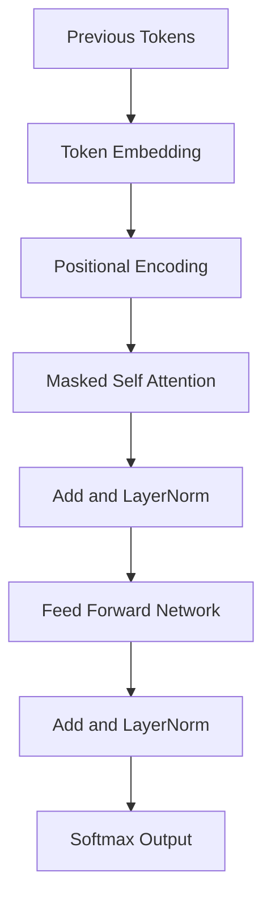

# BERT vs GPT — Complete Explanation (Theory, Architecture & Use Cases)

Modern Natural Language Processing (NLP) is dominated by **Transformer-based models**.  
Among them, **BERT** and **GPT** are the two most influential architectures.

This README provides a **clear, structured, and theoretical comparison** of:

- What is BERT?
- What is GPT?
- How they work internally
- Mathematical intuition
- Architectural differences
- When to use BERT vs GPT

---

## What Is BERT?

**BERT (Bidirectional Encoder Representations from Transformers)** is an  
**encoder-only Transformer model** designed for **language understanding**.

BERT focuses on **comprehension**, not generation.

---

## Core Idea Behind BERT

BERT reads a sentence **bidirectionally**, meaning:

- Each token attends to **all other tokens**
- Context comes from **both left and right**

Example:

```

"I went to the bank to deposit money"

````

BERT understands **bank** using the full sentence context.

---

## BERT Architecture

- Encoder-only Transformer
- No decoder
- No causal masking
- Fully bidirectional self-attention

---

## BERT Encoder Architecture Diagram

```mermaid
flowchart TB
    X[Input Tokens] --> E[Token Embedding]
    E --> P[Positional Encoding]
    P --> SA[Self Attention]
    SA --> LN1[Add and LayerNorm]
    LN1 --> FFN[Feed Forward Network]
    FFN --> LN2[Add and LayerNorm]
    LN2 --> H[Contextual Embeddings]
````

---

## BERT Mathematical Formulation

### Self-Attention

For token matrix `X`:

```
Q = XW_Q
K = XW_K
V = XW_V
```

Scaled dot-product attention:

```
Attention(Q,K,V) = softmax( (QKᵀ) / sqrt(d_k) ) V
```

* No masking
* All tokens attend to all tokens

---

## BERT Pretraining Objectives

### 1. Masked Language Modeling (MLM)

Random tokens are masked:

```
"The cat sat on the [MASK]"
```

Model predicts the masked token.

### 2. Next Sentence Prediction (NSP)

Determines whether sentence B follows sentence A.

---

## What Is GPT?

**GPT (Generative Pre-trained Transformer)** is a
**decoder-only Transformer model** designed for **text generation**.

GPT focuses on **predicting the next token**.

---

## Core Idea Behind GPT

GPT reads text **left-to-right only**.

Each token depends **only on previous tokens**.

Example:

```
"The cat sat on the"
→ GPT predicts: "mat"
```

---

## GPT Architecture

* Decoder-only Transformer
* Causal (masked) self-attention
* Autoregressive generation

---

## GPT Decoder Architecture Diagram



---

## GPT Mathematical Formulation

### Masked Self-Attention

Causal mask:

```
Mask[i][j] = 0    if j ≤ i
Mask[i][j] = -∞   if j > i
```

Attention equation:

```
Attention = softmax( (QKᵀ + Mask) / sqrt(d_k) ) V
```

This **prevents future token access**.

---

## GPT Training Objective

### Autoregressive Language Modeling

Maximize probability of next token:

```
P(x₁, x₂, ..., xₙ) = ∏ P(xᵢ | x₁,...,xᵢ₋₁)
```

---

## Key Differences: BERT vs GPT

| Feature      | BERT          | GPT                   |
| ------------ | ------------- | --------------------- |
| Architecture | Encoder-only  | Decoder-only          |
| Attention    | Bidirectional | Causal (masked)       |
| Reads Text   | Full sentence | Left-to-right         |
| Training     | MLM + NSP     | Next-token prediction |
| Output       | Embeddings    | Token probabilities   |
| Best At      | Understanding | Generation            |

---

## Use Case Comparison

### BERT Is Best For

* Text classification
* Sentiment analysis
* Question answering
* Named Entity Recognition
* Semantic search

### GPT Is Best For

* Text generation
* Chatbots
* Story writing
* Code generation
* Summarization

---

## Real-World Analogy

### BERT

> A **reader** who reads the entire paragraph before answering questions.

### GPT

> A **speaker** who predicts the next word while speaking.

---

## Summary Table

| Model | Strength           | Weakness                      |
| ----- | ------------------ | ----------------------------- |
| BERT  | Deep understanding | Cannot generate text          |
| GPT   | Fluent generation  | Limited bidirectional context |

---

## When to Use What?

### Use **BERT** if:

* You need meaning
* You need classification
* You need embeddings

### Use **GPT** if:

* You need generation
* You need creativity
* You need dialogue or code

---

## Key Takeaways

* BERT = **Understand**
* GPT = **Generate**
* Encoder = bidirectional
* Decoder = autoregressive
* Attention replaces recurrence
* Masking enforces causality

---

## Conclusion

BERT and GPT represent **two complementary philosophies** in Transformer design.

* **BERT** excels at understanding language
* **GPT** excels at generating language

Mastering both gives you full control over modern NLP systems.

Just say **next** 🚀