# Transformer Encoder and Decoder Explained  
*(With Full Theory & Mathematical Foundations)*

Transformers revolutionized Natural Language Processing (NLP) by replacing recurrence with **attention mechanisms**.  
At the heart of the Transformer architecture are two core components:

- **Encoder** — responsible for understanding input data  
- **Decoder** — responsible for generating output data  

This README provides a **complete theoretical and mathematical explanation** of:
- Transformer fundamentals
- Encoder architecture
- Decoder architecture
- Encoder vs Decoder comparison
- Real-world applications

No unrelated topics are included.

---

## What Is a Transformer?

A **Transformer** is a deep learning architecture introduced in  
**“Attention Is All You Need” (Vaswani et al., 2017)**.

Unlike RNNs or LSTMs, Transformers:
- Use **self-attention** instead of recurrence
- Process entire sequences **in parallel**
- Scale efficiently to very large datasets

A Transformer can be built using:
- Encoder blocks only
- Decoder blocks only
- Encoder + Decoder blocks together

---

## Mathematical Notation Used

- Sequence length: `n`
- Model dimension: `d_model`
- Input tokens: `x₁, x₂, ..., xₙ`
- Output tokens: `y₁, y₂, ..., yₜ`
- Embedding matrix: `E`
- Positional encoding: `P`
- Query, Key, Value dimensions: `d_k`, `d_v`

---

## Encoder: Understanding the Input

The **Encoder** processes the input sequence and generates **context-aware vector representations**.

It focuses purely on **understanding**, not generation.

Encoders are **bi-directional**, meaning each token can attend to **all other tokens** in the sequence.

---

## Encoder Workflow (Theory + Mathematics)

### 1. Input Tokenization

Example:
```

"The quick brown fox"
→ ["The", "quick", "brown", "fox"]

```

---

### 2. Token Embedding

Each token is mapped to a dense vector:

```

X = [x₁, x₂, ..., xₙ]
xᵢ ∈ ℝ^(d_model)

```

Using an embedding matrix:
```

xᵢ = E(tokenᵢ)

```

---

### 3. Positional Encoding

Transformers lack inherent order awareness, so positional encoding is added:

```

Z₀ = X + P

```

**Sinusoidal Positional Encoding**
```

PE(pos, 2i)   = sin(pos / 10000^(2i / d_model))
PE(pos, 2i+1) = cos(pos / 10000^(2i / d_model))

```

---

### 4. Self-Attention Mechanism

Linear projections:
```

Q = Z × W_Q
K = Z × W_K
V = Z × W_V

```

---

### Scaled Dot-Product Attention

```

Attention(Q, K, V) = Softmax( (Q × Kᵀ) / sqrt(d_k) ) × V

```

---

### 5. Multi-Head Attention

```

headᵢ = Attention(Qᵢ, Kᵢ, Vᵢ)
MultiHead(Q, K, V) = Concat(head₁, ..., headₕ) × W_O

```

---

### 6. Add & Layer Normalization

```

Z₁ = LayerNorm(Z₀ + MultiHead(Z₀))

```

---

### 7. Feed-Forward Neural Network (FFN)

```

FFN(x) = max(0, x × W₁ + b₁) × W₂ + b₂

```

---

### 8. Final Encoder Output

```

Z_out = LayerNorm(Z₁ + FFN(Z₁))

```

---

## Decoder: Generating the Output

The **Decoder** generates output sequences **autoregressively**, one token at a time.

---

## Decoder Workflow (Theory + Mathematics)

### 1. Input Embedding + Positional Encoding

```

Y₀ = E(y_<t) + P

```

---

### 2. Masked Self-Attention

```

Mask[i][j] = 0    if j ≤ i
Mask[i][j] = -∞   if j > i
Attention = Softmax( (Q × Kᵀ) / sqrt(d_k) + Mask ) × V

```

---

### 3. Encoder–Decoder Attention

```

Attention(Q_dec, K_enc, V_enc)

```

---

### 4. Feed-Forward Network

```

FFN(x) = max(0, x × W₁ + b₁) × W₂ + b₂

```

---

### 5. Output Projection + Softmax

```

logits = Z × W_vocab
P(token_t) = Softmax(logits)

```

---

## Encoder vs Decoder (Mathematical Comparison)

| Feature | Encoder | Decoder |
|------|--------|--------|
| Attention | Full self-attention | Masked self-attention |
| Direction | Bi-directional | Uni-directional |
| Uses Mask | No | Yes |
| Output | Embeddings | Probabilities |
| Objective | Understanding | Generation |
| Training | Parallel | Autoregressive |

---

## Encoder–Decoder Together (Seq2Seq)

```

Input → Encoder → Hidden States → Decoder → Output

```

Used in:
- Machine translation
- Summarization
- Question answering

---

## Real-World Analogy

**Live Translation Booth**

- Encoder → Listener fully understands the sentence  
- Decoder → Speaker generates translation word-by-word

---

## Applications

### Encoder-Only Models

- **BERT**  
  Uses only the encoder for contextual representations.

Use cases:
- Text classification
- Question answering

### Decoder-Only Models

- **GPT**  
  Uses only the decoder for autoregressive generation.

Use cases:
- Text generation
- Chatbots

### Encoder–Decoder Models

- **Transformer (Original)**
- **T5 (Text-to-Text Transfer Transformer)**

Use cases:
- Translation
- Summarization
- Sequence-to-sequence tasks

---

## Key Concepts to Remember

- Self-attention replaces recurrence
- Positional encoding retains order
- Masking enforces causality
- FFN adds non-linearity
- Residuals improve training
- Softmax yields probabilities

---

## References & Resources

### 🔗 Articles & Tutorials

- **Encoder vs Decoder in Transformers** – Hassaan Idrees  
  https://medium.com/@hassaanidrees7/encoder-vs-decoder-in-transformers-unpacking-the-differences-9e6ddb0ff3c5

- **Attention Is All You Need** (original paper)  
  https://arxiv.org/abs/1706.03762

---

## 📊 Transformer Architecture Diagrams (Mermaid)

GitHub supports **Mermaid diagrams**, which allow you to visualize Transformer components directly inside `README.md`.

---

## 🔹 Encoder Architecture Diagram


### Explanation

* Encoder uses **bi-directional self-attention**
* Every token attends to **all other tokens**
* Output is a **context-aware embedding per token**

---

## 🔹 Decoder Architecture Diagram


### Explanation

* Masked attention prevents **future token access**
* Encoder–Decoder attention injects **input context**
* Output is generated **token by token**

---

## 🔹 Full Transformer (Encoder–Decoder) Flow


### Explanation

* Encoder processes the full input sequence
* Decoder generates output **autoregressively**
* Used in translation, summarization, seq2seq tasks

---

## 🔹 Attention Mechanism (Inside a Layer)

```mermaid
flowchart TB
    Z[Input Embeddings] --> Q[Queries]
    Z --> K[Keys]
    Z --> V[Values]

    Q --> DOT[Q × Kᵀ]
    K --> DOT
    DOT --> SCALE[Divide by √d_k]
    SCALE --> SM[Softmax]
    SM --> WEIGHT[Attention Weights]
    WEIGHT --> VOUT[Weighted Sum with V]
```



---

## 🧠 Diagram Summary

| Diagram           | Shows                            |
| ----------------- | -------------------------------- |
| Encoder Diagram   | Understanding & context building |
| Decoder Diagram   | Autoregressive generation        |
| Full Transformer  | End-to-end seq2seq flow          |
| Attention Diagram | Core mathematical operation      |

