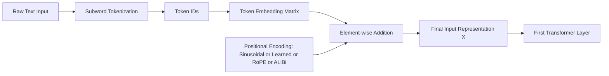

# Transformer Architecture: A Deep Dive into the Components

## PART 1: Input Representation & Encoding

## Project Overview

The Transformer architecture, introduced in the seminal paper **"Attention Is All You Need"**, revolutionized Natural Language Processing (NLP) by replacing recurrent and convolutional layers with self-attention mechanisms. Unlike sequential models, Transformers process entire sequences of data simultaneously, enabling massive parallelization and the effective capture of long-range dependencies.

This repository provides a comprehensive technical breakdown of the Transformer architecture. **Part 1: Input Representation & Encoding** focuses on the foundational stage of the model. Before the first layer of self-attention can operate, raw text must be transformed into high-dimensional numerical representations that preserve both semantic meaning and structural order. Understanding this stage is critical, as the quality of the input representation directly influences the model’s ability to learn complex linguistic patterns.

---

## Input Representation & Encoding

Computers cannot process words in their raw string form. The input representation stage serves as the bridge between human language and linear algebra. It transforms discrete tokens into continuous, dense vectors (embeddings) that the model can manipulate mathematically. This process ensures that the model understands not only **what** a word is, but also **what it means** and **where it appears** in a sentence.

---

## I. Tokenization

Tokenization is the process of breaking down a raw text string into smaller units called **tokens**. These tokens are the atomic building blocks processed by the Transformer.

### Why Tokenization Is Required

Machine learning models require numerical input. Tokenization enables a mapping from a finite vocabulary of text units to a set of unique integers (token IDs). These token IDs serve as indices for retrieving vector representations from the embedding layer.

### Subword Tokenization

Modern Transformer models primarily use subword tokenization to balance vocabulary size with the ability to represent rare or unseen words.

* **Byte Pair Encoding (BPE):** Iteratively merges the most frequent pairs of characters or character sequences into a single token. Used by models such as GPT.
* **WordPiece:** Similar to BPE, but merges tokens based on a likelihood-based objective rather than raw frequency. Used by models such as BERT.

### Key Benefits

* **Handling Rare Words:** Unseen words can be decomposed into known subunits (e.g., `unfriendly → un + friendly`), allowing the model to infer meaning.
* **Vocabulary Efficiency:** Prevents vocabulary explosion seen in word-level tokenization while retaining richer semantics than character-level tokenization.

---

## II. Token Embedding

After tokenization, each token ID is mapped to a dense, continuous vector of fixed size $d_{model}$.

### Learned Token Embeddings

The model maintains an embedding matrix in which each row corresponds to a token in the vocabulary. These embeddings are learned parameters optimized via backpropagation.

* **Mapping:** Each token ID indexes a vector of dimension $d_{model}$.
* **Semantic Structure:** During training, tokens with similar meanings or roles are positioned closer together in the high-dimensional embedding space.

### Shared (Tied) Embeddings

Many Transformer implementations use **weight tying**, where the input embedding matrix and the output projection layer (pre-softmax) share the same weights.

* **Parameter Efficiency:** Reduces the total number of trainable parameters.
* **Improved Generalization:** Encourages embeddings that are effective for both input encoding and output prediction.

### Mathematical Representation

Let the embedding matrix $E$ be defined as:

$$
E \in \mathbb{R}^{V \times d_{model}}
$$

where $V$ is the vocabulary size and $d_{model}$ is the hidden-state dimensionality.

---

## III. Positional Information

Because Transformers process tokens in parallel, they lack an inherent notion of sequence order. Without positional information, the sentences *"The cat chased the dog"* and *"The dog chased the cat"* would be indistinguishable.

### Sinusoidal Positional Encoding

The original Transformer introduces fixed sinusoidal functions to encode token positions:

$$
\begin{aligned}
PE_{(pos, 2i)} &= \sin\left(\frac{pos}{10000^{2i / d_{model}}}\right) \
PE_{(pos, 2i+1)} &= \cos\left(\frac{pos}{10000^{2i / d_{model}}}\right)
\end{aligned}
$$

### Learned Positional Embeddings

Some models (e.g., BERT) learn a unique positional embedding for each position index $0, 1, 2, \dots, N$. While simpler, this approach is constrained by a maximum sequence length fixed at training time.

### Rotary Positional Embedding (RoPE)

RoPE encodes positional information by applying a rotation to token embeddings in the complex plane.

* **Relative Position Awareness:** Naturally captures relative distances between tokens.
* **Scalability:** Particularly effective for long-context models such as LLaMA.

### ALiBi (Attention with Linear Biases)

ALiBi does not modify token embeddings directly. Instead, it adds a static, non-learned bias to attention scores based on token distance.

* **Length Extrapolation:** Demonstrates strong generalization to very long sequences.

---

## IV. Input Composition

The final input representation $X$ is formed by combining semantic token embeddings with positional information.

### Composition Formula

$$
X_i = e_i + p_i
$$

### Mechanism

* **Element-wise Addition:** Preserves the dimensionality $d_{model}$, keeping computation efficient.
* **Unified Representation:** Each vector simultaneously encodes *what* the token is and *where* it appears in the sequence.

This combined representation is then passed to the first multi-head self-attention layer.

---

## Mathematical Summary

The transformation from raw text to the first hidden state can be summarized as:

1. **Tokenization:** $\text{Input String} \rightarrow { t_1, t_2, \dots, t_n }$
2. **Embedding:** $e_i = \text{Embedding}(t_i)$
3. **Position Encoding:** $p_i = \text{PositionalEncoding}(i)$
4. **Combination:** $x_i = e_i + p_i$

---

## Architecture Diagram

