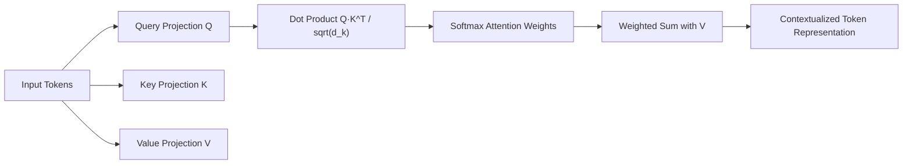

# Transformer Architecture: A Deep Dive into the Components

## PART 2: Attention Mechanism (Context Formation)

## Project Overview

If Part 1 established how data is represented, Part 2 explores the "heart" of the Transformer: the **Attention Mechanism**. In traditional sequence models, information is processed linearly, often losing context over long distances. The Attention Mechanism solves this by enabling every token in a sequence to interact with every other token simultaneously.

This section details how the model dynamically determines which parts of the input sequence are most relevant to a specific token, creating a rich, contextualized representation of the data. This follows the foundation laid in **PART 1: Input Representation & Encoding**.

---

## I. Query–Key–Value Projection

To facilitate contextual interaction, the Transformer does not use the raw input vectors directly for comparison. Instead, it projects the input $X$ into three distinct feature spaces: **Query (Q)**, **Key (K)**, and **Value (V)**.

### The Role of Q, K, and V

For any given token, these vectors serve specific functional purposes:

* **Query (Q):** "What I am looking for." Represents the current token's search criteria for context.
* **Key (K):** "What I contain." Represents the labels or attributes of other tokens in the sequence.
* **Value (V):** "What information I provide." This is the actual content that will be aggregated once a match between a Query and a Key is found.

### Mathematical Representation

These vectors are created by multiplying the input matrix $X$ by three learned weight matrices $W^Q$, $W^K$, and $W^V$:

$$
Q = X W^Q, \quad K = X W^K, \quad V = X W^V
$$

Where $W^Q, W^K \in \mathbb{R}^{d_{model} \times d_k}$ and $W^V \in \mathbb{R}^{d_{model} \times d_v}$.

---

## II. Scaled Dot-Product Attention

Once the Q, K, and V vectors are generated, the model calculates the "alignment" between tokens to determine how much focus (attention) should be placed on different parts of the sequence.

### Attention Equation

$$
\text{Attention}(Q, K, V) = \text{Softmax}\left(\frac{Q K^T}{\sqrt{d_k}}\right) V
$$

### Key Steps

1. **Dot Product ($Q K^T$):** Computes the raw similarity scores between every Query and every Key.
2. **Scaling ($\sqrt{d_k}$):** Divides the scores by the square root of the key dimension to stabilize gradients.
3. **Softmax:** Converts scaled scores into a probability distribution that sums to 1.
4. **Weighted Sum:** Applies the attention weights to the Value vectors to obtain context-aware representations.

---

## III. Attention Types

* **Self-Attention:** Tokens attend to all other tokens within the same sequence (used in Encoders).
* **Masked Self-Attention:** In Decoders, prevents tokens from attending to future tokens by masking with $-\infty$ before softmax.
* **Cross-Attention:** Queries from the Decoder attend to Keys and Values from the Encoder, focusing on relevant input sequence parts.

---

## IV. Attention Variants

* **Flash Attention:** IO-aware GPU algorithm optimizing memory access, speeding up training and inference.
* **Sparse Attention:** Tokens attend only to a subset, reducing quadratic complexity.
* **Sliding-window Attention:** Tokens attend to neighbors within a fixed window, suitable for long documents.

---

## Attention Mechanism Diagram

### Diagram Explanation

* **Alignment Scoring:** $Q K^T$ generates a square matrix of scores; each cell (i, j) represents how much Query i relates to Key j.
* **Probabilistic Mapping:** Softmax converts scores into attention weights summing to 1.
* **Contextualized Output:** Weighted combination of Value vectors; highly relevant tokens contribute more.

