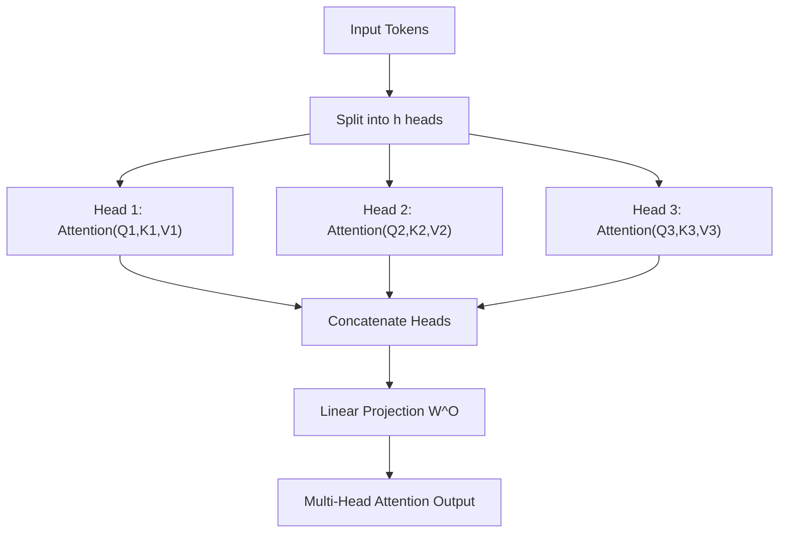

# Transformer Architecture: A Deep Dive into the Components

## PART 3: Multi-Head Attention (Representation Diversity)

## Project Overview

While a single attention mechanism allows tokens to interact, it is often limited to focusing on one type of relationship at a time. Multi-Head Attention (MHA) overcomes this by enabling the model to jointly attend to information from different representation subspaces at various positions.

Building upon **PART 2: Attention Mechanism**, this section explains how the Transformer utilizes parallelization to capture a diverse range of linguistic and structural relationships—such as syntax, semantics, and morphology—simultaneously within a single layer.

---

## I. Head Splitting

In Multi-Head Attention, the model dimension $d_{model}$ is split into $h$ parallel "heads".

### Dimensionality Reduction per Head

Each head operates on a reduced dimension $d_k$:

$$
d_k = \frac{d_{model}}{h}
$$

### Purpose of Splitting

Splitting vectors allows "representation diversity." One head may focus on syntax relationships (e.g., subject-verb), while another focuses on semantic or coreference patterns. This division enables a more holistic understanding of the sequence.

---

## II. Parallel Attention Heads

Each head performs Scaled Dot-Product Attention independently using its own weight matrices ${W_i^Q, W_i^K, W_i^V}$:

$$
\text{head}_i = \text{Attention}(Q_i, K_i, V_i)
$$

Because these computations are independent, they can be executed in parallel, improving efficiency on modern hardware.

---

## III. Head Concatenation

After all $h$ heads compute their attention outputs, these vectors are concatenated and projected back to $d_{model}$ using a learned linear layer $W^O$:

$$
\text{MultiHead}(Q, K, V) = \text{Concat}(\text{head}_1, \dots, \text{head}_h) W^O
$$

This final projection mixes information from different heads, producing a rich, multi-faceted representation.

---

## Multi-Head Attention Diagram

### Diagram Explanation

* **Diverse Contextual Attention:** Splitting the input allows the model to attend to different parts of the sequence simultaneously. For example, in "The bank of the river," one head may focus on "river" to disambiguate "bank."
* **Independent Computation:** Each head has distinct weight matrices, extracting different features.
* **Synthesis via $W^O$:** Concatenation regroups perspectives, and the final linear layer ensures the most important information is distilled into the output vector.
