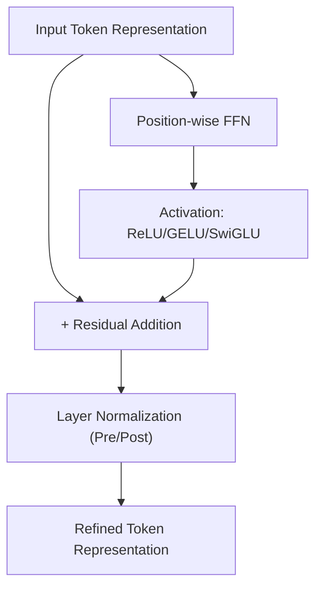

# Transformer Architecture: A Deep Dive into the Components

## PART 4: Feed-Forward & Stabilization Block

## Project Overview

While the Attention Mechanism (Parts 2 and 3) allows tokens to interact and share information, the Feed-Forward & Stabilization Block is where these interactions are processed, refined, and stabilized. This block transforms the context gathered by attention into more abstract and meaningful representations.

This stage is critical for deep Transformers, introducing non-linearities and architectural safeguards—such as Residual Connections and Layer Normalization—that allow models to scale to hundreds of layers without suffering from vanishing or exploding gradients.

---

## I. Position-wise Feed-Forward Network (FFN)

After Multi-Head Attention, each token's representation is passed through a Position-wise Feed-Forward Network. "Position-wise" indicates that the same transformation is applied independently to each token in parallel.

### Architecture

The FFN consists of two linear transformations separated by a non-linear activation, typically expanding the hidden dimension to $4 \times d_{model}$ before projecting back to $d_{model}$:

$$
FFN(x) = \text{max}(0, x W_1 + b_1) W_2 + b_2
$$

### Activation Functions

* **ReLU:** Used in the original Transformer.
* **GELU (Gaussian Error Linear Unit):** Standard in BERT and GPT; applies stochastic weighting by magnitude.
* **SwiGLU:** Combines Swish with Gated Linear Units, used in LLaMA for improved large-scale training.

---

## II. Residual Connections

Residual connections mitigate the "Degradation Problem," where deep networks lose accuracy with increasing depth. The output of a sub-layer is combined with its input:

$$
y = x + \text{Sublayer}(x)
$$

This ensures gradients can flow directly through the network, maintaining strong signal propagation even in very deep stacks.

---

## III. Layer Normalization

Layer Normalization stabilizes the distribution of activations, supporting effective training.

### Placement Variants

* **Post-LayerNorm:** $\text{LayerNorm}(x + \text{Sublayer}(x))$, used in the original Transformer.
* **Pre-LayerNorm:** $x + \text{Sublayer}(\text{LayerNorm}(x))$, standard in modern LLMs for stable training at high learning rates.

---

## Feed-Forward & Stabilization Diagram

### Diagram Explanation

* **Refining Representations:** FFN acts as a local feature extractor for each token.
* **Gradient Flow:** Residual connections preserve the original token information and provide direct gradient pathways.
* **Stability:** Layer Normalization rescales outputs to zero mean and unit variance, preventing internal covariate shift and stabilizing training.
