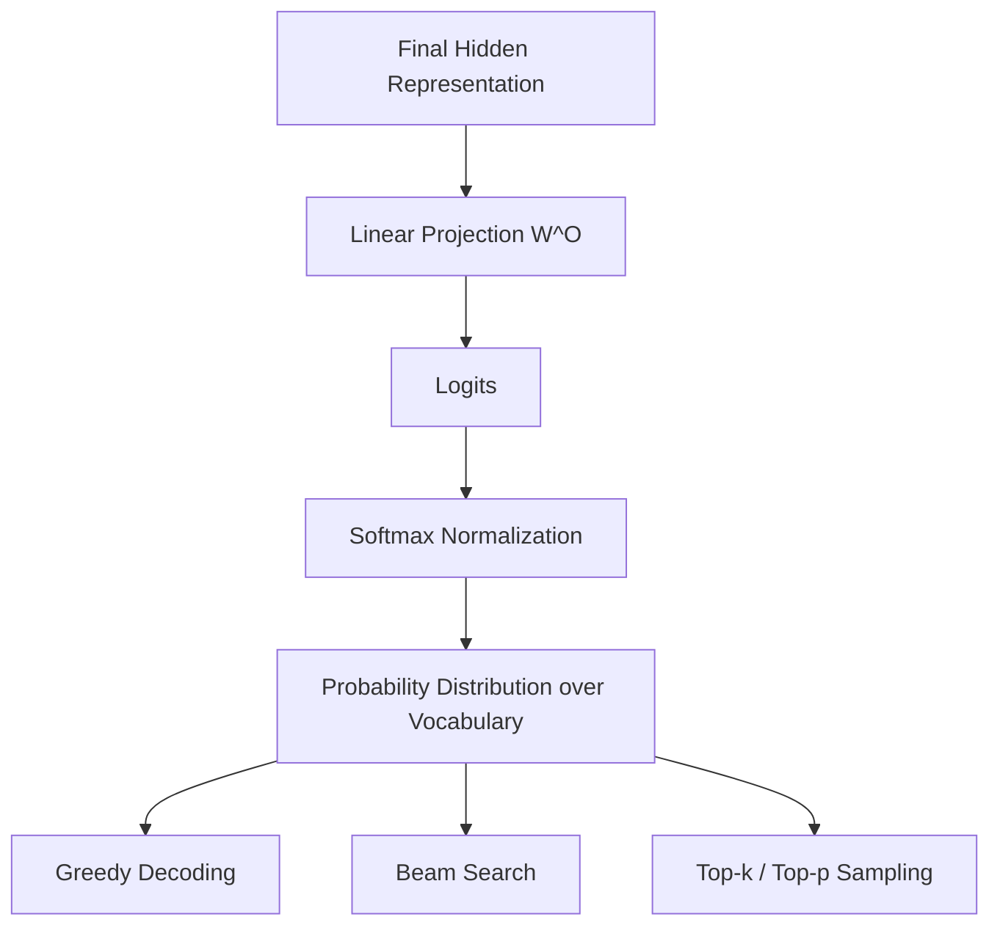

# Transformer Architecture: A Deep Dive into the Components

## PART 5: Output Layer & Prediction

## Project Overview

The **Output Layer** is the final stage of the Transformer pipeline. While preceding layers focus on context understanding and building complex internal representations, the output layer translates these high-dimensional hidden states into human-readable or task-specific predictions.

In generative tasks, this layer determines the likelihood of the next token and facilitates decoding, transforming numerical data into coherent language.

---

## I. Final Hidden Representation

The input to the output layer is the vector from the final Transformer block. Each token has undergone multiple rounds of self-attention and feed-forward processing.

* **Contextual Depth:** Rich, contextualized vectors capture both local syntax and global semantic dependencies.
* **Vector Space:** Representations are in the model's hidden dimension ($d_{model}$) and must be mapped to the discrete vocabulary space.

---

## II. Output Projection

The **Output Projection** is a linear transformation mapping $d_{model}$ vectors to vocabulary size $V$.

### Mathematical Representation

$$
\text{logits} = X W^O + b^O
$$

* **$W^O$:** Learned weight matrix of shape $(d_{model} \times V)$.
* **$b^O$:** Learned bias vector of size $V$.
* **Weight Tying:** Often shared with the input embedding matrix for parameter efficiency and regularization.

---

## III. Softmax Normalization

To convert logits into probabilities, we apply the **Softmax function**:

$$
P(y_i) = \frac{e^{\text{logit}*i}}{\sum*{j=1}^{V} e^{\text{logit}_j}}
$$

### Impact

* **Probabilistic Output:** Ensures all probabilities sum to 1.
* **Selection:** Enables ranking and sampling of vocabulary tokens based on likelihood.

---

## IV. Decoding Strategies

Token selection methods determine the style and quality of generated text:

* **Greedy Decoding:** Selects the token with the highest probability (fast but can be repetitive).
* **Beam Search:** Tracks the top-k sequences at each step to explore multiple paths.
* **Top-k / Top-p (Nucleus) Sampling:** Introduces controlled randomness for diverse generation. Top-k samples from the k most likely tokens; Top-p samples from the smallest set whose cumulative probability exceeds threshold p.

---

## Output Layer & Prediction Diagram

### Diagram Explanation

* **Dimensionality Expansion:** Linear Projection converts internal representations to vocabulary dimension ($V$).
* **Probability Mapping:** Softmax transforms logits into a valid probability distribution.
* **Generation Logic:** Decoding strategies allow tuning between deterministic (Greedy) and diverse (Sampling) outputs.
