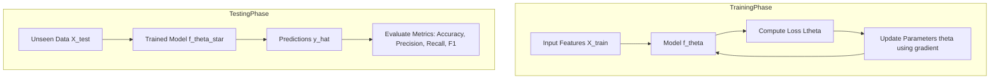

# Model Training & Evaluation 

---

## 1. Introduction

**Model training** is the conceptual process of adjusting model parameters to capture patterns and relationships present in a dataset. It involves transforming input data into a representation that allows accurate prediction of outputs.

**Model evaluation** is the process of assessing how well a trained model performs on unseen data, providing a quantitative measure of its generalization ability.

Both training and evaluation are central to machine learning because they ensure the model not only fits the observed data but also generalizes to new, unobserved instances.

The objective of this document is to present a **purely theoretical and mathematical explanation** of model training and evaluation, including concepts, equations, and visual representation.

---

## 2. Model Training (Theory)

Training a model involves learning a mapping between input features and target labels.

Let the **training dataset** be:

$$
X_{\mathrm{train}} = [x_1, x_2, \dots, x_N] \in \mathbb{R}^{N \times d}, \quad
y_{\mathrm{train}} = [y_1, y_2, \dots, y_N] \in \mathbb{R}^{N \times k}
$$

where:

* $N$ is the number of training samples
* $d$ is the number of input features
* $k$ is the dimensionality of the target output

Let the model be parameterized by:

$$
\theta = { \theta_1, \theta_2, \dots, \theta_P }
$$

The **objective function (loss function)** measures the discrepancy between predicted outputs $\hat{y}_i$ and true labels $y_i$:

$$
L(\theta) = \frac{1}{N} \sum_{i=1}^{N} \ell(\hat{y}_i, y_i), \quad \hat{y}*i = f*\theta(x_i)
$$

where $\ell(\cdot)$ is an element-wise loss function (e.g., mean squared error, cross-entropy).

The **training objective** is to find the optimal parameters:

$$
\theta^* = \arg\min_{\theta} L(\theta, X_{\mathrm{train}}, y_{\mathrm{train}})
$$

### Forward Pass

The model maps inputs to predictions:

$$
\hat{y}*i = f*\theta(x_i)
$$

### Loss Computation

Compute the discrepancy between predictions and targets:

$$
L_i = \ell(\hat{y}*i, y_i), \quad L = \frac{1}{N} \sum*{i=1}^{N} L_i
$$

### Backward Pass (Gradient Computation)

Compute gradients of the loss with respect to parameters:

$$
\nabla_\theta L(\theta) = \frac{\partial L}{\partial \theta}
$$

Update parameters using an abstract optimization rule:

$$
\theta \gets \theta - \eta \nabla_\theta L(\theta)
$$

where $\eta$ is a learning rate controlling step size.

### Convergence

Training proceeds iteratively until the loss stabilizes, indicating parameters $\theta$ have reached a (local) optimum.

---

## 3. Model Testing (Theory)

Let the **test dataset** be:

$$
X_{\mathrm{test}} = [x_1, \dots, x_M] \in \mathbb{R}^{M \times d}, \quad
y_{\mathrm{test}} = [y_1, \dots, y_M] \in \mathbb{R}^{M \times k}
$$

where $M$ is the number of test samples.

During testing:

* Model parameters $\theta^*$ are fixed
* Predictions are computed via a forward pass:

$$
\hat{y}*j = f*{\theta^*}(x_j), \quad j = 1, \dots, M
$$

Evaluation quantifies generalization on unseen data.

---

## 4. Evaluation Metrics (Theory + Mathematical Formulation)

### Confusion Matrix

For binary classification, define:

$$
\mathrm{CM} =
\begin{bmatrix}
\mathrm{TP} & \mathrm{FP} \
\mathrm{FN} & \mathrm{TN} \
\end{bmatrix}
$$

where:

* $\mathrm{TP}$ = True Positives
* $\mathrm{FP}$ = False Positives
* $\mathrm{FN}$ = False Negatives
* $\mathrm{TN}$ = True Negatives

### Metrics

* **Accuracy**:

$$
\mathrm{Accuracy} = \frac{\mathrm{TP} + \mathrm{TN}}{\mathrm{TP} + \mathrm{FP} + \mathrm{FN} + \mathrm{TN}}
$$

* **Precision**:

$$
\mathrm{Precision} = \frac{\mathrm{TP}}{\mathrm{TP} + \mathrm{FP}}
$$

* **Recall**:

$$
\mathrm{Recall} = \frac{\mathrm{TP}}{\mathrm{TP} + \mathrm{FN}}
$$

* **F1 Score**:

$$
\mathrm{F1} = 2 \cdot \frac{\mathrm{Precision} \cdot \mathrm{Recall}}{\mathrm{Precision} + \mathrm{Recall}}
$$

These metrics quantify complementary aspects of predictive performance and allow trade-off analysis between false positives and false negatives.

---

## 5. Visual Representation of Model Training & Evaluation (GitHub-Compatible)

---

## 6. Mathematical Intuition Behind Evaluation

* The **confusion matrix** provides complete classification insight by decomposing predictions into TP, FP, FN, TN.
* **Precision** measures correctness among positive predictions: $\mathrm{Precision} = \frac{\mathrm{TP}}{\mathrm{TP}+\mathrm{FP}}$
* **Recall** measures coverage of actual positives: $\mathrm{Recall} = \frac{\mathrm{TP}}{\mathrm{TP}+\mathrm{FN}}$
* **F1 Score** balances precision and recall via harmonic mean:

$$
\mathrm{F1} = 2 \cdot \frac{\mathrm{Precision} \cdot \mathrm{Recall}}{\mathrm{Precision} + \mathrm{Recall}}
$$

* Each metric highlights different aspects of model performance, allowing abstract reasoning about trade-offs.

---

## 7. Summary of Model Training & Evaluation

* **Purpose of Training**: Learn parameter set $\theta^*$ minimizing loss $L(\theta)$ on training data
* **Purpose of Testing**: Assess generalization on unseen data with fixed parameters $\theta^*$
* **Key Metrics**: Accuracy, Precision, Recall, F1 Score
* **Mathematical Recap**: Forward pass $\hat{y}=f_\theta(x)$, loss $L(\theta)$, gradient $\nabla_\theta L$, evaluation via confusion matrix

---

## 8. Conclusion

Model training and evaluation are fundamental to machine learning, providing a **mathematical framework** for parameter optimization and performance assessment. Understanding the concepts, loss functions, optimization process, and evaluation metrics in abstract and formal terms is essential for rigorous development and theoretical analysis of machine learning models.
