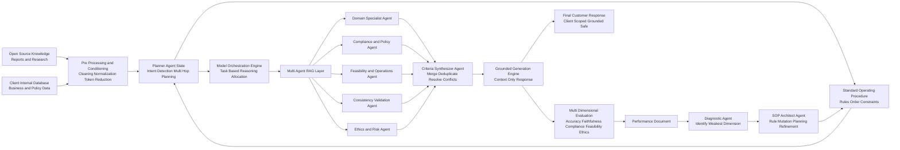

```mermaid
graph LR

%% =========================
%% DATA SOURES
%% =========================
OS[Open Source Knowledge<br/>Reports and Research]
IDB[Client Internal Database<br/>Business and Policy Data]

OS --> PP
IDB --> PP

%% =========================
%% PRE PROCESSING
%% =========================
PP[Pre Processing and Conditioning<br/>Cleaning Normalization Token Reduction]

PP --> PA

%% =========================
%% PLANNER AND SOP
%% =========================
PA[Planner Agent State<br/>Intent Detection Multi Hop Planning]

PA --> SOP
SOP[Standard Operating Procedure<br/>Rules Order Constraints]

SOP --> PA

%% =========================
%% MODEL ORCHESTRATION
%% =========================
PA --> ME[Model Orchestration Engine<br/>Task Based Reasoning Allocation]

%% =========================
%% MULTI AGENT RAG
%% =========================
ME --> RAG[Multi Agent RAG Layer]

RAG --> A1[Domain Specialist Agent]
RAG --> A2[Compliance and Policy Agent]
RAG --> A3[Feasibility and Operations Agent]
RAG --> A4[Consistency Validation Agent]
RAG --> A5[Ethics and Risk Agent]

A1 --> CS
A2 --> CS
A3 --> CS
A4 --> CS
A5 --> CS

%% =========================
%% SYNTHESIS
%% =========================
CS[Criteria Synthesizer Agent<br/>Merge Deduplicate Resolve Conflicts]

CS --> GC

%% =========================
%% GENERATION
%% =========================
GC[Grounded Generation Engine<br/>Context Only Response]

GC --> EV

%% =========================
%% EVALUATION
%% =========================
EV[Multi Dimensional Evaluation<br/>Accuracy Faithfulness Compliance Feasibility Ethics]

EV --> PDOC[Performance Document]

%% =========================
%% DIAGNOSTICS
%% =========================
PDOC --> DA[Diagnostic Agent<br/>Identify Weakest Dimension]

DA --> SOPA

%% =========================
%% SELF IMPROVEMENT
%% =========================
SOPA[SOP Architect Agent<br/>Rule Mutation Planning Refinement]

SOPA --> SOP

%% =========================
%% OUTPUT
%% =========================
GC --> OUT[Final Customer Response<br/>Client Scoped Grounded Safe]


```