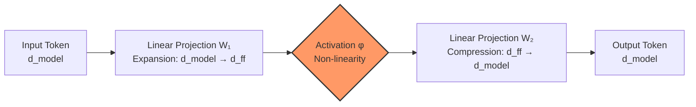

# Feed-Forward Network (FFN) in Transformers 

A deep dive into the position-wise non-linear transformations that provide Transformers with their representational power.

---

## 1. Introduction

The Transformer architecture is composed of stacked layers that jointly model contextual relationships and transform representations. While **Attention Mechanisms** enable information exchange *across* tokens, the **Feed-Forward Network (FFN)** acts as a complementary component that performs non-linear feature transformation *within* individual tokens.

---

## 2. Position in the Transformer Block

Within a standard Transformer encoder or decoder block, the FFN is a dedicated sub-layer that follows the attention mechanism.

### Architectural Roles
* **Self-Attention:** Mixes information **across tokens** in a sequence (Global).
* **FFN:** Transforms information **within each token** independently (Local).
* **Residual Connections:** Preserve original representations and stabilize gradients.
* **Layer Normalization:** Ensures numerical stability and consistent scaling.

---

## 3. Conceptual Theory

The FFN is a **position-wise fully connected neural network**. 

* **Position-wise:** The exact same FFN (sharing the same weights) is applied independently to every token in the sequence. There is no cross-talk between tokens in this stage.
* **Functional Role:** It maps representations into a higher-dimensional space to perform complex feature refinement that simple linear attention cannot achieve.

---

## 4. Mathematical Formulation

Let the input to the FFN be a matrix $X \in \mathbb{R}^{n \times d_{\text{model}}}$, where $n$ is sequence length and $d_{\text{model}}$ is the embedding dimension.

### The FFN Equation
The transformation is typically defined using two linear layers and a non-linear activation function ($\phi$):

$$\text{FFN}(x) = \phi(xW_1 + b_1)W_2 + b_2$$

**Where:**
* $W_1 \in \mathbb{R}^{d_{\text{model}} \times d_{\text{ff}}}$ (Expansion layer)
* $W_2 \in \mathbb{R}^{d_{\text{ff}} \times d_{\text{model}}}$ (Compression layer)
* $d_{\text{ff}}$ is usually significantly larger than $d_{\text{model}}$ (often $4 \times$ larger).

---

## 5. Activation Functions

Non-linearity allows the FFN to represent complex functions. Common choices include:

* **ReLU:** $\text{ReLU}(z) = \max(0, z)$
* **GELU:** $\text{GELU}(z) = z \cdot \Phi(z)$ (Used in BERT, GPT-3, etc.)

---

## 6. Visual Workflow

---

## 7. Comparison: Attention vs. FFN

| Aspect | Attention | Feed-Forward Network |
| --- | --- | --- |
| **Purpose** | Relational modeling | Feature refinement |
| **Operation Domain** | Across tokens (Horizontal) | Within each token (Vertical) |
| **Dependency** | Inter-token | Intra-token (Independent) |
| **Math Nature** | Weighted linear combinations | Non-linear mappings |

---

## 8. Expansion-Compression Principle

A single linear layer cannot increase complexity. The FFN uses a "bottleneck" style in reverse:

1. **Project Up:** Map to a high-dimensional space () to "unfold" features.
2. **Activate:** Apply non-linearity to extract complex patterns.
3. **Project Down:** Map back to  for the next Transformer layer.

---

## 9. Conclusion

The FFN is mathematically essential. By introducing non-linearity and dimensional expansion, it complements the relational focus of attention with the expressive power of deep neural networks. It is the "knowledge engine" where the model processes the context gathered by the attention layers.
