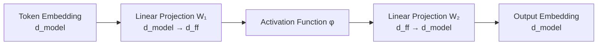

# Feed-Forward Network (FFN) in Transformers 
---

## 1. Introduction

The Transformer architecture is composed of stacked layers that jointly model contextual relationships and transform representations in high-dimensional vector spaces. Each Transformer block consists of multiple sub-layers, most notably **attention mechanisms** and **feed-forward networks (FFNs)**.

While attention mechanisms enable information exchange across tokens in a sequence, they are **not sufficient on their own** to produce expressive representations. The **Feed-Forward Network (FFN)** acts as a complementary component that performs **non-linear feature transformation** at the level of individual tokens.

The goal of this document is to present a **purely theoretical, mathematical, and architectural explanation** of the FFN in Transformers, including its role, formulation, intuition, and visualization.

---

## 2. Position of FFN in the Transformer Architecture (Theory)

Within a standard Transformer encoder or decoder block, the FFN appears as a dedicated sub-layer following an attention mechanism.

At a high level, the block structure is:

1. Attention sub-layer
2. Residual connection + normalization
3. **Feed-Forward Network sub-layer**
4. Residual connection + normalization

### Architectural Relationships

* **Self-Attention:** mixes information *across tokens* in a sequence.
* **FFN:** transforms information *within each token* independently.
* **Residual Connections:** preserve the original representation and stabilize transformations.
* **Layer Normalization:** ensures numerical stability and consistent scaling.

### Token-wise vs Sequence-wise Processing

* Attention operates **sequence-wise**, creating dependencies between tokens.
* FFN operates **token-wise**, applying the same transformation to each token independently.

Crucially, the FFN **does not mix positional information across tokens**. Each token passes through the FFN in isolation, using shared parameters.

---

## 3. What is the Feed-Forward Network in Transformers? (Conceptual Theory)

The Feed-Forward Network in Transformers is a **position-wise fully connected neural network** applied identically to every token representation.

### Why “Position-wise”?

* The same FFN is applied independently to each token position.
* There is **no interaction between different positions** inside the FFN.

### Why “Feed-Forward”?

* Information flows strictly forward through linear and non-linear transformations.
* There are no recurrent or cyclic dependencies.

### Functional Role

The FFN serves as a mechanism for:

* **Feature transformation:** mapping representations into richer feature spaces.
* **Non-linear representation learning:** enabling complex transformations beyond linear mixing.
* **Refinement of token embeddings:** after contextual information has been injected by attention.

In contrast to attention, which focuses on **relational modeling**, the FFN focuses on **representation transformation**.

---

## 4. Mathematical Formulation of the FFN

Let the input to the FFN be a matrix:

$$
X \in \mathbb{R}^{n \times d_{\text{model}}}
$$

where:

* ( n ) is the sequence length
* ( d_{\text{model}} ) is the model embedding dimension

### Standard FFN Equation

The FFN is defined as:

$$
\text{FFN}(x) = \max(0, xW_1 + b_1)W_2 + b_2
$$

More generally, using an activation function ( \phi ):

$$
\text{FFN}(x) = \phi(xW_1 + b_1)W_2 + b_2
$$

where:

* ( W_1 \in \mathbb{R}^{d_{\text{model}} \times d_{\text{ff}}} )
* ( W_2 \in \mathbb{R}^{d_{\text{ff}} \times d_{\text{model}}} )
* ( b_1 \in \mathbb{R}^{d_{\text{ff}}} )
* ( b_2 \in \mathbb{R}^{d_{\text{model}}} )

### Dimensional Transformations

* **Expansion:** ( d_{\text{model}} \rightarrow d_{\text{ff}} )
* **Compression:** ( d_{\text{ff}} \rightarrow d_{\text{model}} )

### Token-wise Application

For each token vector ( x_i \in \mathbb{R}^{d_{\text{model}}} ):

$$
y_i = \text{FFN}(x_i)
$$

This operation is identical for all tokens and does not depend on sequence length.

---

## 5. Activation Functions in FFN (Theory + Math)

### Role of Activation Functions

Activation functions introduce **non-linearity**, allowing the FFN to represent functions that cannot be expressed through linear transformations alone.

### Common Activations

#### ReLU

$$
\text{ReLU}(z) = \max(0, z)
$$

* Introduces sparsity
* Piecewise linear

#### GELU

$$
\text{GELU}(z) = z \cdot \Phi(z)
$$

where ( \Phi(z) ) is the cumulative distribution function of a standard normal distribution.

### Theoretical Motivation

* Smooth non-linearities allow gradual changes in representation space.
* Non-linear activation enables higher-order feature interactions.
* The choice of activation affects the geometry of the transformed feature space.

---

## 6. Visual Representation of FFN (GitHub-Compatible)

---

## 7. FFN as a Non-Linear Feature Transformer (Deep Theory)

From a functional perspective, the FFN acts as a **non-linear operator** applied to each token representation.

Key theoretical properties:

* Two-layer networks with non-linear activation can approximate a wide class of functions.
* The FFN enables **local complexity**, complementing the **global dependency modeling** of attention.
* Attention alone produces weighted averages, which are inherently linear operations.
* The FFN introduces the capacity to reshape and warp representations in feature space.

Thus, the FFN is essential for increasing the **expressive power** of Transformer layers.

---

## 8. Comparison: Attention vs FFN (Theoretical Perspective Only)

| Aspect              | Attention                    | Feed-Forward Network   |
| ------------------- | ---------------------------- | ---------------------- |
| Purpose             | Relation modeling            | Feature transformation |
| Operation domain    | Across tokens                | Within each token      |
| Dependency modeling | Inter-token                  | Intra-token            |
| Mathematical nature | Weighted linear combinations | Non-linear mappings    |

---

## 9. Mathematical Intuition Behind FFN Design

### Why Two Linear Layers?

A single linear transformation cannot increase representational complexity. The two-layer structure allows:

$$
\mathbb{R}^{d_{\text{model}}}
\rightarrow
\mathbb{R}^{d_{\text{ff}}}
\rightarrow
\mathbb{R}^{d_{\text{model}}}
$$

### Expansion–Compression Principle

* Expansion maps vectors into a higher-dimensional space.
* Non-linearity reshapes the space.
* Compression projects the result back into the original dimension.

This design enables richer transformations while preserving architectural consistency.

---

## 10. FFN Across Transformer Layers (Theory)

* Each Transformer layer contains its own FFN.
* FFNs across layers **do not share parameters**.
* Stacking FFNs increases model depth and compositional expressiveness.
* Each layer refines representations produced by previous layers.

Depth allows the composition of multiple non-linear transformations, increasing representational hierarchy.

---

## 11. Key Properties of Transformer FFN

* **Position-wise operation:** applied independently to each token.
* **Parameter sharing:** same weights across all positions.
* **Non-linearity introduction:** enables complex mappings.
* **Dimensional expansion:** increases expressive capacity within layers.

---

## 12. Intuition Summary

The Feed-Forward Network refines token representations by applying structured non-linear transformations after contextual information has been integrated. It operates locally on each token while contributing globally to representational richness through depth and composition.

---

## 13. Conclusion

The Feed-Forward Network is a mathematically essential component of the Transformer architecture. By introducing non-linearity, dimensional expansion, and token-wise transformation, the FFN complements attention mechanisms and enables expressive, layered representation learning. Its architectural role is fundamental to the theoretical power of Transformers.
