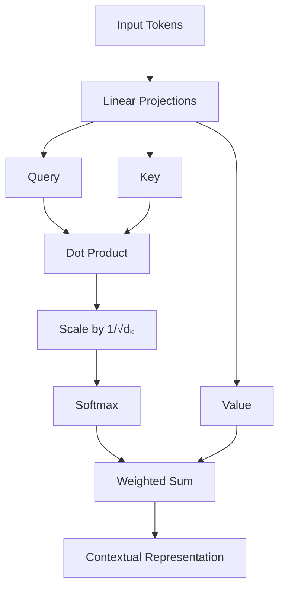

# Self-Attention vs Multi-Head Attention

A comprehensive breakdown of the fundamental building blocks of Transformer architectures.

---

## 1. Introduction

Attention mechanisms are the core components that allow Transformer models to capture relationships across sequences without the limitations of recurrence or convolution. This document explores the transition from basic **Self-Attention** to the more expressive **Multi-Head Self-Attention (MHSA)**.

---

## 2. Self-Attention: The Theoretical Core

Self-attention allows each token in a sequence to "attend" to every other token, generating a context-aware representation. Each token plays three roles:

* **Query ($Q$):** What the token is looking for.
* **Key ($K$):** What information the token offers.
* **Value ($V$):** The actual content the token holds.

### The Mechanism
1.  **Alignment:** Similarity is calculated between a token's Query and all other tokens' Keys.
2.  **Distribution:** Scores are normalized into weights.
3.  **Aggregation:** Values are summed based on these weights to produce the final output.

---

## 3. Mathematical Formulation

Given an input matrix $X \in \mathbb{R}^{n \times d_{\text{model}}}$, where $n$ is sequence length and $d_{\text{model}}$ is embedding dimension:

### Linear Projections
$$Q = XW_Q, \quad K = XW_K, \quad V = XW_V$$
Where $W_Q, W_K \in \mathbb{R}^{d_{\text{model}} \times d_k}$ and $W_V \in \mathbb{R}^{d_{\text{model}} \times d_v}$.

### Scaled Dot-Product Attention
$$\text{Attention}(Q, K, V) = \text{softmax}\left(\frac{QK^\top}{\sqrt{d_k}}\right)V$$

* **$QK^\top$**: Computes raw similarity scores.
* **$\sqrt{d_k}$**: A scaling factor to prevent gradient vanishing during softmax.
* **$\text{softmax}$**: Converts scores to probabilities (summing to 1).

---

## 4. Visual Workflow

---

## 5. From Single-Head to Multi-Head

**Single-Head Attention** has a significant bottleneck: it can only focus on one "type" of relationship at a time (e.g., just syntax or just semantics).

**Multi-Head Attention** overcomes this by:

* Projecting inputs into **multiple subspaces**.
* Running attention mechanisms in **parallel**.
* Allowing the model to attend to information from different representation subspaces simultaneously.

---

## 6. Multi-Head Mathematical Formulation

For  heads, where :

### 1. Parallel Attention

### 2. Concatenation & Projection

Where  is the final linear layer that integrates information from all heads.

---

## 7. Comparison Summary

| Feature | Self-Attention (Single-Head) | Multi-Head Attention |
| --- | --- | --- |
| **Perspective** | Single global view | Multiple parallel views |
| **Complexity** | Lower | Higher (Parallelized) |
| **Expressiveness** | Limited to one subspace | Captures diverse dependencies |
| **Output** | Single attention matrix | Concatenated head outputs |

---

## 8. Intuition Summary

> **The Analogy:** If Self-Attention is like a person looking at a painting through a single magnifying glass, Multi-Head Attention is like a team of experts looking at the same painting—one focusing on color, one on brushstrokes, and another on historical context—then combining their notes.

---

### How to use this documentation

* **For Implementation:** See the `src/` directory for PyTorch/TensorFlow modules.
* **For Math:** Refer to Section 3 and 6 for dimensionality checks.
