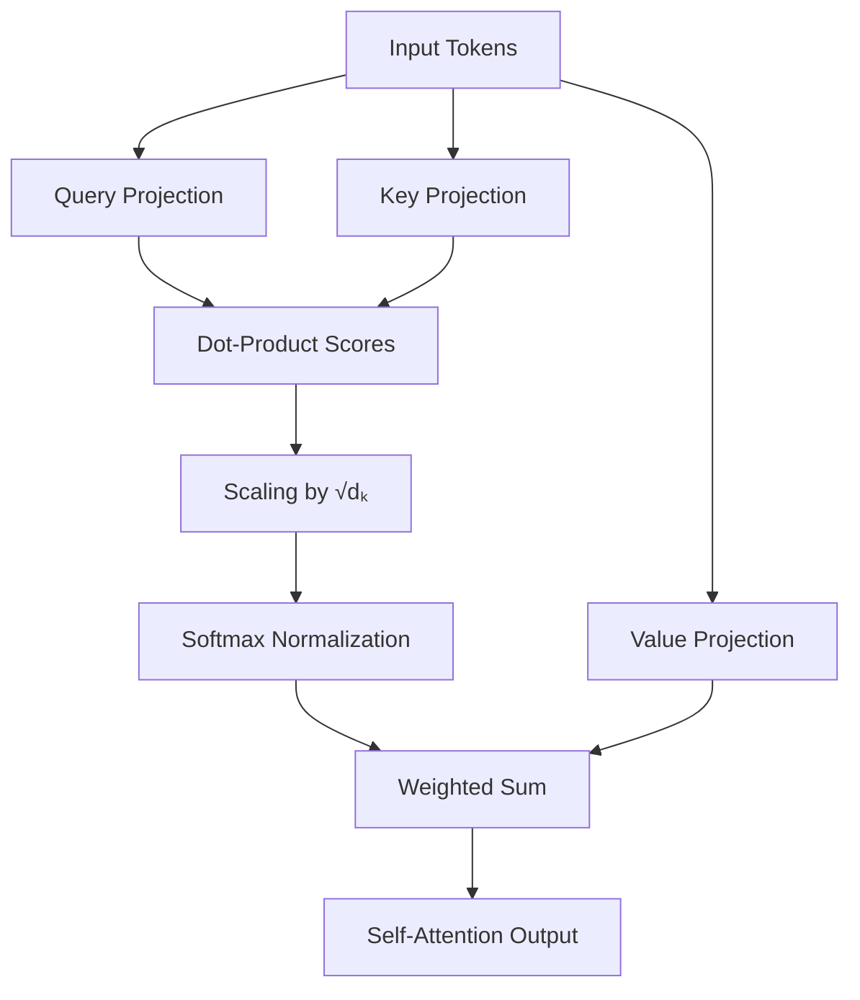
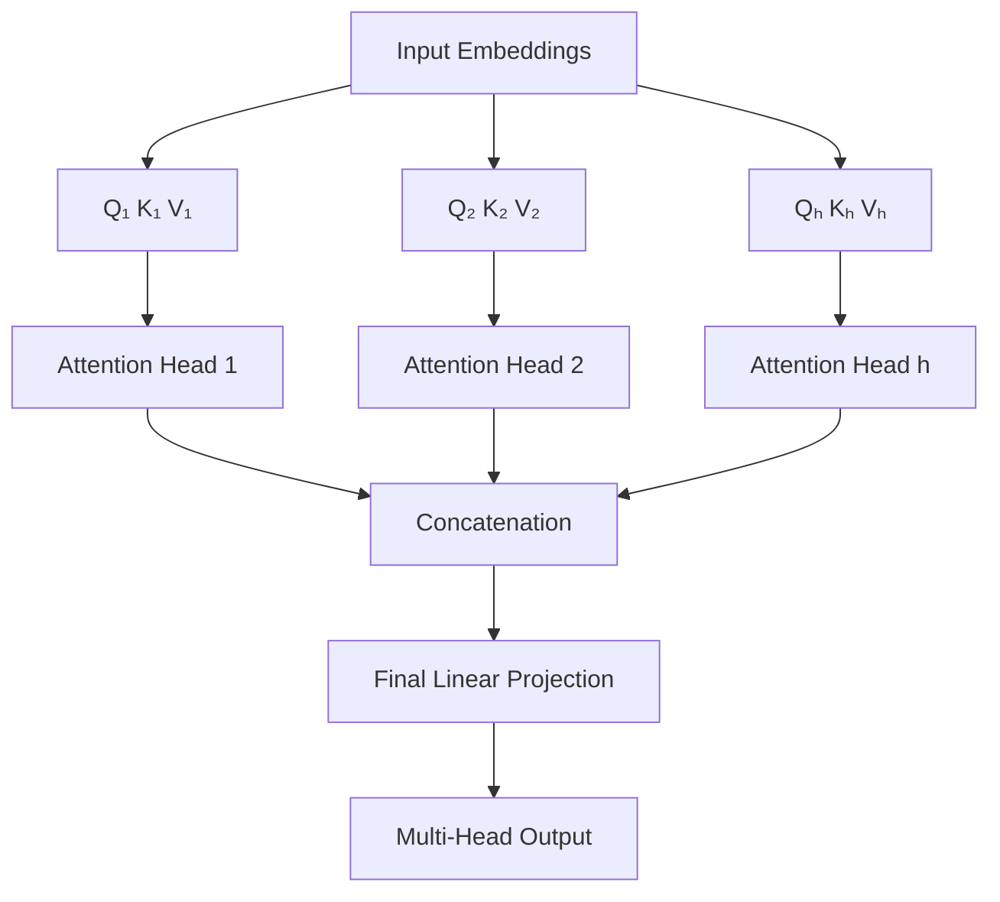

# Self-Attention vs Multi-Head Self-Attention in Transformers

---

## 1. Introduction

Attention mechanisms are the fundamental building blocks that enable Transformer architectures to model relationships within sequences. Unlike recurrence or convolution, attention allows each element of a sequence to directly interact with every other element, regardless of distance.

Within Transformers, **Self-Attention** and **Multi-Head Self-Attention** are the core mechanisms responsible for constructing contextualized representations. This document provides a **purely theoretical, mathematical, and visual explanation** of these two concepts, with the goal of clarifying their structure, limitations, and expressive power.

---

## 2. What is Self-Attention? (Theory)

Self-attention is a mechanism that allows each token in a sequence to compute a representation of itself by **attending to all other tokens in the same sequence**, including itself.

Conceptually:

* Each token asks: *Which other tokens are relevant to me, and by how much?*
* The answer is used to form a new, context-aware representation.

Three abstract roles define this interaction:

* **Query (Q):** represents what a token is seeking.
* **Key (K):** represents what a token offers.
* **Value (V):** represents the information carried by a token.

For a given token:

* Its **query** is compared with the **keys** of all tokens.
* The resulting relevance scores determine how strongly the token aggregates the corresponding **values**.
* The final output is a **weighted combination of values**, producing a contextual representation.

Self-attention therefore transforms independent token embeddings into representations that encode **global contextual dependencies**.

---

## 3. Mathematical Formulation of Self-Attention

Let the input sequence be represented as a matrix:

$$
X \in \mathbb{R}^{n \times d_{\text{model}}}
$$

where:

* ( n ) is the sequence length
* ( d_{\text{model}} ) is the embedding dimension

### Linear Projections

Three learned linear transformations project the input into query, key, and value spaces:

$$
Q = XW_Q,\quad K = XW_K,\quad V = XW_V
$$

where:

* ( W_Q, W_K \in \mathbb{R}^{d_{\text{model}} \times d_k} )
* ( W_V \in \mathbb{R}^{d_{\text{model}} \times d_v} )

### Scaled Dot-Product Attention

The self-attention operation is defined as:

$$
\text{Attention}(Q, K, V)
= \text{softmax}\left(\frac{QK^\top}{\sqrt{d_k}}\right)V
$$

**Explanation of components:**

* **Dot product ( QK^\top ):** measures similarity between queries and keys.
* **Scaling factor ( \sqrt{d_k} ):** prevents dot products from becoming excessively large.
* **Softmax:** normalizes scores into an attention distribution.
* **Weighted sum with ( V ):** aggregates information according to relevance.

### Output Dimensionality

The output has shape:

$$
\mathbb{R}^{n \times d_v}
$$

Each token is now represented by a context-aware vector derived from the entire sequence.

---

## 4. Visual Representation of Self-Attention (GitHub-Compatible)

---

## 5. Limitations of Single-Head Self-Attention

Single-head self-attention computes **one attention distribution** per token, which leads to theoretical limitations:

* **Single representation subspace:** all relationships are modeled within one projected space.
* **Limited expressiveness:** different dependency types must share the same attention distribution.
* **Entangled interactions:** distinct relational structures cannot be isolated simultaneously.

These limitations motivate extending attention beyond a single head.

---

## 6. What is Multi-Head Self-Attention? (Theory)

Multi-head self-attention generalizes self-attention by running **multiple attention mechanisms in parallel**.

Key conceptual ideas:

* The embedding space is divided into multiple lower-dimensional subspaces.
* Each subspace has its own independent attention mechanism (head).
* Each head attends to the sequence differently, capturing distinct relational structures.
* Outputs from all heads are combined to form a richer representation.

Instead of a single perspective, the model observes the sequence through **multiple representational lenses simultaneously**.

---

## 7. Mathematical Formulation of Multi-Head Self-Attention

Let:

* ( h ) be the number of attention heads
* ( d_k = d_v = \frac{d_{\text{model}}}{h} )

### Per-Head Projections

For each head ( i \in {1, \dots, h} ):

$$
Q_i = XW_Q^{(i)},\quad
K_i = XW_K^{(i)},\quad
V_i = XW_V^{(i)}
$$

where:

* ( W_Q^{(i)}, W_K^{(i)}, W_V^{(i)} \in \mathbb{R}^{d_{\text{model}} \times d_k} )

### Per-Head Attention

$$
\text{head}_i = \text{Attention}(Q_i, K_i, V_i)
$$

Each head independently computes scaled dot-product attention.

### Concatenation and Output Projection

The heads are concatenated:

$$
\text{Concat}(\text{head}_1, \dots, \text{head}_h)
\in \mathbb{R}^{n \times (h \cdot d_v)}
$$

A final linear projection combines them:

$$
\text{MultiHead}(X)
= \text{Concat}(\text{head}_1, \dots, \text{head}_h) W_O
$$

where:

* ( W_O \in \mathbb{R}^{(h \cdot d_v) \times d_{\text{model}}} )

Dimensional consistency ensures the output matches the original embedding size.

---

## 8. Visual Representation of Multi-Head Self-Attention (GitHub-Compatible)

---

## 9. Key Differences: Self-Attention vs Multi-Head Self-Attention

| Aspect                  | Self-Attention    | Multi-Head Self-Attention            |
| ----------------------- | ----------------- | ------------------------------------ |
| Number of mechanisms    | Single            | Multiple (parallel)                  |
| Representation space    | One subspace      | Multiple subspaces                   |
| Attention distributions | One per token     | One per head per token               |
| Mathematical structure  | Single projection | Parallel projections + concatenation |
| Expressiveness          | Limited           | Significantly richer                 |

---

## 10. Intuition Summary

Self-attention provides a **single global viewpoint** for modeling relationships within a sequence. Multi-head self-attention extends this idea by enabling **multiple simultaneous viewpoints**, each focusing on different relational patterns. The result is a more structured and nuanced representation of sequence relationships.

---

## 11. Mathematical Intuition Summary

From a linear algebra perspective:

* Self-attention operates in a single projected vector subspace.
* Multi-head attention projects the same input into **multiple independent subspaces**.
* Parallel attention allows the model to represent more complex functions through composition.
* Concatenation followed by projection re-integrates these subspaces into a unified representation.

This parallelism increases representational capacity without altering sequence length.

---

## 12. Conclusion

Self-attention establishes the theoretical foundation of Transformer models by enabling global contextual interaction. Multi-head self-attention generalizes this mechanism, overcoming single-head limitations through parallel subspace projections. The distinction between the two is fundamentally **mathematical and representational**, making multi-head self-attention a strictly more expressive abstraction within Transformer architectures.
