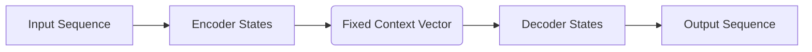
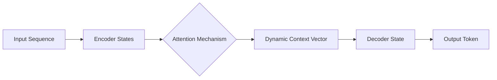

# Understanding the Seq2Seq Model

A comprehensive theoretical and mathematical breakdown of Sequence-to-Sequence models, covering the transition from fixed-length context to dynamic attention.

---

## 1. Introduction

The **Sequence-to-Sequence (Seq2Seq)** modeling paradigm addresses the problem of transforming one sequence into another, where both input and output are ordered collections with potentially different lengths.

This architecture serves as the **conceptual and mathematical precursor** to Transformer architectures, establishing the groundwork for conditional sequence modeling.

---

## 2. Formal Definition

Let the input sequence be  and the output sequence be .

The Seq2Seq problem is defined as learning the conditional distribution:

### Key Characteristics:

* **Variable-Length:** Handles cases where .
* **Autoregressive Generation:** Each output element depends on all previous outputs and the entire input sequence.

---

## 3. Architecture Overview

The Seq2Seq architecture decomposes the problem into two conceptual components:

1. **Encoder:** Processes the input sequence into a latent representation.
2. **Decoder:** Generates the output sequence conditioned on that representation.

---

## 4. The Encoder Network

The encoder is a **sequence processor** that iteratively updates an internal state to summarize the input sequence.

### Mathematical Formulation

Let  denote the encoder hidden state at time step :

The final encoder representation (context vector) is typically:

where  is a fixed-dimensional summary of the entire input.

---

## 5. The Decoder Network

The decoder is a **conditional sequence generator** that produces the output sequence one element at a time.

### Mathematical Formulation

The decoder hidden state  is updated via:

The probability of the next output token is:

---

## 6. The Information Bottleneck

Standard Seq2Seq relies on a **fixed-length context vector** ().

> [!IMPORTANT]
> This creates a bottleneck: all input information must be compressed into a single vector of size . As sequence length increases, representational fidelity typically degrades.

---

## 7. Seq2Seq with Attention

Attention allows the decoder to "look back" at all encoder hidden states selectively, creating a **dynamic context vector** for every decoding step.

### Attention Math

1. **Alignment Scores:** 
2. **Weights:** 
3. **Context Vector:** 

---

## 8. Visual Representations

### Standard Seq2Seq

### Seq2Seq with Attention

---

## 9. Limitations & Evolution

| Limitation | Theoretical Impact |
| --- | --- |
| **Sequential Constraints** | Computation depth grows linearly with sequence length (). |
| **Long-Range Decay** | Recurrent steps weaken information gradients over time. |
| **Bottleneck** | Fixed dimensionality limits capacity for complex sequences. |

**The Bridge to Transformers:** Transformers generalize attention by making it the primary operation and removing recurrence entirely, allowing for  path lengths between any two tokens.

---

## 10. Conclusion

The Seq2Seq architecture establishes a rigorous mathematical and architectural framework for sequence-to-sequence modeling. Through encoder–decoder decomposition, autoregressive probability modeling, and attention-based context computation, Seq2Seq models lay the theoretical groundwork for modern sequence architectures. A deep understanding of these principles is a prerequisite for fully comprehending Transformer-based models.

