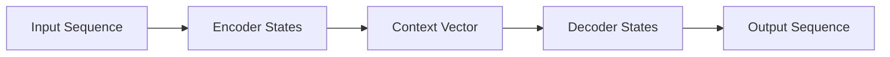
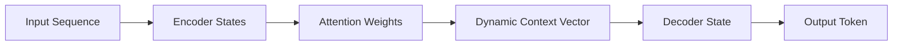

# Understanding the Seq2Seq Model 

---

## 1. Introduction

The **Sequence-to-Sequence (Seq2Seq)** modeling paradigm addresses the problem of transforming one sequence into another, where both the input and output are ordered collections of elements with potentially different lengths. This formulation arises whenever structured sequential dependencies must be preserved while mapping between domains.

Sequence mapping is inherently non-trivial because:

* Input and output sequences may differ in length
* Dependencies exist both within and across sequences
* Outputs must be generated conditionally and sequentially

The Seq2Seq architecture provides a **foundational framework** for conditional sequence modeling and serves as a conceptual and mathematical precursor to Transformer architectures.
The objective of this document is to present a **purely theoretical, mathematical, and architectural understanding** of Seq2Seq models, establishing the groundwork necessary for understanding Transformers.

---

## 2. Formal Definition of the Seq2Seq Problem

Let the input sequence be:

$$
X = (x_1, x_2, \dots, x_n)
$$

and the output sequence be:

$$
Y = (y_1, y_2, \dots, y_m)
$$

where:

* ( n ) and ( m ) may differ
* ( x_i \in \mathcal{X} ), ( y_j \in \mathcal{Y} )

The Seq2Seq problem is defined as learning the conditional distribution:

$$
P(Y \mid X)
$$

### Variable-Length Sequences

* The model must handle arbitrary input and output lengths
* There is no fixed alignment between elements of ( X ) and ( Y )

### Autoregressive Generation

The output sequence is factorized autoregressively as:

$$
P(Y \mid X) = \prod_{t=1}^{m} P(y_t \mid y_{<t}, X)
$$

Each output element depends on:

* All previous outputs
* The entire input sequence

---

## 3. High-Level Seq2Seq Architecture (Theory)

The Seq2Seq architecture decomposes the problem into two conceptual components:

* **Encoder**
* **Decoder**

### Encoder–Decoder Decomposition

* The **encoder** processes the input sequence and produces an internal representation
* The **decoder** generates the output sequence conditioned on this representation

### Information Flow

$$
X ;\longrightarrow; \text{Encoder} ;\longrightarrow; \text{Latent Representation} ;\longrightarrow; \text{Decoder} ;\longrightarrow; Y
$$

### Latent Space Compression

The encoder compresses the entire input sequence into a **latent representation**, which acts as the sole information channel between the encoder and the decoder.

---

## 4. Encoder Network (Theory)

The encoder is a **sequence processor** that iteratively consumes input elements and updates an internal state.

Key conceptual properties:

* Processes inputs in a defined order
* Maintains a hidden state that evolves over time
* Accumulates contextual information from the entire input prefix

The encoder’s role is to construct a representation that summarizes the input sequence in a form usable by the decoder.

---

## 5. Mathematical Formulation of the Encoder

Let ( h_t ) denote the encoder hidden state at time step ( t ).

$$
h_t = f(x_t, h_{t-1})
$$

where:

* ( f(\cdot) ) is a parameterized state transition function
* ( h_t \in \mathbb{R}^{d_h} )

### Recurrence (Abstract View)

* Each hidden state depends on the current input and the previous state
* Information is propagated sequentially through time

### Encoder Representation

The final encoder representation is often defined as:

$$
c = h_n
$$

where ( c \in \mathbb{R}^{d_h} ) is a fixed-dimensional context vector summarizing the entire input.

---

## 6. Decoder Network (Theory)

The decoder is a **conditional sequence generator** that produces the output sequence one element at a time.

Key properties:

* Generation is sequential and ordered
* Each output depends on prior outputs and encoder-provided context
* Temporal dependencies are explicitly modeled

The decoder transforms latent information into a structured output sequence.

---

## 7. Mathematical Formulation of the Decoder

Let ( s_t ) denote the decoder hidden state at time step ( t ).

$$
s_t = g(y_{t-1}, s_{t-1}, c)
$$

where:

* ( g(\cdot) ) is a state transition function
* ( c ) is the encoder context vector

### Output Distribution

The probability of the next output token is defined as:

$$
P(y_t \mid y_{<t}, X) = \text{softmax}(W s_t + b)
$$

The softmax function maps decoder states to a normalized probability distribution over the output space.

---

## 8. Encoder–Decoder Information Bottleneck (Theory)

The standard Seq2Seq architecture relies on a **fixed-length context vector** ( c ).

### Bottleneck Characteristics

* All input information must be compressed into a single vector
* Compression capacity is limited by dimensionality
* Long or complex sequences strain representational fidelity

This creates an information bottleneck:

$$
X ;\longrightarrow; c ;\longrightarrow; Y
$$

where:

$$
c \in \mathbb{R}^{d_c}
$$

---

## 9. Introduction to Attention in Seq2Seq (Conceptual Bridge)

Attention was introduced to address the limitations of fixed-length context representations.

Conceptually, attention:

* Computes **dynamic context vectors** at each decoding step
* Allows selective access to encoder hidden states
* Replaces static compression with adaptive information retrieval

Attention redefines how encoder information is consumed by the decoder.

---

## 10. Mathematical Formulation of Attention in Seq2Seq

Let ( h_1, h_2, \dots, h_n ) denote encoder hidden states.

### Attention Scores

$$
e_{t,i} = \text{score}(s_t, h_i)
$$

### Alignment Weights

$$
\alpha_{t,i} = \frac{\exp(e_{t,i})}{\sum_{j=1}^{n} \exp(e_{t,j})}
$$

### Context Vector

$$
c_t = \sum_{i=1}^{n} \alpha_{t,i} h_i
$$

### Differentiability

* All operations are differentiable
* Gradients propagate through attention weights and encoder states

---

## 11. Visual Representation of Seq2Seq Architecture (GitHub-Compatible)

---

## 12. Visual Representation of Seq2Seq with Attention

---

## 13. Mathematical Intuition Behind Seq2Seq Models

Seq2Seq models rely on conditional probability decomposition:

$$
P(Y \mid X) = \prod_{t=1}^{m} P(y_t \mid y_{<t}, X)
$$

This autoregressive factorization:

* Enables structured dependency modeling
* Decomposes complex joint distributions into simpler conditionals
* Introduces dependency chains proportional to sequence length

Expressiveness emerges through the composition of these conditional distributions.

---

## 14. Limitations of Seq2Seq Models (Theoretical)

### Sequential Computation Constraints

* Encoder and decoder operate sequentially
* Computational depth grows linearly with sequence length

### Long-Range Dependency Degradation

* Information must traverse many recurrent steps
* Representations may weaken or compress excessively

### Information Bottleneck

* Fixed-dimensional context limits representational capacity
* Attention mitigates but does not remove sequential dependence

---

## 15. Conceptual Bridge to Transformers

Transformers generalize the attention mechanism by:

* Making attention the primary modeling operation
* Removing explicit recurrence
* Allowing direct interaction between all sequence elements

Seq2Seq models therefore serve as the **conceptual and mathematical foundation** for Transformer architectures.

---

## 16. Key Takeaways

* Seq2Seq formalizes conditional sequence modeling
* Encoder–decoder decomposition structures information flow
* Autoregressive factorization governs output generation
* Attention addresses fixed-length representation limits
* Mastery of Seq2Seq theory is essential before Transformers

---

## 17. Conclusion

The Seq2Seq architecture establishes a rigorous mathematical and architectural framework for sequence-to-sequence modeling. Through encoder–decoder decomposition, autoregressive probability modeling, and attention-based context computation, Seq2Seq models lay the theoretical groundwork for modern sequence architectures. A deep understanding of these principles is a prerequisite for fully comprehending Transformer-based models.
