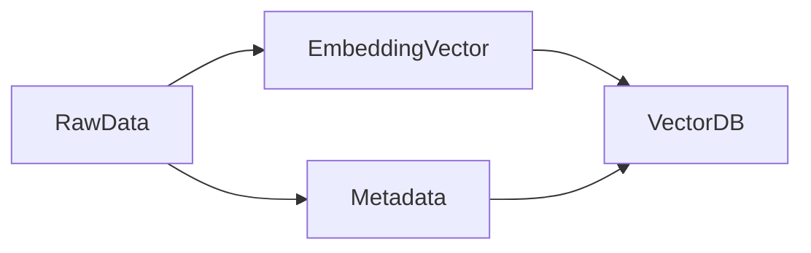
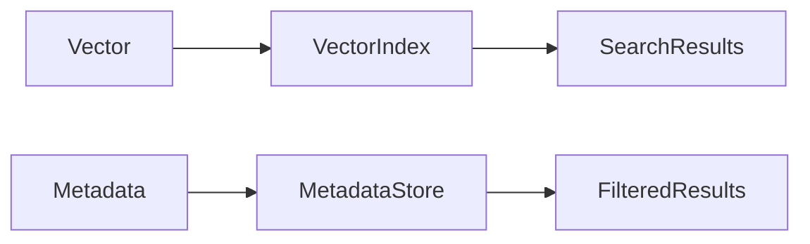
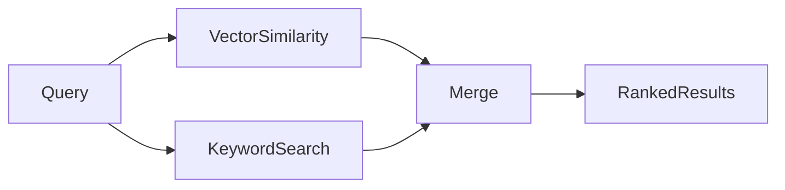

# **Metadata – Context & Filtering Layer in Vector Databases**

While vector embeddings capture semantic meaning, **metadata adds structure, context, and control** to retrieval. In real-world AI systems, vectors alone are often insufficient because enterprise, regulatory, and personalization constraints require **deterministic filtering**.

Metadata provides the **control layer** that allows vector databases and RAG pipelines to enforce rules, apply filters, and deliver precise, compliant, and contextually relevant results.

---

## 4. Metadata (Context & Filtering Layer)

Metadata represents **non-vector, descriptive information** associated with each vector. It complements semantic similarity by acting as a **filtering and selection mechanism**.

Key points:

* Metadata is **discrete**, while embeddings are continuous
* Enables deterministic, rule-based filtering
* Allows semantic retrieval to be constrained by business logic, time, ownership, or compliance rules

---

## 4.1 What Is Metadata

Metadata includes:

* Unique IDs
* Tags or categories
* Timestamps
* Ownership or tenant information
* Other structured attributes

Conceptually:

* Embeddings capture **“what this is”**
* Metadata captures **“who, when, where, and how”**

By combining both, systems achieve **semantic relevance with operational control**.

---

## 4.2 Metadata Storage

Metadata can be stored in two ways:

### Stored Alongside Vectors

* Embedded with the vector in the same database
* Enables **fast, tightly-coupled filtering**
* Simplifies query execution

### External Metadata Stores

* Maintains vectors and metadata separately
* Offers **scalability and modularity**
* Supports enterprise architectures with complex pipelines

Trade-offs to consider:

* Performance vs. flexibility
* Consistency requirements
* System complexity

---

## 4.3 Filtering Types

Filtering controls which vectors are considered during retrieval.

### Pre-Filtering

* Applies metadata constraints **before vector search**
* Reduces candidate vectors (N)
* Improves performance and precision

### Post-Filtering

* Applies filters **after similarity computation**
* Preserves recall
* May increase computational cost

Mathematically:

* Pre-filtered candidates: ( N_{\text{filtered}} \ll N_{\text{total}} )
* Post-filtering preserves ( N_{\text{total}} ) but incurs additional computation

---

## 4.4 Hybrid Search

Hybrid search combines **semantic similarity** with **symbolic or structured constraints** to achieve both meaning-based and rule-based retrieval.

### Vector + Keyword Search

* Combines embeddings with exact term matches
* Handles edge cases like proper nouns or technical terminology

### Vector + Structured Filters

* Applies deterministic rules (tags, timestamps, ownership)
* Ensures compliance, relevance, and operational constraints

Hybrid search is essential for enterprise-grade RAG systems.

---

## 4.5 Use Cases

Metadata enables real-world, context-aware retrieval.

### User-Based Filtering

* Multi-tenant isolation
* Personalized recommendations

### Time-Based Filtering

* Freshness and temporal relevance
* Time-windowed searches

### Access Control

* Enforces authorization rules
* Ensures compliance with security policies

---

## Final Summary

Metadata is the **control plane of vector databases**. It enables:

* Deterministic filtering
* Hybrid search combining semantic meaning with business rules
* Precision, security, and compliance in RAG pipelines

While embeddings determine **what is similar**, metadata determines **what is allowed or relevant**, making it essential for scalable, production-grade AI systems.

---

## Writing Style & Audience

This README is intended for:

* Students learning vector databases and RAG
* AI engineers designing production systems
* Interview preparation and system design
* Open-source contributors and researchers

It is clear, structured, professional, and functions as a **mini textbook chapter** on metadata in vector databases.

