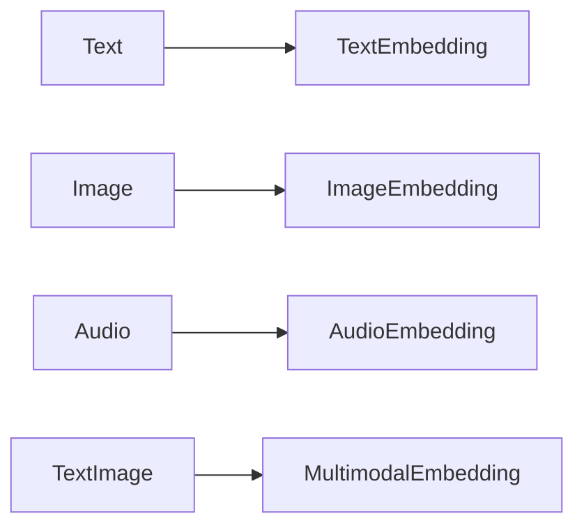
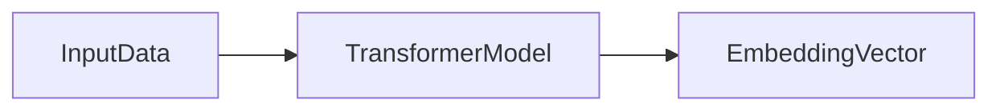
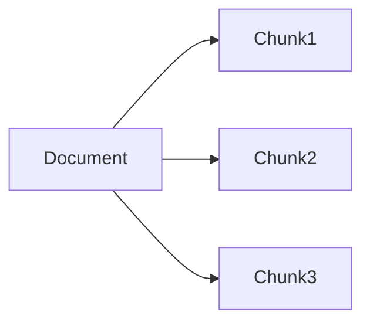
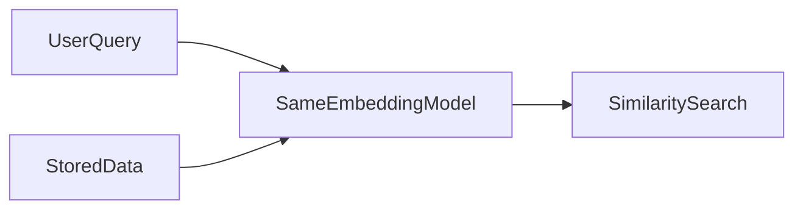

# **Embeddings – Foundation of Vector Databases**

Embeddings are the fundamental building block behind modern AI systems that operate on meaning rather than keywords. They enable machines to represent unstructured data—such as text, images, and audio—in a mathematical form that can be compared, searched, and reasoned about.

Nearly every contemporary intelligent system relies on embeddings at its core, including:

* Vector Databases
* Semantic Search Engines
* Recommendation Systems
* Retrieval-Augmented Generation (RAG) pipelines

By converting symbolic inputs (words, pixels, sounds) into numerical vectors, embeddings allow AI systems to move from **human language and perception** to **mathematical meaning**, enabling scalable and accurate understanding.

---

## 1. Embeddings (Foundation of Vector Databases)

Machines do not inherently understand language, images, or sound. Raw data is symbolic and ambiguous, while machine learning systems operate on numbers and geometry. Embeddings bridge this gap.

Conceptually, embeddings transform raw data into points in a high-dimensional vector space where **meaning is represented by position**. In this space:

* Similar concepts are located close to each other
* Dissimilar concepts are far apart
* Relationships are encoded through distance and direction

This geometric representation is powerful because it allows models to reason using **mathematical similarity** rather than brittle keyword matching. Instead of asking “Do these words match?”, systems ask “How close are these meanings in space?”

---

## 1.1 What Are Embeddings

Embeddings are dense numerical vector representations of data that capture semantic meaning. Each embedding is a point in an *n-dimensional continuous space* designed so that semantic relationships are preserved geometrically.

Why embeddings are necessary:

* Machine learning models operate on numbers, not symbols
* Text, images, and audio are unstructured and ambiguous
* Numerical vectors allow similarity, clustering, and retrieval using math

Unstructured data is transformed into vectors such that semantically similar inputs map to nearby points in space.

### Mathematical Intuition

An embedding can be represented as a vector:

**v ∈ ℝⁿ**

where:

* *n* is the embedding dimension
* Each dimension captures latent semantic features learned by the model

Semantic similarity is often measured using **cosine similarity**:

[
\cos(\theta) = \frac{A \cdot B}{||A|| , ||B||}
]

Intuitively, cosine similarity measures the **angle between vectors**, not their magnitude. Two vectors pointing in the same direction represent similar meaning, regardless of length. This makes cosine similarity robust for comparing semantic content.

---

## 1.2 Types of Embeddings

Different modalities require different embedding strategies, but the underlying principle remains the same: represent meaning numerically.

### Text Embeddings

Text embeddings encode sentences, paragraphs, or documents into vectors that capture semantic meaning. They are widely used in semantic search, question answering, document retrieval, and RAG systems.

### Image Embeddings

Image embeddings represent visual features such as shapes, textures, and objects. They enable image similarity search, visual recommendation systems, and multimodal AI applications.

### Audio Embeddings

Audio embeddings capture patterns in sound, tone, and speech. They are used in speech recognition, voice search, speaker identification, and audio retrieval systems.

### Multimodal Embeddings

Multimodal embeddings map multiple data types (e.g., text and images) into a shared vector space. This allows cross-modal retrieval, such as searching for images using text queries.

Vector databases rely on these embeddings to store, index, and retrieve data efficiently across modalities.

---

## 1.3 Embedding Models

Embedding models are responsible for learning meaningful vector representations from data.

### Transformer-Based Models

Transformers dominate modern embedding generation due to their ability to model long-range dependencies and contextual meaning. Self-attention mechanisms allow these models to understand relationships between all parts of the input simultaneously.

### Open-Source Models

Open-source embedding models offer transparency, customization, and cost control. They are ideal when data privacy, fine-tuning, or on-prem deployment is required.

### API-Based Models

API-based models provide state-of-the-art performance with minimal setup. They are well-suited for rapid development and production systems where infrastructure complexity is a concern.

Choosing between these options depends on accuracy requirements, latency constraints, cost, and control over the model lifecycle.

---

## 1.4 Embedding Dimensions

Embedding dimensionality refers to the number of numerical values in each vector.

Common dimensions include:

* 384
* 768
* 1024
* 1536

Higher dimensions allow models to encode more nuanced semantic information but introduce trade-offs.

| Dimension | Detail Level | Cost   | Typical Use Case              |
| --------- | ------------ | ------ | ----------------------------- |
| Low       | Coarse       | Low    | Fast retrieval, simple search |
| Medium    | Balanced     | Medium | General-purpose RAG systems   |
| High      | Rich         | High   | Complex reasoning and context |

Mathematically, higher dimensions create a richer vector space, enabling finer semantic distinctions. However, as dimensionality increases, data becomes sparser—a phenomenon known as the **curse of dimensionality**—which can impact retrieval efficiency and indexing performance.

---

## 1.5 Data Preprocessing

Preprocessing is critical before embedding generation because embedding models assume clean and consistent input.

Key steps include:

* Text cleaning to remove noise
* Normalization to ensure consistency
* Tokenization to structure input for the model

Poor preprocessing leads to noisy embeddings that degrade similarity search quality. Equally important is maintaining the **same preprocessing pipeline** during both data ingestion and query time.

Consistency ensures that vectors are comparable within the same semantic space.

---

## 1.6 Chunking Strategies

Large documents must be split into smaller units before embedding. Chunking determines how information is segmented and directly affects retrieval quality.

* **Fixed-size chunking** offers simplicity but may split semantic units.
* **Semantic chunking** preserves meaning but is computationally expensive.
* **Overlapping chunks** improve recall by retaining context across boundaries.

The choice of strategy impacts:

* Retrieval accuracy
* Context relevance
* Vector similarity behavior

Effective chunking balances semantic coherence with system performance.

---

## 1.7 Embedding Consistency (Production Rule)

Embedding consistency is a non-negotiable rule in production systems.

To ensure reliable retrieval:

* Use the **same embedding model** for both stored data and user queries
* Apply the **same preprocessing and chunking pipeline**
* Maintain identical configuration across environments

Violating consistency breaks the geometry of the vector space, causing similarity search to fail silently.

Inconsistent embeddings result in poor retrieval, irrelevant results, and unreliable RAG outputs.

---

## Final Summary

Embeddings are the mathematical foundation that enables vector databases to function. They transform unstructured data into structured vector spaces where meaning can be indexed, searched, and retrieved efficiently.

Through embeddings, systems gain the ability to:

* Perform similarity search
* Build scalable vector indexes
* Power Retrieval-Augmented Generation pipelines

As AI systems grow in scale and complexity, embeddings remain the critical abstraction that connects raw data to intelligent reasoning.

---

## Audience & Writing Style

This README is designed for:

* Students learning modern AI systems
* AI engineers building production pipelines
* Interviewers evaluating system-level understanding
* Open-source contributors seeking clarity

The tone is professional, clear, and authoritative, and the content is intended to function as a **mini textbook chapter** within a serious AI GitHub project.

