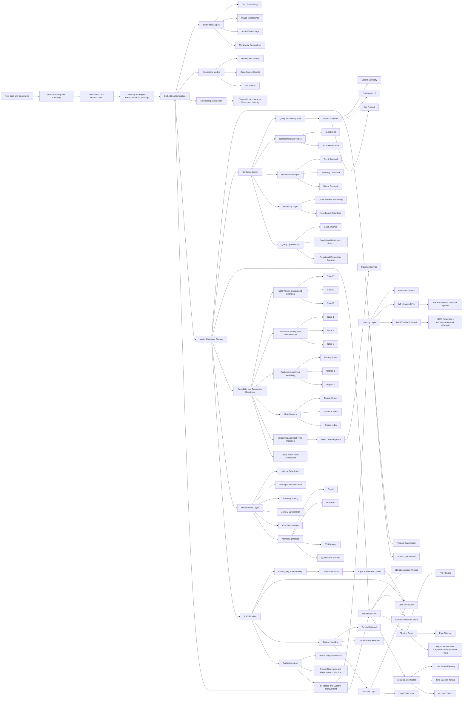
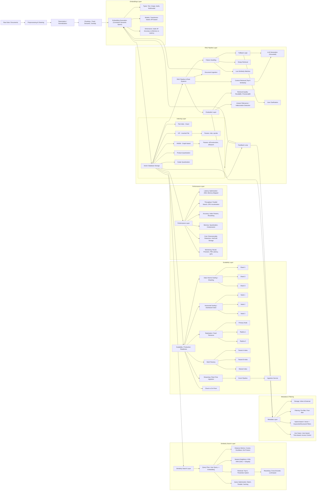
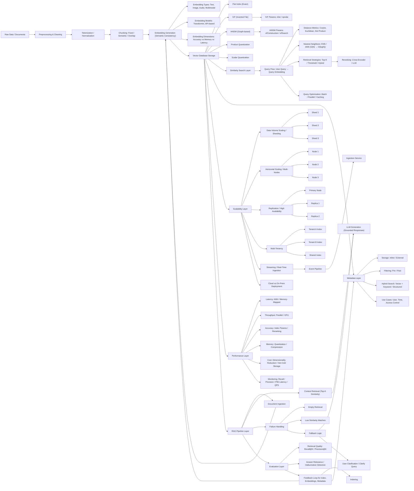

```mermaid
graph LR
%% Raw Data Ingestion
RawData["Raw Data and Documents"] --> Preprocessing["Preprocessing and Cleaning"]
Preprocessing --> Tokenization["Tokenization and Normalization"]
Tokenization --> Chunking["Chunking Strategies - Fixed, Semantic, Overlap"]
Chunking --> EmbeddingGeneration["Embedding Generation"]

%% Embeddings
EmbeddingGeneration --> EmbeddingTypes["Embedding Types"]
EmbeddingTypes --> TextEmb["Text Embeddings"]
EmbeddingTypes --> ImageEmb["Image Embeddings"]
EmbeddingTypes --> AudioEmb["Audio Embeddings"]
EmbeddingTypes --> MultiModalEmb["Multimodal Embeddings"]

EmbeddingGeneration --> EmbeddingModels["Embedding Models"]
EmbeddingModels --> TransformerModels["Transformer Models"]
EmbeddingModels --> OpenSourceModels["Open Source Models"]
EmbeddingModels --> APIModels["API Models"]

EmbeddingGeneration --> EmbeddingDims["Embedding Dimensions"]
EmbeddingDims --> DimTradeoff["Trade-offs: Accuracy vs Memory vs Latency"]

%% Vector Storage and Indexing
EmbeddingGeneration --> VectorDB["Vector Database Storage"]
VectorDB --> Indexing["Indexing Layer"]
Indexing --> FlatIndex["Flat Index - Exact"]
Indexing --> IVF["IVF - Inverted File"]
Indexing --> HNSW["HNSW - Graph Based"]
Indexing --> PQ["Product Quantization"]
Indexing --> ScalarQuant["Scalar Quantization"]

%% Index Parameters
IVF --> IVFParams["IVF Parameters: nlist and nprobe"]
HNSW --> HNSWParams["HNSW Parameters: efConstruction and efSearch"]

%% Similarity Search
VectorDB --> SimilaritySearch["Similarity Search"]
SimilaritySearch --> QueryFlow["Query Embedding Flow"]
QueryFlow --> DistanceMetrics["Distance Metrics"]
DistanceMetrics --> Cosine["Cosine Similarity"]
DistanceMetrics --> Euclidean["Euclidean / L2"]
DistanceMetrics --> DotProduct["Dot Product"]

SimilaritySearch --> NearestNeighbors["Nearest Neighbor Types"]
NearestNeighbors --> KNN["Exact KNN"]
NearestNeighbors --> ANN["Approximate ANN"]

SimilaritySearch --> RetrievalStrategies["Retrieval Strategies"]
RetrievalStrategies --> TopK["Top K Retrieval"]
RetrievalStrategies --> Threshold["Similarity Threshold"]
RetrievalStrategies --> Hybrid["Hybrid Retrieval"]

SimilaritySearch --> Reranking["Reranking Layer"]
Reranking --> CrossEncoders["Cross Encoder Reranking"]
Reranking --> LLMRerank["LLM-Based Reranking"]

SimilaritySearch --> QueryOptimization["Query Optimization"]
QueryOptimization --> BatchQueries["Batch Queries"]
QueryOptimization --> ParallelSearch["Parallel and Distributed Search"]
QueryOptimization --> Caching["Result and Embedding Caching"]

%% Metadata
VectorDB --> MetadataLayer["Metadata Layer"]
MetadataLayer --> StoredMetadata["Stored Alongside Vectors"]
MetadataLayer --> ExternalMetadata["External Metadata Store"]

MetadataLayer --> Filtering["Filtering Types"]
Filtering --> PreFilter["Pre-Filtering"]
Filtering --> PostFilter["Post-Filtering"]
Filtering --> HybridSearch["Hybrid Search with Keywords and Structured Filters"]

MetadataLayer --> UseCases["Metadata Use Cases"]
UseCases --> UserFilter["User Based Filtering"]
UseCases --> TimeFilter["Time Based Filtering"]
UseCases --> AccessControl["Access Control"]

%% Scalability
VectorDB --> Scalability["Scalability and Production Readiness"]
Scalability --> DataScaling["Data Volume Scaling and Sharding"]
DataScaling --> Shard1["Shard 1"]
DataScaling --> Shard2["Shard 2"]
DataScaling --> Shard3["Shard 3"]

Scalability --> HorizontalScaling["Horizontal Scaling and Multiple Nodes"]
HorizontalScaling --> Node1["Node 1"]
HorizontalScaling --> Node2["Node 2"]
HorizontalScaling --> Node3["Node 3"]

Scalability --> Replication["Replication and High Availability"]
Replication --> Primary["Primary Node"]
Replication --> Replica1["Replica 1"]
Replication --> Replica2["Replica 2"]

Scalability --> MultiTenancy["Multi-Tenancy"]
MultiTenancy --> TenantA["Tenant A Index"]
MultiTenancy --> TenantB["Tenant B Index"]
MultiTenancy --> SharedIndex["Shared Index"]

Scalability --> Streaming["Streaming and Real-Time Ingestion"]
Streaming --> EventStream["Event Driven Pipeline"]
EventStream --> IngestionService["Ingestion Service"]

Scalability --> Deployment["Cloud vs On-Prem Deployment"]

%% Performance
VectorDB --> Performance["Performance Layer"]
Performance --> Latency["Latency Optimization"]
Performance --> Throughput["Throughput Optimization"]
Performance --> Accuracy["Accuracy Tuning"]
Performance --> Memory["Memory Optimization"]
Performance --> Cost["Cost Optimization"]
Performance --> Metrics["Monitoring Metrics"]
Metrics --> Recall["Recall"]
Metrics --> Precision["Precision"]
Metrics --> P95["P95 Latency"]
Metrics --> QPS["Queries Per Second"]

%% RAG Pipeline
VectorDB --> RAGPipeline["RAG Pipeline"]
RAGPipeline --> QueryEmbedding["User Query to Embedding"]
QueryEmbedding --> ContextRetrieval["Context Retrieval"]
ContextRetrieval --> TopKContext["Top-K Retrieved Context"]

RAGPipeline --> LLMGeneration["LLM Generation"]
TopKContext --> LLMGeneration

%% Failure Handling
RAGPipeline --> Failures["Failure Handling"]
Failures --> EmptyRetrieval["Empty Retrieval"]
Failures --> LowSimilarity["Low Similarity Matches"]
Failures --> FallbackLogic["Fallback Logic"]

FallbackLogic --> LLMGeneration
FallbackLogic --> UserClarification["User Clarification"]

%% Evaluation
RAGPipeline --> Evaluation["Evaluation Layer"]
Evaluation --> RetrievalQuality["Retrieval Quality Metrics"]
Evaluation --> AnswerRelevance["Answer Relevance and Hallucination Detection"]

%% Loops and Feedback
Evaluation --> FeedbackLoop["Feedback and System Improvement"]
FeedbackLoop --> Indexing
FeedbackLoop --> EmbeddingGeneration
FeedbackLoop --> MetadataLayer
```
---

```mermaid
graph LR
%% ===============================
%% Section 1: Embeddings (Foundation Layer)
%% ===============================
RawData["Raw Data / Documents"] --> Preprocessing["Preprocessing & Cleaning"]
Preprocessing --> Tokenization["Tokenization / Normalization"]
Tokenization --> Chunking["Chunking - Fixed, Semantic, Overlap"]
Chunking --> EmbeddingGen["Embedding Generation (Consistent Semantic Space)"]

subgraph Embeddings ["Embeddings Layer"]
    EmbeddingGen --> EmbTypes["Types: Text, Image, Audio, Multimodal"]
    EmbeddingGen --> EmbModels["Models: Transformer-based, API-based"]
    EmbeddingGen --> EmbDims["Dimensions: trade-off Accuracy vs Memory vs Latency"]
end

%% ===============================
%% Section 2: Indexing (Core Speed Layer)
%% ===============================
EmbeddingGen --> VectorDB["Vector Database Storage"]

subgraph Indexing ["Indexing Layer"]
    VectorDB --> Flat["Flat Index - Exact"]
    VectorDB --> IVF["IVF - Inverted File"]
    VectorDB --> HNSW["HNSW - Graph-based"]
    VectorDB --> PQ["Product Quantization"]
    VectorDB --> ScalarQuant["Scalar Quantization"]

    IVF --> IVFParams["Params: nlist, nprobe"]
    HNSW --> HNSWParams["Params: efConstruction, efSearch"]
end

%% ===============================
%% Section 3: Similarity Search (Retrieval Layer)
%% ===============================
VectorDB --> SimSearch["Similarity Search Layer"]

subgraph SimilaritySearch ["Similarity Search Layer"]
    SimSearch --> QueryFlow["Query Flow: User Query -> Embedding"]
    QueryFlow --> DistanceMetrics["Distance Metrics: Cosine, Euclidean, Dot Product"]
    QueryFlow --> NearestNeighbors["Nearest Neighbors: KNN, ANN (O(N) -> O(logN))"]
    QueryFlow --> RetrievalStrategies["Retrieval: Top-K, Threshold, Hybrid"]
    RetrievalStrategies --> Reranking["Reranking: Cross-Encoder, LLM-based"]
    QueryFlow --> QueryOpt["Query Optimization: Batch, Parallel, Caching"]
end

%% ===============================
%% Section 4: Metadata (Context & Filtering Layer)
%% ===============================
VectorDB --> MetadataLayer["Metadata Layer"]

subgraph Metadata ["Metadata & Filtering"]
    MetadataLayer --> Storage["Storage: Inline & External"]
    MetadataLayer --> Filtering["Filtering: Pre-filter, Post-filter"]
    MetadataLayer --> HybridSearch["Hybrid Search: Vector + Keywords/Structured Filters"]
    MetadataLayer --> UseCases["Use Cases: User-based, Time-based, Access Control"]
end

%% ===============================
%% Section 5: Scalability (Production Layer)
%% ===============================
VectorDB --> Scalability["Scalability / Production Readiness"]

subgraph ScalabilityLayer ["Scalability Layer"]
    Scalability --> DataScaling["Data Volume Scaling / Sharding"]
    DataScaling --> Shard1["Shard 1"]
    DataScaling --> Shard2["Shard 2"]
    DataScaling --> Shard3["Shard 3"]

    Scalability --> Horizontal["Horizontal Scaling / Distributed Index"]
    Horizontal --> Node1["Node 1"]
    Horizontal --> Node2["Node 2"]
    Horizontal --> Node3["Node 3"]

    Scalability --> Replication["Replication / Fault Tolerance"]
    Replication --> Primary["Primary Node"]
    Replication --> Replica1["Replica 1"]
    Replication --> Replica2["Replica 2"]

    Scalability --> MultiTenant["Multi-Tenancy"]
    MultiTenant --> TenantA["Tenant A Index"]
    MultiTenant --> TenantB["Tenant B Index"]
    MultiTenant --> SharedIndex["Shared Index"]

    Scalability --> Streaming["Streaming / Real-Time Ingestion"]
    Streaming --> EventStream["Event Pipeline"]
    EventStream --> Ingestion["Ingestion Service"]

    Scalability --> Deployment["Cloud vs On-Prem"]
end

%% ===============================
%% Section 6: Performance (Speed, Cost, Accuracy)
%% ===============================
VectorDB --> Performance["Performance Layer"]

subgraph PerformanceLayer ["Performance Layer"]
    Performance --> Latency["Latency Optimization: ANN, Memory-Mapped"]
    Performance --> Throughput["Throughput: Parallel Search, GPU Acceleration"]
    Performance --> Accuracy["Accuracy: Index Params, Reranking"]
    Performance --> Memory["Memory: Quantization, Compression"]
    Performance --> Cost["Cost: Dimensionality Reduction, Hot/Cold Storage"]
    Performance --> Metrics["Monitoring: Recall, Precision, P95 Latency, QPS"]
end

%% ===============================
%% Section 7: RAG Pipeline & Real Systems
%% ===============================
VectorDB --> RAG["RAG Pipeline & Real Systems"]

subgraph RAGPipeline ["RAG Pipeline Layer"]
    RAG --> DocIngest["Document Ingestion"]
    DocIngest --> EmbeddingGen
    RAG --> ContextRetrieval["Context Retrieval (Top-K Similarity)"]
    ContextRetrieval --> LLMGen["LLM Generation (Grounded)"]

    RAG --> Failures["Failure Handling"]
    Failures --> Empty["Empty Retrieval"]
    Failures --> LowSim["Low Similarity Matches"]
    Failures --> Fallback["Fallback Logic"]
    Fallback --> LLMGen
    Fallback --> UserClarification["User Clarification"]

    RAG --> Eval["Evaluation Layer"]
    Eval --> RetrievalQuality["Retrieval Quality: Recall@K, Precision@K"]
    Eval --> AnswerRelevance["Answer Relevance / Hallucination Detection"]
    Eval --> Feedback["Feedback Loop"]
    Feedback --> Indexing
    Feedback --> EmbeddingGen
    Feedback --> MetadataLayer
end

```
---

```mermaid
graph LR
%% ===============================
%% Unified Vector Database + RAG Flow
%% ===============================

%% ---------- Embeddings ----------
RawData["Raw Data / Documents"] --> Preprocessing["Preprocessing & Cleaning"]
Preprocessing --> Tokenization["Tokenization / Normalization"]
Tokenization --> Chunking["Chunking: Fixed / Semantic / Overlap"]
Chunking --> EmbeddingGen["Embedding Generation (Semantic Consistency)"]

EmbeddingGen --> EmbTypes["Embedding Types: Text, Image, Audio, Multimodal"]
EmbeddingGen --> EmbModels["Embedding Models: Transformer, API-based"]
EmbeddingGen --> EmbDims["Embedding Dimensions: Accuracy vs Memory vs Latency"]

%% ---------- Indexing ----------
EmbeddingGen --> VectorDB["Vector Database Storage"]
VectorDB --> FlatIndex["Flat Index (Exact)"]
VectorDB --> IVF["IVF (Inverted File)"]
VectorDB --> HNSW["HNSW (Graph-based)"]
VectorDB --> PQ["Product Quantization"]
VectorDB --> ScalarQuant["Scalar Quantization"]

IVF --> IVFParams["IVF Params: nlist / nprobe"]
HNSW --> HNSWParams["HNSW Params: efConstruction / efSearch"]

%% ---------- Similarity Search ----------
VectorDB --> SimSearch["Similarity Search Layer"]
SimSearch --> QueryFlow["Query Flow: User Query → Query Embedding"]
QueryFlow --> DistanceMetrics["Distance Metrics: Cosine, Euclidean, Dot Product"]
QueryFlow --> NearestNeighbors["Nearest Neighbors: KNN / ANN (O(N) → O(logN))"]
QueryFlow --> RetrievalStrategies["Retrieval Strategies: Top-K / Threshold / Hybrid"]
RetrievalStrategies --> Reranking["Reranking: Cross-Encoder / LLM"]
QueryFlow --> QueryOptimization["Query Optimization: Batch / Parallel / Caching"]

%% ---------- Metadata ----------
VectorDB --> Metadata["Metadata Layer"]
Metadata --> Storage["Storage: Inline / External"]
Metadata --> Filtering["Filtering: Pre / Post"]
Metadata --> HybridSearch["Hybrid Search: Vector + Keyword / Structured"]
Metadata --> UseCases["Use Cases: User, Time, Access Control"]

%% ---------- Scalability ----------
VectorDB --> Scalability["Scalability Layer"]
Scalability --> DataScaling["Data Volume Scaling / Sharding"]
DataScaling --> Shard1["Shard 1"]
DataScaling --> Shard2["Shard 2"]
DataScaling --> Shard3["Shard 3"]

Scalability --> Horizontal["Horizontal Scaling / Multi-Nodes"]
Horizontal --> Node1["Node 1"]
Horizontal --> Node2["Node 2"]
Horizontal --> Node3["Node 3"]

Scalability --> Replication["Replication / High Availability"]
Replication --> Primary["Primary Node"]
Replication --> Replica1["Replica 1"]
Replication --> Replica2["Replica 2"]

Scalability --> MultiTenant["Multi-Tenancy"]
MultiTenant --> TenantA["Tenant A Index"]
MultiTenant --> TenantB["Tenant B Index"]
MultiTenant --> SharedIndex["Shared Index"]

Scalability --> Streaming["Streaming / Real-Time Ingestion"]
Streaming --> EventStream["Event Pipeline"]
EventStream --> IngestionService["Ingestion Service"]

Scalability --> Deployment["Cloud vs On-Prem Deployment"]

%% ---------- Performance ----------
VectorDB --> Performance["Performance Layer"]
Performance --> Latency["Latency: ANN / Memory-Mapped"]
Performance --> Throughput["Throughput: Parallel / GPU"]
Performance --> AccuracyPerf["Accuracy: Index Params / Reranking"]
Performance --> MemoryPerf["Memory: Quantization / Compression"]
Performance --> CostPerf["Cost: Dimensionality Reduction / Hot-Cold Storage"]
Performance --> Metrics["Monitoring: Recall / Precision / P95 Latency / QPS"]

%% ---------- RAG Pipeline ----------
VectorDB --> RAG["RAG Pipeline Layer"]
RAG --> DocIngest["Document Ingestion"]
DocIngest --> EmbeddingGen
RAG --> ContextRetrieval["Context Retrieval (Top-K Similarity)"]
ContextRetrieval --> LLMGen["LLM Generation (Grounded Responses)"]

%% ---------- Failure Handling ----------
RAG --> Failures["Failure Handling"]
Failures --> Empty["Empty Retrieval"]
Failures --> LowSim["Low Similarity Matches"]
Failures --> Fallback["Fallback Logic"]
Fallback --> LLMGen
Fallback --> UserClarification["User Clarification / Clarify Query"]

%% ---------- Evaluation ----------
RAG --> Evaluation["Evaluation Layer"]
Evaluation --> RetrievalQuality["Retrieval Quality: Recall@K / Precision@K"]
Evaluation --> AnswerRelevance["Answer Relevance / Hallucination Detection"]
Evaluation --> FeedbackLoop["Feedback Loop for Index, Embeddings, Metadata"]
FeedbackLoop --> Indexing
FeedbackLoop --> EmbeddingGen
FeedbackLoop --> Metadata

```
