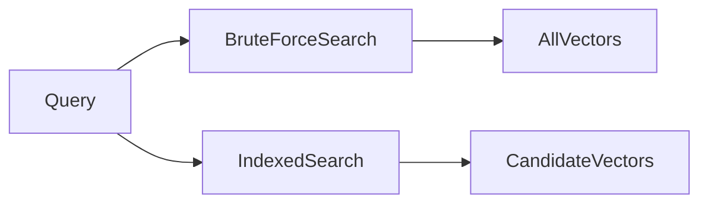
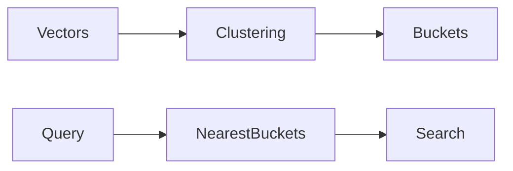
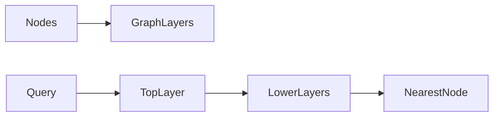
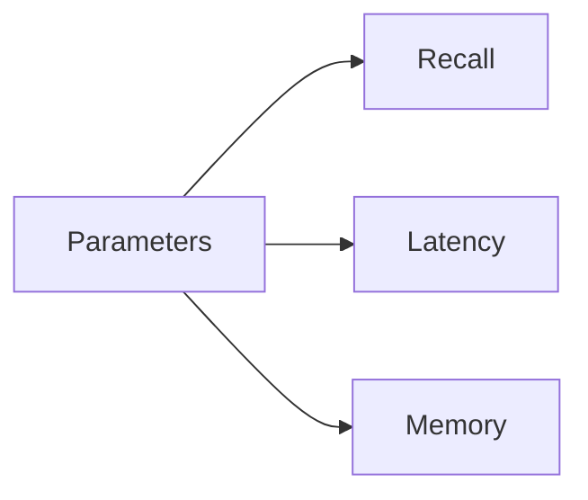
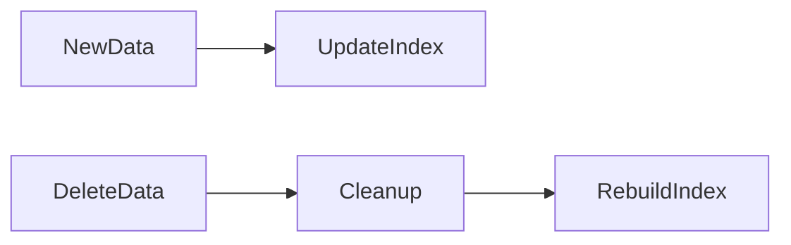

# **Indexing – Core Speed Mechanism in Vector Databases**

Indexing is the single most important factor that determines whether a vector database can operate at real-world scale. While embeddings capture meaning, indexing determines **how fast that meaning can be retrieved**. Without indexing, vector databases would be limited to toy datasets and offline experiments.

Modern AI systems—such as semantic search engines, recommendation platforms, and Retrieval-Augmented Generation (RAG) pipelines—require millisecond-level response times while operating over millions or billions of vectors. Indexing is what makes this possible by transforming an otherwise infeasible brute-force problem into an efficient, scalable search process.

---

## 2. Indexing (Core Speed Mechanism)

In the context of vector databases, an index is a data structure and strategy designed to **reduce the amount of computation required to find similar vectors**. Instead of comparing a query vector against every stored vector, an index narrows the search to a small, highly relevant subset.

Conceptually, indexing works by **organizing vectors in a way that reflects their geometric relationships**. This allows the system to quickly eliminate irrelevant regions of the vector space and focus computation where the most likely matches exist.

Indexing is not merely an optimization—it is the core enabler of sub-second similarity search at scale.

---

## 2.1 Why Indexing Is Needed

A naive vector search approach compares a query vector with every stored vector. This brute-force method has a time complexity of:

[
O(N \times d)
]

Where:

* **N** is the number of vectors
* **d** is the dimensionality of each vector

As N grows into the millions or billions, this approach becomes computationally infeasible. Even with optimized hardware, full scans introduce unacceptable latency and cost.

Indexing addresses this by **reducing the search space**. Instead of scanning all vectors, the index identifies a much smaller set of candidate vectors that are likely to contain the nearest neighbors.

This reduction in candidate size is what enables real-time AI systems.

---

## 2.2 Index Types

Different indexing strategies make different trade-offs between accuracy, speed, memory usage, and scalability. Understanding these trade-offs is critical for designing production systems.

### Flat Index (Exact Search)

A flat index performs a full scan over all vectors and computes the exact similarity score for each one. It guarantees perfect accuracy because no approximation is involved.

Flat indexes are useful:

* For small datasets
* As a baseline for evaluation
* When absolute correctness is required

However, they do not scale well and quickly become impractical as data volume grows.

---

### IVF (Inverted File Index)

IVF is a clustering-based indexing method that partitions the vector space into regions.

Key ideas:

* Vectors are grouped using clustering (typically k-means)
* Each cluster is represented by a centroid
* At query time, only the clusters closest to the query are searched

Mathematically, this is equivalent to approximating the vector space using Voronoi partitions and limiting computation to the nearest regions.

IVF significantly reduces search cost while maintaining high recall when tuned correctly.

---

### HNSW (Graph-Based Index)

HNSW (Hierarchical Navigable Small World) indexing models the vector space as a multi-layer graph.

Core intuition:

* Vectors are nodes in a graph
* Edges connect nearby vectors
* Higher layers provide long-range connections
* Lower layers provide fine-grained local search

Search begins at the top layer and greedily navigates toward the query, descending through layers to refine results.

HNSW offers an excellent balance between speed, accuracy, and scalability, making it a dominant choice in production systems.

---

### Product Quantization (PQ)

Product Quantization reduces memory usage by compressing vectors.

Key concepts:

* Vectors are split into multiple sub-vectors
* Each sub-vector is quantized independently
* Distances are approximated using precomputed codebooks

This approach dramatically reduces storage requirements at the cost of some accuracy. PQ is especially useful when memory constraints dominate system design.

---

### Scalar Quantization

Scalar quantization compresses vectors by reducing the precision of each value.

Characteristics:

* Lower memory footprint
* Faster memory access
* Controlled precision loss

Scalar quantization is commonly used in very large-scale deployments where storage efficiency outweighs the need for perfect recall.

---

## 2.3 ANN vs Exact Search

Vector databases typically operate in one of two modes:

* **Exact Nearest Neighbor (KNN)** search
* **Approximate Nearest Neighbor (ANN)** search

| Feature     | ANN         | Exact |
| ----------- | ----------- | ----- |
| Speed       | Fast        | Slow  |
| Accuracy    | Approximate | Exact |
| Scalability | High        | Low   |

ANN methods dominate production environments because they provide near-perfect results with a fraction of the computational cost. In RAG systems, slight approximation errors are usually acceptable compared to the benefits of speed and scalability.

---

## 2.4 Index Parameters

Index parameters control the balance between recall, latency, memory usage, and cost. Poor tuning can render even the best index ineffective.

### IVF Parameters

* **nlist**: Number of clusters used to partition the vector space
* **nprobe**: Number of clusters searched during a query

Increasing nlist improves space partitioning, while increasing nprobe improves recall at the cost of latency. Optimal values depend on dataset size and query workload.

---

### HNSW Parameters

* **efConstruction**: Controls graph density during index building
* **efSearch**: Controls search breadth during queries

Higher values improve recall but increase memory usage and query time.

---

## 2.5 Index Build Process

Building an index typically follows a structured lifecycle:

1. **Index training** (for clustering-based indexes)
2. **Adding vectors** to the index
3. **Persisting the index** to disk for reuse

Training is required for indexes that rely on learned structure, such as IVF and PQ. Graph-based indexes like HNSW build structure incrementally as vectors are added.

---

## 2.6 Index Maintenance

Real-world systems must handle continuously changing data.

### Rebuilding Indexes

Over time, data distributions change. Rebuilding ensures that the index structure remains aligned with the underlying data.

### Handling Deletions

Common strategies include:

* Lazy deletions
* Tombstone markers
* Periodic cleanup and reindexing

### Updating Vectors

Updates are typically handled as delete-and-reinsert operations, which introduces consistency and synchronization challenges.

---

## Final Summary

Indexing is non-negotiable for vector databases operating at scale. It transforms similarity search from an intractable computation into an efficient, real-time operation.

The choice of index directly affects:

* Query latency
* Memory consumption
* Retrieval accuracy
* System cost

In RAG pipelines, indexing is the bridge between stored knowledge and real-time reasoning, enabling fast and relevant context retrieval for language models.

---

## Writing Style & Audience

This document is written for:

* Students learning vector databases
* AI engineers designing scalable systems
* Interview preparation and system design discussions
* Open-source contributors and researchers

It is structured, professional, and authoritative, and is intended to function as a **mini textbook chapter** within a serious AI or Vector Database GitHub project.

