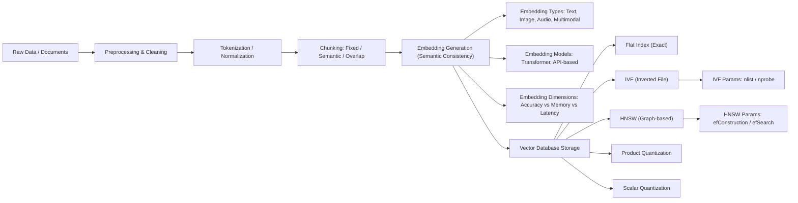
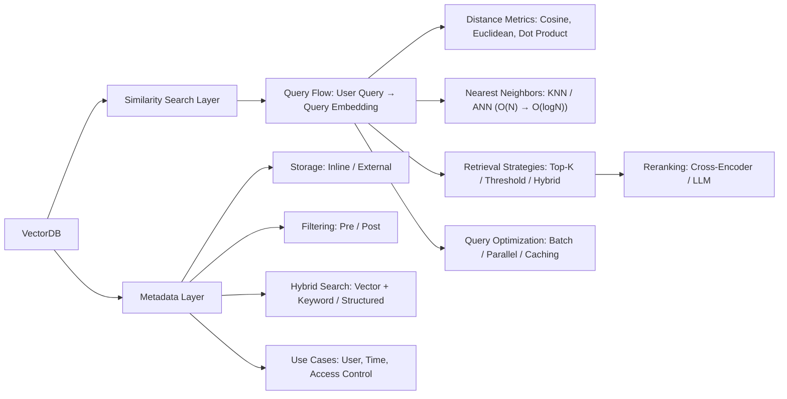
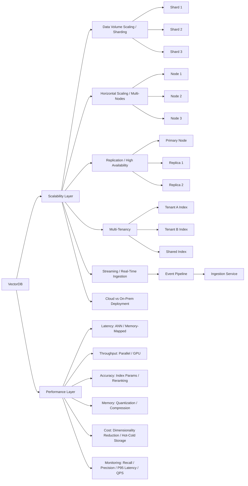
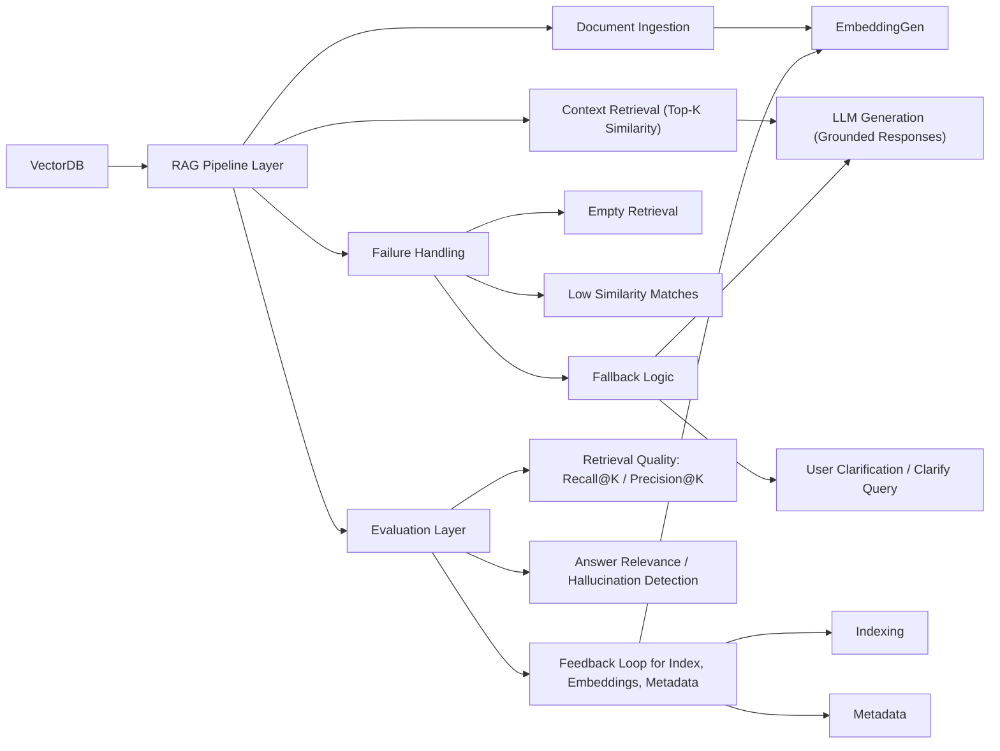

```mermaid
graph LR
RawData["Raw Data / Documents"] --> Preprocessing["Preprocessing & Cleaning"]
Preprocessing --> Tokenization["Tokenization / Normalization"]
Tokenization --> Chunking["Chunking: Fixed / Semantic / Overlap"]
Chunking --> EmbeddingGen["Embedding Generation (Semantic Consistency)"]

EmbeddingGen --> EmbTypes["Embedding Types: Text, Image, Audio, Multimodal"]
EmbeddingGen --> EmbModels["Embedding Models: Transformer, API-based"]
EmbeddingGen --> EmbDims["Embedding Dimensions: Accuracy vs Memory vs Latency"]

EmbeddingGen --> VectorDB["Vector Database Storage"]
VectorDB --> FlatIndex["Flat Index (Exact)"]
VectorDB --> IVF["IVF (Inverted File)"]
VectorDB --> HNSW["HNSW (Graph-based)"]
VectorDB --> PQ["Product Quantization"]
VectorDB --> ScalarQuant["Scalar Quantization"]

IVF --> IVFParams["IVF Params: nlist / nprobe"]
HNSW --> HNSWParams["HNSW Params: efConstruction / efSearch"]
```

---

```mermaid
graph LR
VectorDB --> SimSearch["Similarity Search Layer"]
SimSearch --> QueryFlow["Query Flow: User Query → Query Embedding"]
QueryFlow --> DistanceMetrics["Distance Metrics: Cosine, Euclidean, Dot Product"]
QueryFlow --> NearestNeighbors["Nearest Neighbors: KNN / ANN (O(N) → O(logN))"]
QueryFlow --> RetrievalStrategies["Retrieval Strategies: Top-K / Threshold / Hybrid"]
RetrievalStrategies --> Reranking["Reranking: Cross-Encoder / LLM"]
QueryFlow --> QueryOptimization["Query Optimization: Batch / Parallel / Caching"]

VectorDB --> Metadata["Metadata Layer"]
Metadata --> Storage["Storage: Inline / External"]
Metadata --> Filtering["Filtering: Pre / Post"]
Metadata --> HybridSearch["Hybrid Search: Vector + Keyword / Structured"]
Metadata --> UseCases["Use Cases: User, Time, Access Control"]
```

---

```mermaid
graph LR
VectorDB --> Scalability["Scalability Layer"]
Scalability --> DataScaling["Data Volume Scaling / Sharding"]
DataScaling --> Shard1["Shard 1"]
DataScaling --> Shard2["Shard 2"]
DataScaling --> Shard3["Shard 3"]

Scalability --> Horizontal["Horizontal Scaling / Multi-Nodes"]
Horizontal --> Node1["Node 1"]
Horizontal --> Node2["Node 2"]
Horizontal --> Node3["Node 3"]

Scalability --> Replication["Replication / High Availability"]
Replication --> Primary["Primary Node"]
Replication --> Replica1["Replica 1"]
Replication --> Replica2["Replica 2"]

Scalability --> MultiTenant["Multi-Tenancy"]
MultiTenant --> TenantA["Tenant A Index"]
MultiTenant --> TenantB["Tenant B Index"]
MultiTenant --> SharedIndex["Shared Index"]

Scalability --> Streaming["Streaming / Real-Time Ingestion"]
Streaming --> EventStream["Event Pipeline"]
EventStream --> IngestionService["Ingestion Service"]

Scalability --> Deployment["Cloud vs On-Prem Deployment"]

VectorDB --> Performance["Performance Layer"]
Performance --> Latency["Latency: ANN / Memory-Mapped"]
Performance --> Throughput["Throughput: Parallel / GPU"]
Performance --> AccuracyPerf["Accuracy: Index Params / Reranking"]
Performance --> MemoryPerf["Memory: Quantization / Compression"]
Performance --> CostPerf["Cost: Dimensionality Reduction / Hot-Cold Storage"]
Performance --> Metrics["Monitoring: Recall / Precision / P95 Latency / QPS"]
```

---

```mermaid
graph LR
VectorDB --> RAG["RAG Pipeline Layer"]
RAG --> DocIngest["Document Ingestion"]
DocIngest --> EmbeddingGen
RAG --> ContextRetrieval["Context Retrieval (Top-K Similarity)"]
ContextRetrieval --> LLMGen["LLM Generation (Grounded Responses)"]

RAG --> Failures["Failure Handling"]
Failures --> Empty["Empty Retrieval"]
Failures --> LowSim["Low Similarity Matches"]
Failures --> Fallback["Fallback Logic"]
Fallback --> LLMGen
Fallback --> UserClarification["User Clarification / Clarify Query"]

RAG --> Evaluation["Evaluation Layer"]
Evaluation --> RetrievalQuality["Retrieval Quality: Recall@K / Precision@K"]
Evaluation --> AnswerRelevance["Answer Relevance / Hallucination Detection"]
Evaluation --> FeedbackLoop["Feedback Loop for Index, Embeddings, Metadata"]
FeedbackLoop --> Indexing
FeedbackLoop --> EmbeddingGen
FeedbackLoop --> Metadata
```

