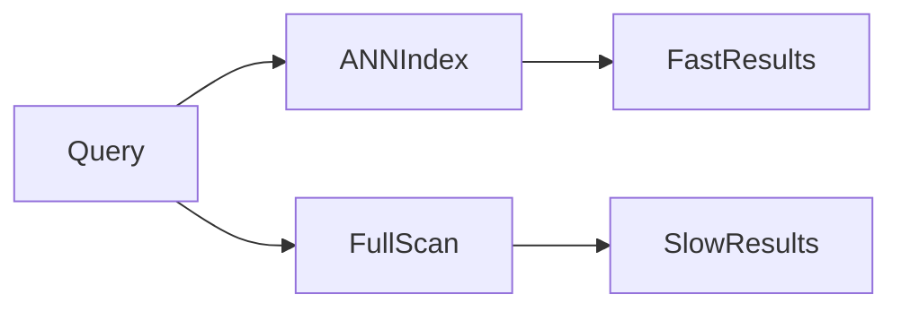
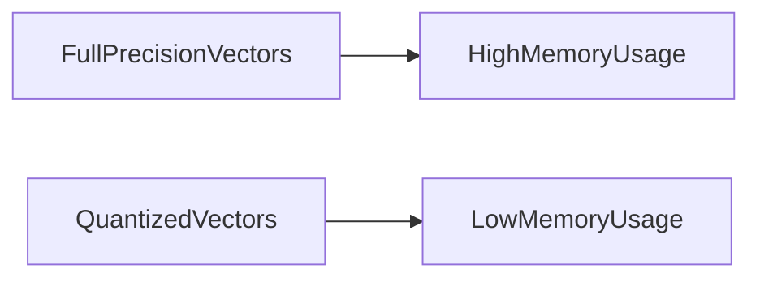
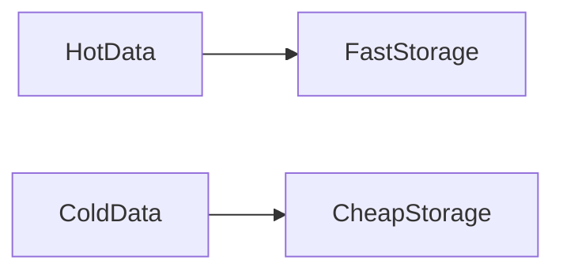
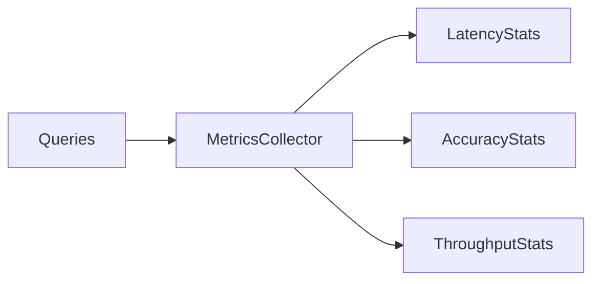

# **Performance – Speed, Cost, and Accuracy in Vector Databases**

Performance in vector databases is a **multi-dimensional trade-off** between **speed, accuracy, and cost**. Optimizing one dimension often impacts the others. Production-ready AI systems—such as chatbots, RAG pipelines, or recommendation engines—require careful **performance engineering** to ensure low latency, high throughput, precise results, and cost-efficiency.

Performance tuning in vector databases is critical because **real-time retrieval of billions of vectors** is fundamentally different from small-scale experimentation.

---

## 6. Performance (Speed, Cost, Accuracy)

Performance encompasses multiple axes:

* **Latency:** Time to retrieve results
* **Throughput:** Queries per second (QPS)
* **Accuracy:** Recall and precision of retrieved vectors
* **Memory:** Resource usage for storage and computation
* **Cost:** Operational expenses, including compute and storage

Balancing these dimensions ensures a **reliable, scalable, and user-responsive system**.

---

## 6.1 Latency Optimization

Low latency is essential for **real-time applications**.

### ANN Indexes

* Approximate Nearest Neighbor (ANN) search reduces latency
* Narrows search space instead of computing all distances
* Trade-off: speed versus recall

Mathematical intuition:

[
O(\log N) \quad \text{vs} \quad O(N)
]

### Memory-Mapped Indexes

* Disk vs memory access affects query time
* OS-level caching reduces repeated disk I/O
* Startup time vs per-query latency trade-offs

---

## 6.2 Throughput Optimization

Throughput is measured as **queries per second (QPS)**.

### Parallel Search

* Multi-threaded execution
* Shard-level parallelism
* Query fan-out and result aggregation

### GPU Acceleration

* GPUs accelerate vector math and matrix operations
* SIMD and parallel computation improve throughput
* Cost vs performance trade-offs

---

## 6.3 Accuracy Tuning

Accuracy is **continuous**, not binary.

### Index Parameters

* Control recall and coverage
* Trade-offs between latency and precision
* Diminishing returns at very high recall

### Reranking Layers

* Two-stage retrieval: fast vector search followed by reranking
* Improves semantic relevance
* Cost vs quality trade-offs

---

## 6.4 Memory Optimization

Memory limits impact speed and scale.

### Quantization

* Reduces precision representation of vectors
* Lowers memory usage
* Slight accuracy loss

### Compression

* Reduces disk footprint
* Trade-offs between decompression cost and storage savings

---

## 6.5 Cost Optimization

Performance must be balanced with operational cost.

### Dimensionality Reduction

* Fewer dimensions → faster searches, smaller indexes
* Trade-off: lower semantic expressiveness

### Cold vs Hot Storage

* Frequently accessed vectors → fast storage
* Rarely accessed vectors → cheaper storage
* Tiered strategy balances cost and latency

---

## 6.6 Monitoring Metrics

“**You cannot optimize what you do not measure.**”

* **Recall:** Fraction of true nearest neighbors retrieved
* **Precision:** Relevance of results
* **P95 Latency:** Tail latency importance
* **QPS:** System throughput under load

---

## Final Summary

Performance in vector databases is a **multi-dimensional optimization problem**:

* Speed, cost, and accuracy must be balanced
* Latency, throughput, and reranking are critical for real-time AI
* Memory optimization and tiered storage reduce operational costs
* Monitoring ensures that tuning aligns with production goals

Effective performance engineering **enables reliable, scalable, and cost-efficient vector retrieval** in RAG pipelines and other AI systems.

If you want, next I can **combine all 6 sections** (Embeddings, Indexing, Similarity Search, Metadata, Scalability, Performance) into **a single master README** for a complete **Vector Database / RAG reference guide**.
