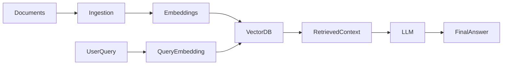
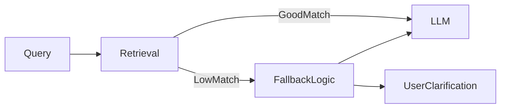
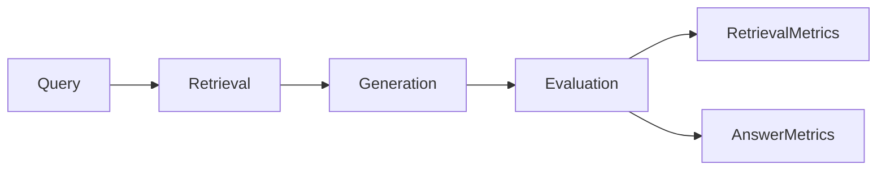

# **Vector Databases in Real Systems – RAG (Retrieval-Augmented Generation) Focus**

Vector databases are **central to real-world AI systems**. While LLMs excel at generating fluent text, they are **limited by static knowledge**. Retrieval-Augmented Generation (RAG) combines **dynamic retrieval** with **LLM generation**, improving:

* **Accuracy** – grounding responses in real data
* **Freshness** – incorporating the latest knowledge
* **Explainability** – linking answers to source documents
* **Cost efficiency** – avoiding full-scale model re-training

In production, **retrieval quality directly determines answer quality**.

---

## 7. Vector Database in Real Systems (RAG Focus)

RAG is a **system-level architecture** in which **vector databases act as the knowledge layer**. LLMs query embeddings to access relevant context, producing answers that are **both semantically rich and verifiable**.

---

## 7.1 RAG Pipeline

A production RAG pipeline involves **sequential stages**, each critical for system quality.

### Document Ingestion

* Sources: files, databases, APIs, streaming data
* Continuous ingestion ensures **up-to-date knowledge**
* Preprocessing and **chunking** improve retrieval granularity

### Embedding Creation

* Converts raw documents into **vector embeddings**
* Captures semantic meaning in **high-dimensional space**
* Consistent embedding models ensure **query and document compatibility**

### Vector Storage

* Vector databases store embeddings efficiently
* Support **indexing, metadata, and persistence**
* Scalability is achieved via **sharding, replication, and distributed storage**

### Context Retrieval

* Queries converted to embeddings
* Similarity search identifies **top-K relevant vectors**
* Trade-offs: context size vs retrieval precision

Mathematical intuition:
Similarity score ( s(q, d) ) is computed, and retrieval seeks:

[
\text{Top-K } d_i = \arg\max_{d \in D} s(q, d)
]

### LLM Generation

* Retrieved context is injected into prompts
* Reduces hallucinations by grounding generation
* Retrieval and generation responsibilities are **separated for robustness**

---

## 7.2 Failure Handling

RAG systems can fail subtly. Designing **defensive mechanisms** is crucial.

### Empty Retrieval

* Occurs when **no vectors match the query**
* Causes: incomplete knowledge, index gaps, embedding mismatches
* Mitigation: expand corpus, improve embeddings, adjust similarity thresholds

### Low Similarity Matches

* Semantic drift or ambiguous queries
* Can reduce relevance of retrieved context
* Mitigation: similarity thresholding, hybrid retrieval strategies

### Fallback Logic

* When retrieval fails, rely on **LLM prior knowledge** or **clarification**
* Ensures **system resilience and user satisfaction**

---

## 7.3 Evaluation

Evaluating RAG systems is **multi-dimensional**, covering both **retrieval and generation**.

### Retrieval Quality

* Metrics: Recall@K, Precision@K, coverage
* Probabilistic evaluation: chance of retrieving relevant context
* Retrieval errors propagate downstream, impacting answer quality

### Answer Relevance

* Measures **faithfulness to retrieved context**
* Detects **hallucinations**
* Evaluates **human vs automated judgments**

---

## Final Summary

* Vector databases are the **backbone of RAG systems**
* **Retrieval quality defines generation quality**
* Production RAG systems require:

  * Monitoring
  * Fallback logic
  * End-to-end evaluation

A well-designed RAG system combines **robust retrieval**, **grounded generation**, and **continuous evaluation** for real-world AI reliability.
