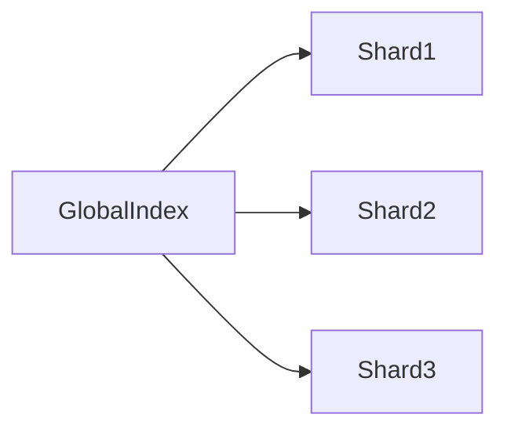
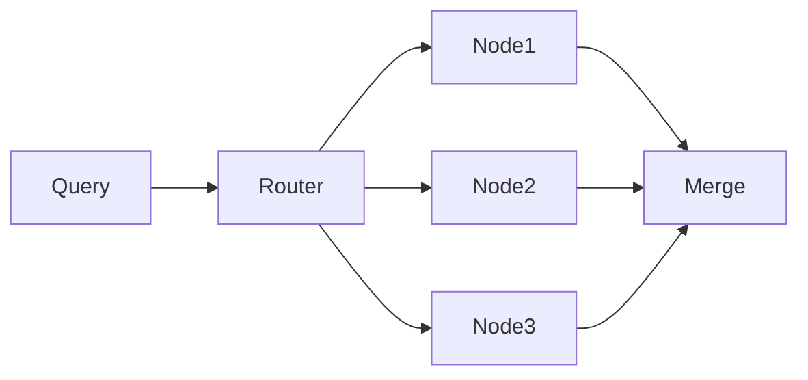
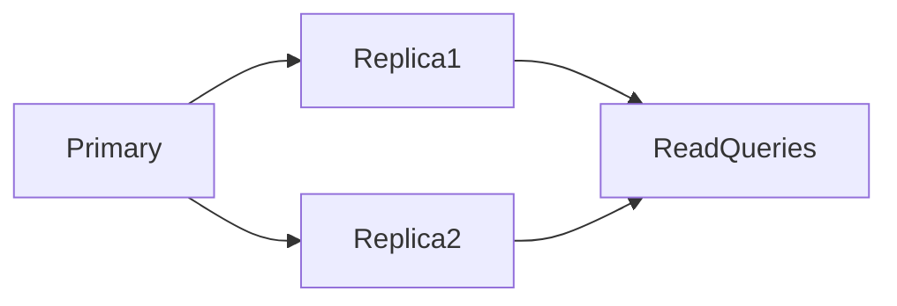
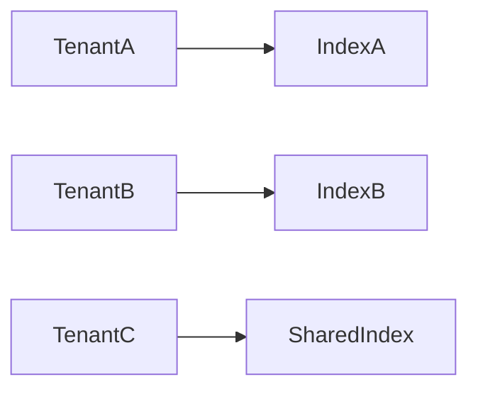
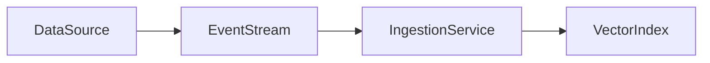
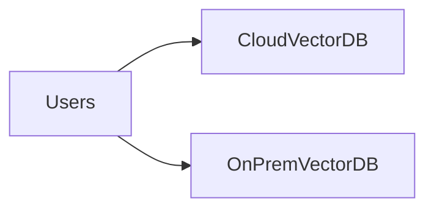

# **Scalability – Production Readiness in Vector Databases**

Scalability determines whether a vector database or RAG system is truly **production-ready**. While a prototype may work with thousands of vectors, real-world AI systems must handle **billions of vectors**, **high query volumes**, and **multi-tenant environments** while maintaining low latency, fault tolerance, and cost efficiency.

Scalability is not just about data size—it encompasses **distribution, replication, ingestion, and operational models**. Poorly scaled systems risk slow queries, inconsistent results, or system outages.

---

## 5. Scalability (Production Readiness)

Scalability in vector databases refers to the system’s ability to:

* Maintain low-latency retrieval as data and query load grow
* Handle distributed storage and computation efficiently
* Ensure availability and reliability under heavy load
* Support operational complexity like multi-tenancy and real-time ingestion

Key dimensions include:

* **Data Size:** Millions → Billions of vectors
* **Query Volume:** Low latency at high throughput
* **Availability & Reliability:** Fault tolerance and replication
* **Cost Efficiency:** Optimal resource usage

---

## 5.1 Data Volume Scaling

As datasets grow, naive search becomes infeasible due to memory and computational constraints. Scaling requires **sharding** and **partitioning** strategies.

### Sharding Strategies

* **Horizontal Sharding:** Split vectors evenly across shards
* **Hash-Based Sharding:** Deterministic distribution via hash function
* **Range-Based Sharding:** Partition by vector properties or time
* **Semantic / Tenant-Based Sharding:** Cluster similar vectors together for performance or isolate tenants

Mathematical intuition:

* Dataset size ( N )
* Number of shards ( k )
* Per-shard search complexity: ( O(N/k) )
* Reduces per-query load and improves throughput

---

## 5.2 Horizontal Scaling

Scaling horizontally means **adding more machines** rather than upgrading hardware. It is essential for production-level AI systems.

### Multiple Nodes

* Distribute query load across nodes
* Reduce single-node bottlenecks
* Enable parallel retrieval

### Distributed Indexes

* Partition indexes across nodes
* Merge partial results for final retrieval
* Trade-offs: latency vs recall

---

## 5.3 Replication

Replication ensures **high availability and fault tolerance** beyond performance improvements.

### High Availability

* Maintain read replicas
* Automatic failover during node downtime

### Fault Tolerance

* Survive node failures and network partitions
* Balance consistency and recovery speed

Key reliability metrics:

* Mean Time To Failure (MTTF)
* Recovery trade-offs between availability and consistency

---

## 5.4 Multi-Tenancy

In SaaS AI platforms, multi-tenancy enables **shared infrastructure for multiple clients** while maintaining isolation.

### Namespace Isolation

* Logical separation per tenant
* Controlled access boundaries

### Per-Tenant Indexing

* Dedicated indexes for each tenant vs shared indexes
* Trade-offs: performance, cost, and operational complexity

---

## 5.5 Streaming Ingestion

Production systems require **real-time vector availability**, not just batch updates.

### Real-Time Updates

* Near real-time vector indexing
* Ensures freshness of retrieval

### Event-Driven Pipelines

* Asynchronous ingestion
* Decoupled architecture improves reliability and scalability

---

## 5.6 Cloud vs On-Prem

Deployment models significantly impact scalability, operations, and cost.

### Managed Services (Cloud)

* Elastic scaling
* Operational simplicity
* Potential vendor lock-in

### Self-Hosted (On-Prem)

* Full control over infrastructure
* Cost predictability
* Operational complexity and maintenance overhead

| Aspect | Cloud | On-Prem |
| ------ | ----- | ------- |

---

## Final Summary

Scalability is **non-negotiable** for production AI systems:

* **Sharding, replication, and distribution** work together to handle growth
* Horizontal scaling and multi-node architecture enable low-latency retrieval at scale
* Streaming ingestion ensures real-time freshness
* Deployment decisions (cloud vs on-prem) influence cost, control, and elasticity

A well-architected scalable vector database supports **billions of vectors**, **millions of queries**, and **multi-tenant enterprise workloads** reliably and efficiently.

