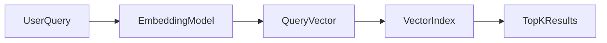
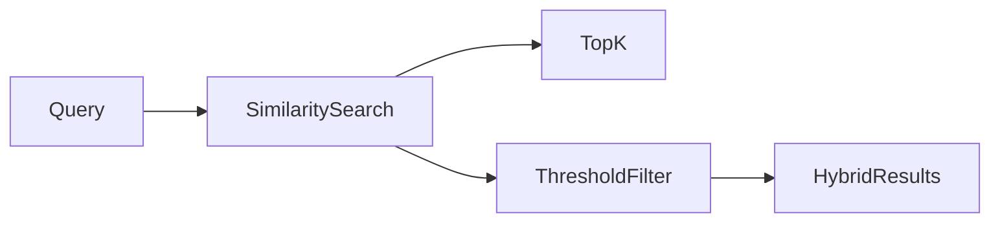
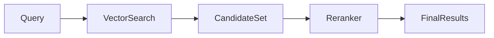
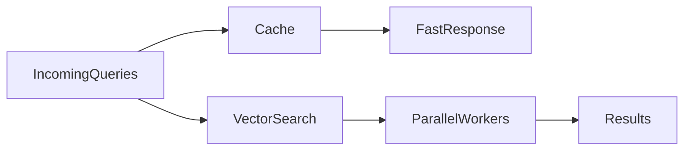

# **Similarity Search – How Retrieval Works in Vector Databases**

Similarity search is the core operation that gives vector databases their power. While embeddings encode meaning and indexing enables speed, similarity search is the mechanism that actually **retrieves relevant information**. It determines how well a system can find semantically related content rather than relying on exact keyword matches.

In modern AI systems—such as semantic search engines, recommendation platforms, and Retrieval-Augmented Generation (RAG) pipelines—similarity search enables models to reason over meaning, intent, and context. Without it, vector databases would be unable to deliver intelligent, human-like retrieval.

---

## 3. Similarity Search (How Retrieval Works)

Similarity search is the process of finding vectors in a database that are **closest to a query vector** according to a defined distance or similarity metric. Instead of matching exact terms, similarity search operates in a continuous vector space where semantic relationships are represented geometrically.

Vectors enable meaning-based retrieval by encoding concepts such that:

* Similar meanings map to nearby points
* Different meanings are separated by distance
* Relationships are expressed through geometry

At scale, similarity search becomes computationally challenging because it must operate over high-dimensional spaces containing millions or billions of vectors, while still meeting strict latency requirements.

---

## 3.1 Vector Query Flow

The retrieval process in a vector database follows a structured pipeline that transforms a user’s query into a mathematical search problem.

1. **User Query**
   The process begins with a natural language query or other unstructured input.

2. **Query Embedding**
   The query is transformed into a numerical vector using the same embedding model used for stored data.

3. **Vector Index Search**
   The query vector is compared against indexed vectors using an approximate or exact search strategy.

4. **Top-K Retrieval**
   The system returns the K most similar vectors based on the chosen similarity metric.

Each step ensures that semantic meaning is preserved and efficiently retrieved.

Mathematically, retrieval can be viewed as an optimization problem:
find vectors that minimize distance or maximize similarity with respect to the query vector.

---

## 3.2 Distance Metrics

Distance metrics define what “similarity” means in a vector space. The choice of metric directly influences retrieval behavior and system performance.

### Cosine Similarity

Cosine similarity measures the angle between two vectors, ignoring their magnitude. It focuses purely on direction, making it ideal for comparing semantic content.

[
\cos(\theta) = \frac{A \cdot B}{|A| |B|}
]

Intuitively:

* Small angle → high semantic similarity
* Large angle → low semantic similarity

Cosine similarity is widely used for text embeddings because meaning is more about direction than vector length.

---

### Euclidean Distance (L2)

Euclidean distance measures the straight-line distance between two vectors in space.

[
|A - B|_2 = \sqrt{\sum (a_i - b_i)^2}
]

It captures absolute geometric distance and is sensitive to magnitude. This metric is often used when vector norms carry semantic importance.

---

### Dot Product

The dot product measures both alignment and magnitude.

* Larger dot product → stronger similarity
* Influenced by vector length

Dot product is common in dense retrieval systems and recommendation engines where magnitude reflects confidence or importance.

---

### Metric Comparison

| Metric            | Focus             | Scale Sensitivity | Common Use Case      |
| ----------------- | ----------------- | ----------------- | -------------------- |
| Cosine Similarity | Direction         | No                | Semantic text search |
| Euclidean (L2)    | Absolute distance | Yes               | Spatial similarity   |
| Dot Product       | Alignment + size  | Yes               | Dense retrieval      |

Choosing the correct metric is critical for accurate and meaningful retrieval.

---

## 3.3 Nearest Neighbor Types

Similarity search revolves around the concept of **nearest neighbors**—vectors that are closest to the query in the vector space.

### KNN (Exact Nearest Neighbor)

Exact search computes distances between the query and all stored vectors.

Characteristics:

* Perfect accuracy
* High computational cost
* Poor scalability

KNN is mainly used for evaluation, benchmarking, or very small datasets.

---

### ANN (Approximate Nearest Neighbor)

Approximate search reduces the search space using indexing techniques.

Characteristics:

* Near-optimal accuracy
* Orders of magnitude faster
* Scales to millions or billions of vectors

ANN is the standard approach in production vector databases.

| Feature     | KNN   | ANN         |
| ----------- | ----- | ----------- |
| Accuracy    | Exact | Approximate |
| Speed       | Slow  | Fast        |
| Scalability | Low   | High        |

---

## 3.4 Retrieval Strategies

After similarity computation, systems must decide **how to select and filter results**.

### Top-K Retrieval

Top-K returns a fixed number of the most similar vectors.

* Simple and predictable
* Common default strategy
* Ensures consistent output size

---

### Similarity Threshold

Threshold-based retrieval returns all vectors above a similarity score.

* Dynamic result size
* Precision-focused
* Useful when relevance is more important than quantity

---

### Hybrid Retrieval

Hybrid retrieval combines vector similarity with keyword or metadata filtering.

Benefits:

* Improved relevance
* Better control
* Reduced false positives

Hybrid approaches are especially important in enterprise and RAG systems.

---

## 3.5 Reranking

Initial vector retrieval is fast but imperfect. Reranking improves result quality by applying more expensive but accurate models to a smaller candidate set.

### Cross-Encoders

Cross-encoders evaluate query-document pairs jointly.

* High accuracy
* High computational cost
* Used on small candidate sets

---

### LLM-Based Reranking

Large language models can evaluate contextual relevance, reasoning over semantics and intent.

In RAG pipelines, reranking ensures that only the most relevant documents are passed to the generation step.

### Two-Stage Retrieval Architecture

1. Fast ANN-based vector search
2. Slow, high-quality reranking

This architecture balances speed and quality.

---

## 3.6 Query Optimization

Production systems apply multiple optimizations to meet performance requirements.

### Batch Queries

Processing queries in batches improves throughput and reduces overhead, especially for embedding generation and index access.

---

### Parallel Search

Distributed and multi-core execution reduces latency by searching multiple partitions or graph paths simultaneously.

---

### Caching

Caching accelerates repeated queries by storing:

* Query embeddings
* Search results
* Popular query responses

These techniques are essential for high-traffic systems.

---

## Final Summary

Similarity search is the heart of vector databases. It enables semantic retrieval by comparing meaning rather than keywords, making it indispensable for modern AI systems.

Key takeaways:

* Vector similarity defines relevance
* Metric choice shapes retrieval behavior
* ANN enables scalability
* Reranking improves quality
* Similarity search powers RAG pipelines end to end

Together, these components allow AI systems to retrieve context efficiently and accurately at scale.

---

## Writing Style & Audience

This README is written for:

* Students learning vector retrieval
* AI engineers building production systems
* Interview preparation and system design
* Open-source contributors and researchers

It is clear, structured, professional, and designed to function as a **mini textbook chapter** within a serious Vector Database or RAG GitHub project.

